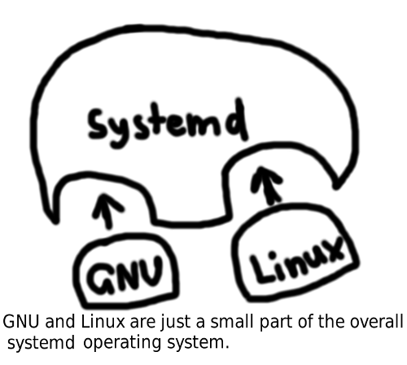
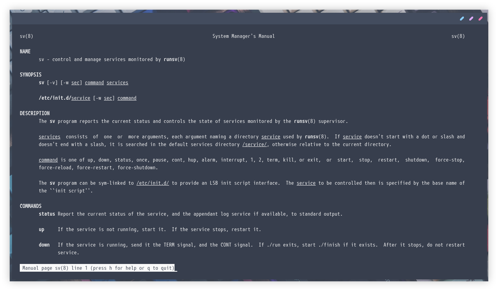

# Beralih ke Runit


Runit merupakan sebuah UNIX _init scheme_ dengan _service supervision_. Pada dasarnya hal ini berarti Runit mampu menyediakan _automatic starting_ sebuah services ketika sistem operasi dijalankan untuk pertamakali, serta _automatic monitoring and restarting_ sebuah service jika terjadi sebuah interupsi.

<!--more-->

## Systemd vs Runit
Ketika artikel ini diterbitkan, **systemd** nyaris menguasai semua distro sistem operasi GNU/Linux. Misalnya Fedora, Debian, Ubuntu, dan banyak lagi lainnya sudah beralih dari _init system_ sebelumnya lalu menggunakan _systemd_. Hal ini terjadi karena systemd menawarkan banyak hal yang terintegrasi, hampir segala hal pada sistem operasi akan di-_handle_ olehnya.



### Kontroversi systemd
**systemd** memang menjadi kontroversi karena beberapa hal. Sebagian orang menganggap bahwa systemd tidak menghormati filosofi Unix. Saya ingat ketika awal sekali mengenal GNU/Linux, bahwa GNU/Linux adalah sistem operasi yang **_Unix-like_** dan **_Unix_** memiliki filosofi sebagai berikut :
* Tugas sebuah program adalah melakukan satu hal, dan melakukannya dengan baik.
* Sistem yang besar dan kompleks merupakan gabungan dari program-program kecil yang bekerja sama.
* Teks adalah antarmuka yang universal.
* Segala hal di Unix adalah file.

_systemd_ dianggap tidak _conform_ dengan filosofi Unix diatas sehingga banyak yang menolaknya. _systemd_ awalnya dikembangkan oleh **Lennart Pottering**, seorang developer yang saat artikel ini diterbitkan tengah bekerja untuk **Red Hat**. Dia sebelumnya juga membuat sebuah program yang tak kalah kontroversial yaitu _Avahi_ dan _PulseAudio_. Silahkan baca tentang Lennart Pottering di [Wikipedia](https://en.wikipedia.org/wiki/Lennart_Poettering).

Beberapa kritik lain terhadap _systemd_ misalnya karena _systemd_ tidak hanya menjadi _init system_ tapi **juga mengambil ali banyak fungsi**. Misalnya _systemd_ berusaha mengatur _network_, `cron`, `fstab`, `syslog` atau `rsyslog`, `ntp`, dan banyak lainnya. Artinya _systemd_ bukanlah sebuah program yang melakukan satu hal saja, tapi banyak hal. Kemudian, _systemd_ dikritik karena _logging file_-nya tidak berbasis teks seperti _Unix_ dan _GNU/Linux_ pada umumnya, melainkan _binary log file_.

### Runit Sebagai Alternatif
Berbagai penolakan tentu saja terjadi, tidak sedikit developer yang kemudian melakukan _fork_ lalu mengembangkan distro GNU/Linux yang bebas dari _systemd_. Misalnya [**Artix Linux**](http://artixlinux.org), yang merupakan _fork_ dari project [**Arch Linux**](http://archlinux.org) dengan maksud membebaskan pengguna _Arch_ dari cengkeraman _systemd_. Artix menawarkan beberapa alternatif sebagai pengganti _systemd_, misalnya [**OpenRC**](https://wiki.archlinux.org/index.php/OpenRC), [**S6**](https://wiki.gentoo.org/wiki/S6), dan tentu saja [**Runit**](http://smarden.org/runit/).

```cfg
/etc/runit/sv/foo
├── log
│   ├── run
│   └── supervise
│       ├── control
│       ├── lock
│       ├── ok
│       ├── pid
│       ├── stat
│       └── status
├── run
└── supervise
    ├── control
    ├── lock
    ├── ok
    ├── pid
    ├── stat
    └── status
```
Pada distro _Artix_, biasanya direktori sebuah _service_ akan terlihat seperti di atas. Anggaplah `/etc/runit/sv` adalah _templatedir_, dan `/etc/runit/sv/foo` adalah direktori konfigurasi _service_. Maka kelak _service_ yang berjalan akan bernama sebagai `foo` juga. Dalam direktori `foo` biasanya kita hanya diwajibkan untuk membuat sebuah file _executable_ bernama `run`, berisikan baris perintah untuk mengeksekusi program yang akan dijadikan sebagai sebuah _service_. Namun jika kita membutuhkan _logging_, kita dapat memanfaatkan `svlogd` dengan membuat sebuah direktori bernama `log` di dalam `/etc/runit/sv/foo`, kemudian buat lagi sebuah file bernama `run` di dalam direktori `log` tersebut. Isi dari file-file `run` tersebut akan kita bahas dibawah.

---

## Beralih ke Runit
Dalam dokumentasi ini kita akan belajar tentang :
1. Membuat sebuah _runit template_ untuk untuk konfigurasi _monitored service_.
2. Konfigurasi _monitored service_ untuk pertamakali.
3. Mengelola _monitored service_ secara manual.



### 0. Prerequisites
Pastikan paket dari `runit` sudo terpasang pada sistem. Sebagian besar distro GNU/Linux biasanya memiliki paket tersebut pada _repository_ mereka. Misalnya, jika kita menggunakan sebuah distro _Arch-based_ maka kita dapat memasang paket dengan perintah berikut.
```bash
$ sudo pacman -Sy runit
```


Pada distro [**Artix**](https://artixlinux.org) biasanya kita tidak perlu melakukan pemasangan paket _Runit_. Kita diperkenankan memilih _init system_ apa yang akan digunakan pada waktu mengunduh berkas ISO installer.


Periksa apakah _runit_ telah terpasang pada sistem, dengan mencari sebuah _process_ bernama `runsvdir` dengan perintah.
```bash
$ sudo ps -ef | grep runsvdir
```

Jika _runit_ telah terpasang, harusnya akan keluar _output_ seperti berikut.
```cfg
root      1090     1  0 Dec15 ?        00:00:00 runsvdir -P /run/runit/service log:..............
```
Di sini `runsvdir` merupakan hal paling pertama dari beberapa lainnya yang akan kita pahami. _runit_ memang diarancang untuk mengambil pendekatan yang terasa sangat **Unixy**, yaitu dengan cara memecah fungsionalitas utama menjadi beberapa _utilities_ kecil yang masing-masing unitnya bertanggung jawab menjalankan sebuah tugas. Pendekatan tersebut membuat komponen-komponen kecilnya mampu dibentuk dengan beberapa metode sesuai dengan yang kita butuhkan. _Core unit_ yang terdapat pada _runit_ beberapa diantaranya adalah `runsvdir`, `runsv`, `chpst`, `svlogd`, dan `sv`. Nantinya, dalam dokumentasi ini kita akan mengkombinasikan beberapa hal diatas untuk kofigurasi _runit_ dan menjalankan sebuah _managed service_.

### 1. Membuat sebuah _Template_
Hal pertama yang perlu kita lakukan adalah memperhatikan lebih dalam apa yang sebenarnya terjadi pada output `runsvdir -P /run/runit/service log:.....`. Pada dasarnya, dalam output tersebut terdapat sebuah perintah yang mengawasi direktori `/run/runit/service`, karena di dalamnya terdapat file konfigurasi dari _monitored service_. Sebuah _monitored service_ dikonfigurasi dengan menambahkan sebuah subdirektori ke dalam `/run/runit/service` berisikan sebuah berkas script `run` di dalamnya. Ketika `runsvdir` menemukan sebuah konfigurasi baru, maka ia akan menjalankan _process_ `runsv`baru untuk mengelola _service_. Ingat, bahwa salah satu _Filosofi Unix_ berbunyi **tugas sebuah program adalah melakukan satu hal, dan melakukannya dengan baik.**

Pastikan bahwa direktori `/etc/runit/sv/` ada. Di dalamnya kita akan membuat direktori baru bernama `foo`.
```bash
$ sudo mkdir -p /etc/runit/sv/foo
```
Lalu di dalam direktori tersebut kita buat sebuah file _template_ bernama `run` untuk ilustrasi.
```cfg
#!/bin/sh
exec 2>&1
exec chpst -u foo /opt/example/foo-service.sh
```
Jangan lupa file `run` harus menjadi _executable_ dengan cara berikut.
```bash
$ sudo chmod +x /etc/runit/sv/foo/run
```
Script `run` di atas akan mengeksekusi script `foo-service.sh` yang nantinya akan kita buat di dalam direktori `/opt/example`. Terdapat juga `chpst` yang berfungsi agar nantinya eksekusi akan dijalankan oleh user bernama `foo`, kita akan buat juga usernya nanti.

Runit menawarkan `svlogd` untuk mengelola _logfile_ dari sebuah _service_, kita akan mencoba membuatnya juga. Mari buat direktori baru bernama `log`.
```bash
$ sudo mkdir /etc/runit/sv/foo/log
```
Di dalam direktori tersebut, kita akan membuat file baru lagi bernama `run` berisikan script berikut.
```cfg
#!/bin/sh
exec chpst -u foo svlogd -tt /var/log/foo
```
Pada script diatas `svlogd` akan menghasilkan output dari _template_ yang sebelumnya kita buat. Output yang muncul akan ditampung pada direktori `/var/log/foo` yang kita buat nanti.

### 2. Menyiapkan Logging Directory
Buat sebuah direktori untuk menampung log dari service.
```bash
$ sudo mkdir -p /var/log/foo
```
Lalu kita membutuhkan user baru bernama `foo` sebagai ilustrasi.
```bash
$ sudo useradd foo
```
Direktori log seharusnya menjadi milik user `foo` supaya user tersebut mampu menulis di dalamnya, sehingga kita perlu merubah kepemilikannya dengan perintah berikut.
```bash
$ sudo chown foo:foo /var/log/foo
```

### 3. Membuat Program Ilustrasi
Buat sebuah direktori baru untuk meletakkan file program ilustrasi.
```bash
$ sudo mkdir -p /opt/example
```
Dari sini kita akan melanjutkan dengan membuat program sebagai ilustrasi bernama `foo-service.sh` yang terletak pada direktori `/opt/example`.
```cfg
#!/bin/bash
echo "Menjalankan service..."
for i in {1..30}
do
    echo "Melakukan sesuatu..."
    sleep 1
done
echo "Oh tidak, program crash!" >&2
exit 1
```
Jangan lupa untuk menjadikan file tersebut _executable_ seperti berikut.
```bash
$ sudo chmod +x /opt/example/foo-script.sh
```
Kemudian jadikan direktori serta file di dalamnya menjadi milik user `foo`.
```bash
$ sudo chown -R foo:foo /opt/example
```
Program `foo-script.sh` akan mensimulasikan sebuah _process_ yang dieksekusi menggunakan _runit_ sesuai dengan _template_ yang sebelumnya telah kita buat. `foo-script.sh` akan _crash_ setiap 30 detik, dan setiap output nya akan dicatat ke dalam log. 

### 4. Mengelola _Service_
Kita tiba pada tahap menggunakan _sv_ untuk pengelolaan _service_ dari ilustrasi yang telah kita buat sebelumnya. Untuk menjalankan _service_ kita perlu melakukan _symlink_ direktori _template_ ke dalam direktori _runsvdir_.

#### Enable service
```bash
$ sudo ln -s /etc/runit/sv/foo /run/runit/service
```
Ketika melakukan perintah `ln -s` diatas, direktori _template_ dari _service_ tersebut (`/etc/runit/sv/foo`) akan dijadikan sebagai titik _link_ yang ditambahkan ke dalam direktori `runsvdir` pada `/run/runit/service`. Lalu `runsvdir` terus melakukan pengawasan pada _service_ yang baru saja kita tambahkan. Sehingga pada saat _process_ terinterupsi (misalnya oleh _reboot_ atau _kill_) maka _service_ tersebut akan kembali dinyalakan secara otomatis. **Itulah yang dimaksud dengan _supervision_ di dalam sebuah sistem _init_**.

#### Memeriksa status service
Kemudian lakukan pemeriksaan, apakah service berhasil dijalankan.
```bash
$ sudo sv status /run/runit/service/foo
```
Jika berhasil, seharusnya akan keluar output seperti berikut.
```cfg
run: foo: (pid 16998) 3s; run: log: (pid 16997) 3s
```

#### Menghentikan service
Coba hentikan _service_ dengan perintah berikut.
```bash
$ sudo sv down /run/runit/service/foo
```
Jika berhasil dihentikan, maka akan keluar output seperti berikut.
```cfg
ok: down: example: 1s, normally up
```

#### Menyalakan service
Nyalakan lagi kemudian periksa lagi statusnya dengan perintah seperti berikut ini.
```bash
$ sudo sv up /run/runit/service/foo
$ sudo sv status /run/runit/service/foo
```
Jika berhasil berjalan, maka akan muncul output sebagai berikut.
```cfg
run: foo: (pid 18146) 16s; run: log: (pid 16997) 250s
```

#### Melihat logfile
Sekarang kita akan coba melihat apakah _logging_ berhasil dilakukan.
```bash
$ sudo tail -f /var/log/foo/current
```
`svlogd` akan membuat sebuah file baru bernama `current` dalam direktori log yang sudah kita siapkan. Nantinya file tersebut akan menampung tiap output dari _service_ yang sedang berjalan. Apabila berhasil, seharusnya akan muncul output seperti berikut.
```cfg
2020-12-16_17:38:43.31313 Melakukan sesuatu...
2020-12-16_17:38:44.31422 Melakukan sesuatu...
2020-12-16_17:38:45.31513 Melakukan sesuatu...
2020-12-16_17:39:13.34046 Oh tidak, program crash!
2020-12-16_17:39:13.34372 Menjalankan service...
2020-12-16_17:39:13.34375 Melakukan sesuatu...
2020-12-16_17:39:14.34453 Melakukan sesuatu...
2020-12-16_17:39:15.34541 Melakukan sesuatu...
```
Terlihat seperti diatas, bahwa program `foo-script.sh` berhasil dijalankan, berhenti setiap 30 detik, kemudian _runit_ akan berusaha menyalakannya lagi. Tidak terbatas seperti `tail -f` saja, namun `svlogd` mampu melakukan _log rotation_ otomatis layaknya `logrotate`, bahkan `svlogd` mampu melakukannya tanpa perlu mematikan _service_ terlebih dahulu.

#### Disable service
Untuk menghilangkan sebuah _service_ dari `runsvdir` kita perlu menghapus symlink yang sebelumnya kita buat.
```bash
$ sudo unlink /run/runit/service/example
```
Setelah dihapus, maka _service_ akan berhenti seketika dan tidak akan dimuat ketika sistem operasi booting.

---

## Perbandingan Perintah Runit vs Systemd
**Systemd** memang memiliki lebih banyak perintah daripada **Runit**, namun jika dibandingkan maka berikut ini adalah beberapa perintah yang umum digunakan dalam mengelola _service_ dari kedua _init system_ tersebut.
| Usage | Systemd | Runit |
|-----|:-------:|:-----:|
| Menjalankan _service_         | systemctl start \<service\>   | sv up \<service\>                                             |
| Mematikan _service_           | systemctl stop \<service\>    | sv down \<service\>                                           |
| Menyalakan ulang _service_    | systemctl restart \<service\> | sv restart \<service\>                                        |
| _Enable service at boot_      | systemctl enable \<service\>  | ln -s /etc/runit/sv/\<template dir\> /run/runit/\<runsvdir\>  |
| _Disable service from boot_   | systemctl disable \<service\> | unlink /run/runit/\<runsvdir\>/\<service\>                    |

---

## Manakah yang lebih baik?
* **Dalam pekerjaan, _systemd_ tetap digunakan pada server-server _customer_ yang saya jumpai**. Tidak ada masalah bagi saya, karena itulah prosedur yang diterapkan di perusahaan-perusaahan tersebut. Tentu sebuah server yang berada dalam skala _production_ membutuhkan stabilitas tinggi, nyaris semua yang saya kelola menggunakan berbagai platform dari Red Hat. Dan RHEL (Red Hat Enterprise Linux) sendiri adalah salah satu distro GNU/Linux yang paling bergantung pada _systemd_. Saya mengakui bahwa _systemd_ adalah sistem yang modern. Yang menurut saya kurang adalah sistem _logging_ dengan `journald`, file log yang dihasilkan bukanlah _textfile_. Sebelumnya, dengan `rsyslog` kita bebas memakai beragam tool seperti `cat`, `grep`, `tail`, atau `head`. Tetapi dengan `journald` kita dibatasi hanya bisa menggunakan satu tool yaitu `journalctl`.

* **Untuk pemakaian di komputer pribadi, tentu saja saya lebih _prefer_ menggunakan _Runit_**. Bukan tanpa alasan, _runit_ mengkonsumsi resouce (seperti RAM dan CPU) yang relatif lebih sedikit daripada systemd. _Dependency_ yang digunakan oleh _runit_ juga tidak sebanyak _systemd_, berarti _runit_ juga lebih ramah dalam urusan penggunaan storage. Untuk kecepatan, saya berani mengadu kecepatan antara _runit_ melawan _systemd_, karena telah memiliki pengalaman pribadi bahwa _runit_ menang telak! _Runit_ membuat sistem operasi saya booting lebih cepat daripada _systemd_. Terlepas dari semua itu, saya juga belum membutuhkan _systemd_ dengan segala ~~_bloated features_~~ nya untuk urusan pribadi (itu terlalu berlebihan, saya bahkan tidak pernah menggunakan itu semua secara keseluruhan), yang saya perlukan pada komputer pribadi adalah program dapat berjalan sesuai dengan yang saya kehendaki. Sehingga saya menyimpulkan bahwa _runit_ layak dijadikan sebagai alternatif.

---

## Referensi
- [smarden.org/runit](http://smarden.org/runit/)
- [devnull.web.id/debian/pengenalan-systemd.html](https://devnull.web.id/debian/pengenalan-systemd.html)
- [kchard.github.io/runit-quickstart](https://kchard.github.io/runit-quickstart/)
- [ihatesystemd.com](https://ihatesystemd.com/)
- [wiki.gentoo.org/wiki/Comparison_of_init_systems](https://wiki.gentoo.org/wiki/Comparison_of_init_systems)
- [wiki.archlinux.org/index.php/init](https://wiki.archlinux.org/index.php/init)


