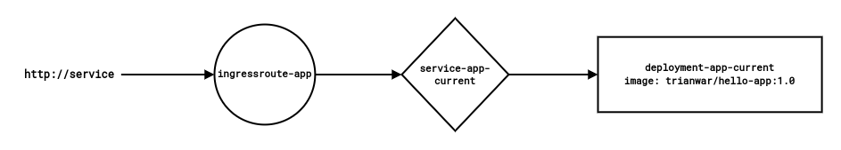
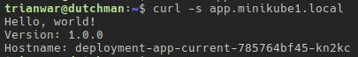
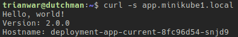
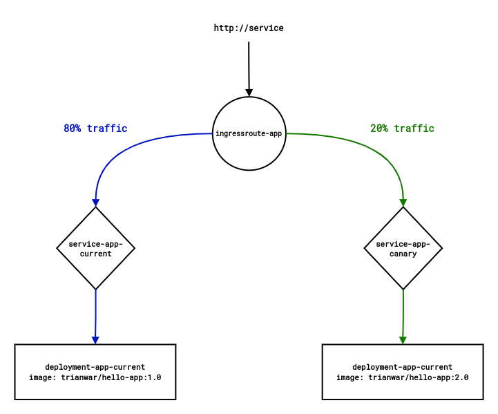
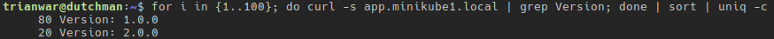
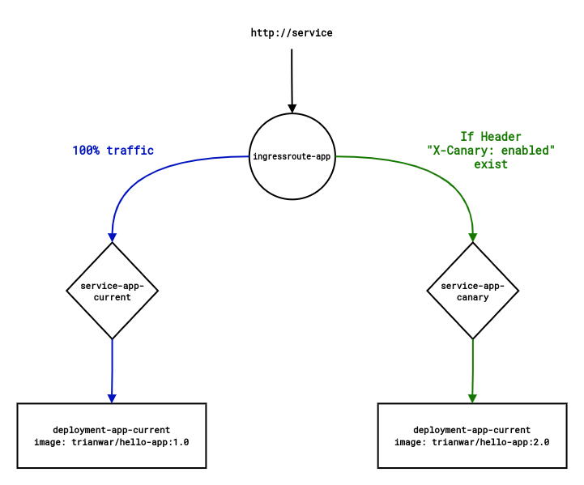
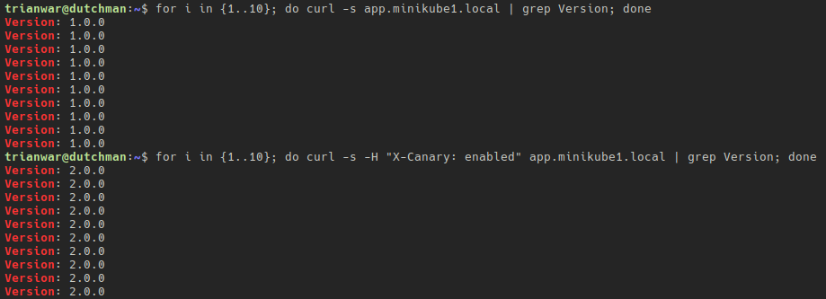
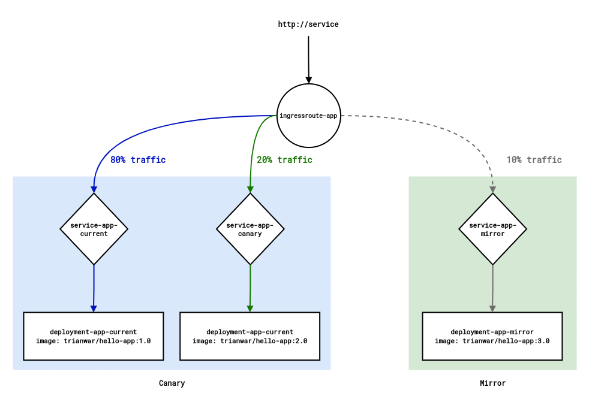
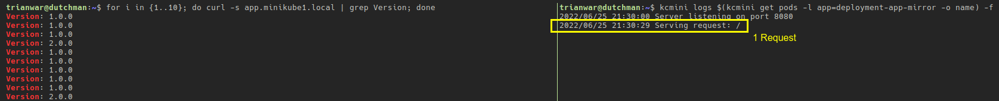

# Canary Deployment dan Mirroring Dengan Traefik


Saat kita melakukan deployment aplikasi ke versi terbaru pada Kubernetes, mungkin muncul kecemasan akan adanya insiden tak terduga walaupun versi terbaru sudah lolos tahap testing. Guna mengurangi kemungkinan insiden dalam skala besar, kita dapat memakai skenario bernama Canary. 

<!--more-->

## Canary Idiom
Frasa Canary dalam deployment aplikasi berasal dari sejarah penambang batu bara di awal abad 20. Pekerja tambang membawa burung kenari dalam sangkar ke terowongan bawah tanah, sehingga ketika muncul gas berbahaya seperti [karbon monoksida](https://id.wikipedia.org/wiki/Karbon_monoksida#Toksisitas) maka burung kenari akan mati dan menjadi peringatan bagi para pekerja untuk segera evakuasi.

### Kubernetes's Canary
Fitur canary pada Kubernetes biasanya tersedia jika kita menggunakan solusi _service mesh_. Namun sebenarnya canary dapat diimplementasikan tanpanya. Sebagai contohnya adalah menggunakan [Ingress Nginx](https://kubernetes.github.io/ingress-nginx/), [HAProxy Ingress](https://haproxy-ingress.github.io/), hingga [Traefik](https://traefik.io). Jika tertarik, silahkan cari [Kubernetes Ingress Controller](https://kubernetes.io/docs/concepts/services-networking/ingress-controllers/) lainnya yang mendukung fitur canary pada tabel [berikut](https://docs.google.com/spreadsheets/d/191WWNpjJ2za6-nbG4ZoUMXMpUK8KlCIosvQB0f-oq3k/edit?fbclid=IwAR2vaSsGgTKZWw4RaA-meycB8tnfcWf1vp1pC29TEsUm-EYad1r5oAI-HDM#gid=907731238).

## Traefik
Traefik adalah ~~Cloud Native Edge Router~~ salah satu _reverse proxy_ dan _load balancer_. Terlepas dari gimmick **cloud-native**, yang menjadikan Traefik berbeda dari Nginx, HAproxy, dan yang lain adalah tersedianya _configurability_ secara otomatis dan dinamis. Bagian paling menonjol darinya mungkin adalah kemampuan _automatic service discovery_. Jika kita menggunakan Traefik di atas Docker, Kubernetes, atau bahkan cara lama seperti sekedar VM dan _bare-metal_ untuk menjajakan service yang berjalan di dalamnya. Layaknya sulap, Traefik akan me-_expose_ service tersebut ke dunia luar. Tentu jika kita mengikuti dokumentasi dengan benar.


---

## Prerequisites
Untuk mempersingkat artikel ini, maka saya anggap beberapa hal ini sudah terpenuhi.
1. Kubernetes cluster telah tersedia.
2. Traefik sudah terpasang pada Kubernetes.
3. Pemahaman mengenai Ingress, Service, dan Deployment pada Kubernetes.

---
## Scenario

### Tanpa Canary

Pada contoh di atas, terlihat saya mempunyai sebuah service dengan aplikasi versi pertama yang anggaplah sudah mengudara dan menerima request dari user. Kurang lebih seperti inilah bagaimana service tersebut dapat berjalan.

```shell
kubectl create deployment deployment-app-current --image=trianwar/hello-app:1.0 -n default
kubectl expose deployment deployment-app-current --name service-app-current --type ClusterIP --port 8080 -n default

```

Selanjutnya kita buat sebuah `IngressRoute` dengan Traefik.

```yaml
apiVersion: traefik.containo.us/v1alpha1
kind: IngressRoute
metadata:
  name: ingressroute-app
spec:
  entryPoints:
  - web
  routes:
  - kind: Rule
    match: Host(`app.minikube1.local`)
    services:
    - name: service-app-current
      namespace: default
      port: 8080
```

Simpan misalnya dengan nama `ingressroute-app.yaml` dan terapkan konfigurasi di atas
```shell
kubectl create -f ingressroute-app.yam -n default
```

Jika dilakukan request dengan `curl` maka akan menjawab seperti berikut.

Dari sini mari kita berasumsi bahwa aplikasi kita telah menerima aliran trafik sepenuhnya. Lalu suatu ketika saya ingen melakukan merilis versi aplikasi kedua.
```shell
kubectl set image deployment/deployment-app-current hello-app=trianwar/hello-app:2.0
kubectl rollout restart deployment/deployment-app-current
```
Kita dapat melakukan rolling release ke versi terbaru tanpa canary, yang hasilnya tentu saja trafik akan sepenuhnya dialirkan ke satu-satunya rilis yang tersedia yaitu misalkan versi `2.0.0` seperti berikut.


 
Dari sini, lebih baiknya kita kembalikan `image tag` dari `deployment-app-current` ke versi `1.0.0` agar praktik selanjutnya sesuai dengan skenario.



### Weighted Canary
Alih - alih langsung mengganti rilis pertama ke versi terbaru sekaligus, di sini kita akan mendeploy aplikasi versi kedua sebagai rilisan baru. Dan selanjutnya kita manipulasi besaran traffic yang dialirkan.

Untuk menggunakan fitur canary kita perlu memisahkan rilis terbaru ke deployment dan service baru. Besar aliran trafik akan kita tentukan dengan pembobotan. Pada diagram di atas, terlihat bahwa 80% traffic akan diarahkan ke versi pertama, sisanya sebesar 20% diarahkan ke versi kedua.

```shell
kubectl create deployment deployment-app-canary --image=trianwar/hello-app:2.0 -n default
kubectl expose deployment deployment-app-canary --name service-app-canary --type ClusterIP --port 8080 -n default

```

Kemudian modifikasi file manifest `ingressroute-app.yaml` tadi menjadi seperti berikut.
```yaml
apiVersion: traefik.containo.us/v1alpha1
kind: IngressRoute
metadata:
  name: ingressroute-app
spec:
  entryPoints:
  - web
  routes:
  - kind: Rule
    match: Host(`app.minikube1.local`)
    services:
    - name: service-app-current
      namespace: default
      port: 8080
      weight: 80
    - name: service-app-canary
      namespace: default
      port: 8080
      weight: 20
```

Jangan lupa kita terapkan perubahannya.
```shell
kubectl appy -f ingressroute-app.yaml
```

Mari kita jalankan 100 request dengan menggunakan `curl` seperti berikut.
```shell
for i in {1..100}; do curl -s app.minikube1.local | grep Version; done | sort | uniq -c
```

Akan terhitung bahwa trafik sebanyak 80% dialirkan ke aplikasi versi pertama, dan sisanya 20% ke versi kedua.



### Canary by Header
Semisal yang kita inginkan adalah melakukan canary namun bukan untuk end-user langsung, melainkan untuk kebutuhan testing. Traefik juga mendukung manipulasi trafik berdasarkan _Request Header_ dengan menggunakan objek **Middleware**.



Contoh file manifest untuk membuat middleware adalah sebagai berikut, simpan dengan nama misalnya `middleware-app-canary.yaml`.
```yaml
apiVersion: traefik.containo.us/v1alpha1
kind: Middleware
metadata:
  name: middleware-app-canary
  namespace: webapp
spec:
  headers:
    customRequestHeaders:
      X-Canary: "enabled"
```

Kemudian modifikasi file `ingressroute-app.yaml` tadi menjadi seperti di bawah ini.
```yaml
apiVersion: traefik.containo.us/v1alpha1
kind: IngressRoute
metadata:
  name: ingressroute-app
spec:
  entryPoints:
  - web
  routes:
  - kind: Rule
    match: Host(`app.minikube1.local`)
    services:
    - name: service-app-current
      namespace: default
      port: 8080
  - kind: Rule
    match: Host(`app.minikube1.local`) && HeadersRegexp(`X-Canary`, `enabled`)
    services:
    - name: service-app-canary
      namespace: default
      port: 8080
```

Terapkan konfigurasi di atas pada Kubernetes.
```shell
kubectl apply -f middleware-app-canary.yaml -f ingressroute-app.yaml
```

Sekarang mari kita lakukan pengujian dengan melakukan 10 request tanpa header, dan 10 request lagi dengan menggunakan header.



### Mirroring
Sekenario lainnya yang disediakan adalah melakukan mirroring atau shadowing.



Selain dialirkan ke service - service canary tadi, Traefik juga dapat memanipulasi trafik yang lewat untuk menciptakan bayangannya, dan bayangan itu akan dialirkan ke service versi lain dengan persentase yang bisa ditentukan juga.

```shell
kubectl create deployment deployment-app-mirror --image=trianwar/hello-app:3.0 -n default
kubectl expose deployment deployment-app-mirror --name service-app-mirror --type ClusterIP --port 8080 -n default

```
Modifikasi file `ingressroute-app.yaml` yang telah dibuat sebelumnya.
```yaml
apiVersion: traefik.containo.us/v1alpha1
kind: IngressRoute
metadata:
  name: ingressroute-app
spec:
  entryPoints:
  - web
  routes:
  - kind: Rule
    match: Host(`app.minikube1.local`)
    services:
    - name: mirroring-app
      namespace: default
      kind: TraefikService

```
Untuk menerapkan mirroring, kita juga perlu membuat objek bertipe **TraefikService** (bukan kubernetes service, kali ini adalah [Custom Resource Definition](https://doc.traefik.io/traefik/v2.4/routing/providers/kubernetes-crd/#custom-resource-definition-crd) milik Traefik).
```yaml
apiVersion: traefik.containo.us/v1alpha1
kind: TraefikService
metadata:
  name: canary-app
  namespace: default
spec:
  weighted:
    services:
      - name: service-app-current
        port: 8080
        weight: 80
      - name: service-app-canary
        weight: 20
        port: 8080

---
apiVersion: traefik.containo.us/v1alpha1
kind: TraefikService
metadata:
  name: mirroring-app
  namespace: default
spec:
  mirroring:
    name: canary-app
    kind: TraefikService
    mirrors:
      - name: service-app-mirror
        percent: 10
        port: 8080

```
Simpan saja misalnya dengan nama `traefikservice-app.yaml` kemudian terapkan ke kubernetes.
```shell
kubectl apply -f ingressroute-app.yaml -f traefikservice-app.yaml
```
Lalu kita uji dengan melakukan 10 kali request.
```shell
for i in {1..10}; do curl -s app.minikube1.local | grep Version; done; kcmini logs $(kcmini get pods -l app=deployment-app-mirror -o name)
```

Akan terlihat bahwa rilis versi pertama menerima 8 request, sedangkan sisanya sebanyak 2 request ditangani oleh rilis versi kedua. Sementara itu, traffic sebanyak 10% atau dalam kasus ini setara 1 request dibuat bayangannya dan dialirkan ke rilis mirror.

Dengan mirroring service akan menerima bayangan request dari user, aplikasi akan melayaninya. Namun user tidak akan menerima balikan dari service mirror karena traffic yang mengalir hanyalah sebuah request bayangan.

---

## Advantages
Beberapa manfaat yang kita peroleh dari penerapan canary dan traffic mirroring adalah sebagai berikut:
1. Minimalisir resiko/insiden dari rilisan baru di environment production.
2. Reduksi _cost_ dan _effort_ karena tidak perlu membangun cluster lain untuk environment pre-production.
3. Mengalirkan sebagian kecil _realtime traffic_ ke rilisan baru untuk testing.
4. Mempercepat identifikasi terhadap Bug/Issue aplikasi.

---

## References
- [blog.scienceandindustrymuseum.org.uk/canary-resuscitator](https://blog.scienceandindustrymuseum.org.uk/canary-resuscitator/)
- [traefik.io/glossary/kubernetes-deployment-strategies-blue-green-canary](https://traefik.io/glossary/kubernetes-deployment-strategies-blue-green-canary/)
- [doc.traefik.io/traefik/v2.4/routing/providers/kubernetes-crd/#custom-resource-definition-crd](https://doc.traefik.io/traefik/v2.4/routing/providers/kubernetes-crd/#custom-resource-definition-crd)
- [doc.traefik.io/traefik/middlewares/http/headers](https://doc.traefik.io/traefik/middlewares/http/headers/)
- ["Kubernetes Ingress Controllers" List by learnk8s](https://docs.google.com/spreadsheets/d/191WWNpjJ2za6-nbG4ZoUMXMpUK8KlCIosvQB0f-oq3k/edit?fbclid=IwAR2vaSsGgTKZWw4RaA-meycB8tnfcWf1vp1pC29TEsUm-EYad1r5oAI-HDM#gid=907731238)

