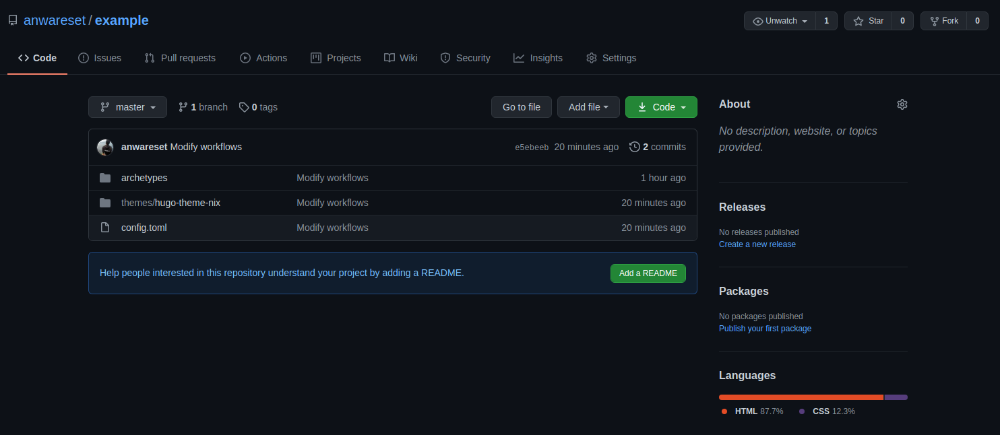
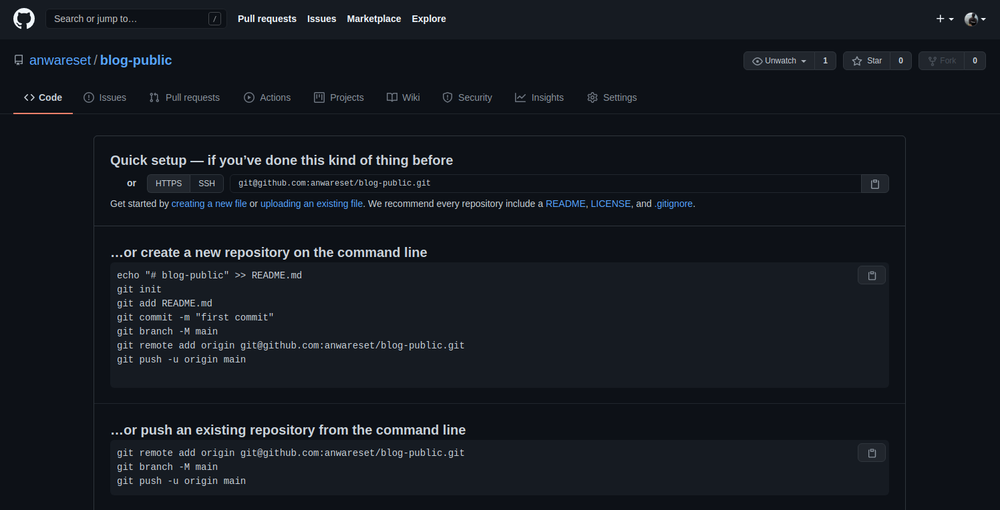
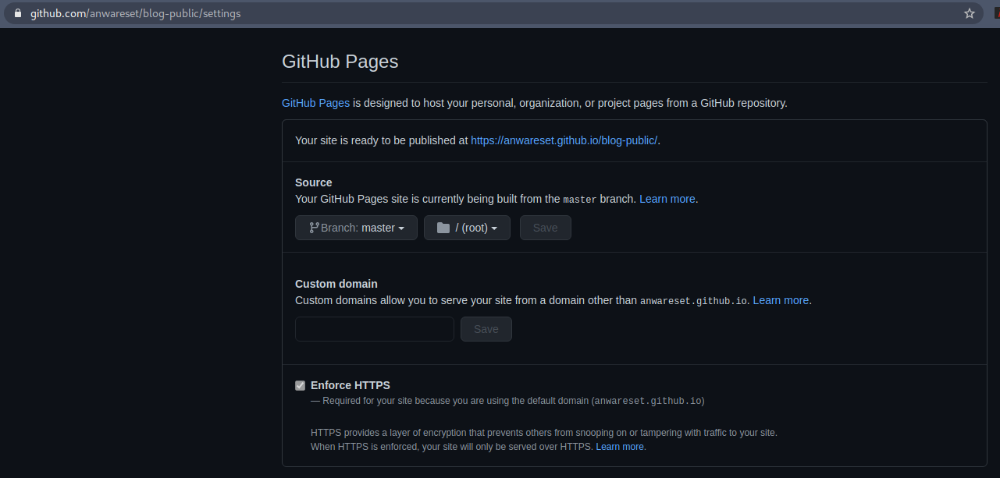
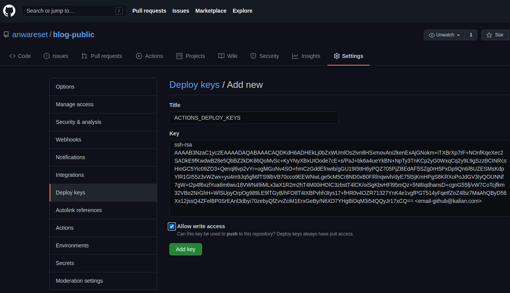
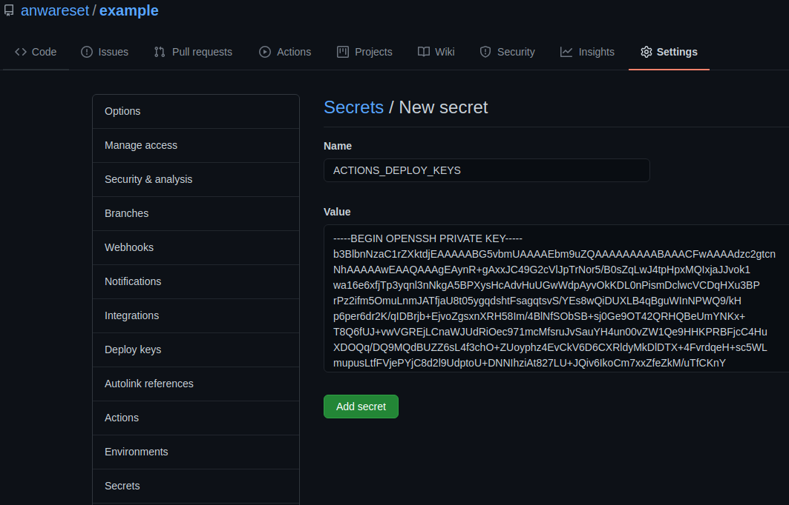
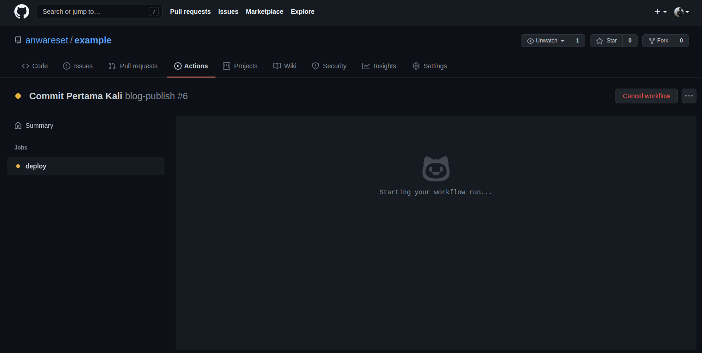
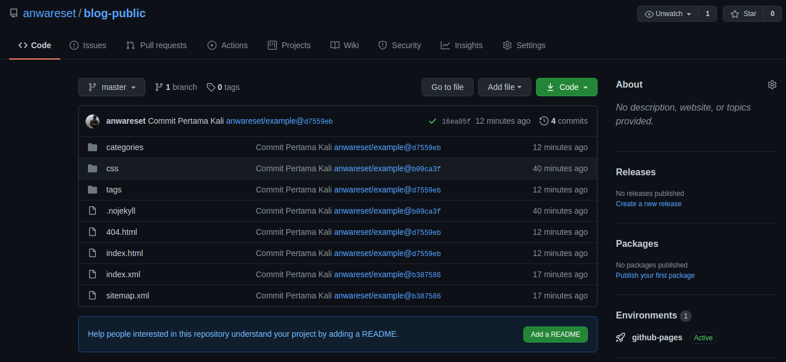
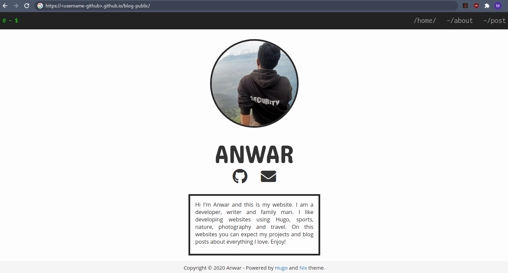

# Continuous Deployment Hugo dengan Github Actions


Hugo adalah static site generator untuk membangun situs web statis yang database-free. Karena Hugo berjalan tanpa koneksi basis data, maka dapat digunakanlah Github Pages sebagai hosting. Dalam meningkatkan efisiensi operasionalnya, Github Actions akan menjadi solusi continuous deployment.

<!--more-->

## Remote Repository
Anggap kita sudah memiliki sebuah project situs website Hugo bernama **example** dengan struktur direktori seperti di bawah. Lalu kita anggap bahwa project kita telah terintegrasi dengan remote repository di Github.

```cfg
example
├── archetypes
│   └── default.md
├── config.toml
├── content
│   └── posts
├── data
├── layouts
├── resources
│   └── _gen
│       ├── assets
│       └── images
├── static
└── themes
    └── hugo-theme-nix
        ├── archetypes
        │   └── default.md
        ├── exampleSite
        │   ├── config.toml
        │   ├── content
        │   │   ├── about.md
        │   │   └── post
        │   │       ├── creating-a-new-theme.md
        │   │       ├── goisforlovers.md
        │   │       ├── hugoisforlovers.md
        │   │       └── migrate-from-jekyll.md
        │   └── static
        │       ├── favicon.ico
        │       └── profile.jpg
        ├── i18n
        │   ├── en.yaml
        │   └── es.yaml
        ├── images
        │   ├── about.png
        │   ├── index.png
        │   ├── posts.png
        │   ├── screenshot.png
        │   └── tn.png
        ├── layouts
        │   ├── 404.html
        │   ├── _default
        │   │   ├── list.html
        │   │   └── single.html
        │   ├── index.html
        │   └── partials
        │       ├── footer.html
        │       ├── head-custom.html
        │       ├── header.html
        │       ├── head.html
        │       ├── pagination.html
        │       └── social.html
        ├── LICENSE.md
        ├── README.md
        ├── static
        │   └── css
        │       └── nix.css
        └── theme.toml
```

 
Artikel ini tidak membahas bagaimana caranya membuat sebuah situs Hugo. Silahkan membaca dokumentasi tentang Hugo yang lebih lengkap di [Hugo Documentation](https://gohugo.io/documentation/). 
 

Project dalam repository lokal perlu diintegrasikan dengan remote repository di Github.

Jika belum maka silahkan menjalankan perintah berikut untuk melakukan inisialisasi repository.
```bash
$ git init
```
Kemudian silahkan login akun Github dan [membuat sebuah repository baru](https://github.com/new), misalnya dengan nama **example**. Jika sudah, kembali ke terminal dan tambahkan remote repository baru dari Github dengan perintah berikut.
```bash
$ git remote add origin git@github.com:<username-github>/example.git
```

---

## Github Pages
Kita perlu membuat remote repository lain di Github, misalnya dengan nama **blog-public**. Nantinya repository baru tersebut akan menampung file-file hasil _generate_ Hugo secara otomatis dari repository **example**.



Kemudian masuk ke **Settings** pada repository tersebut, dan aktifkan _Source_ `master` pada bagian **GitHub Pages**



---

## Workflows
Kembali ke terminal, buat sebuah direktori baru di project kita dengan nama `.github` lalu di dalamnya buat lagi sebuah direktori bernama `workflows`
```bash
$ mkdir -p .github/workflows
```

Jika sudah, di dalamnya kita buat sebuah file, misalnya bernama `pages.yml` dan di dalam file tersebut akan kita gunakan sebagai konfigurasi _runner_ dari Github Actions.
```yaml
name: blog-publish

on:
  push:
    branches:
    - master

jobs:
  deploy:
    runs-on: ubuntu-latest
    steps:
    - uses: actions/checkout@v2
      with:
        submodules: false

    - name: Setup Hugo
      uses: peaceiris/actions-hugo@v2
      with:
        hugo-version: 'latest'
        extended: true

    - name: Build
      run: hugo --minify --environment production

    - name: Deploy
      uses: peaceiris/actions-gh-pages@v3
      with:
        external_repository: <username-github>/blog-public
        publish_branch: master
        publish_dir: ./public
        deploy_key: ${{ secrets.ACTIONS_DEPLOY_KEYS }}
        allow_empty_commit: false
        commit_message: ${{ github.event.head_commit.message }}
```

### Generate SSH Keys
SSH Keys diperlukan untuk memberikan akses kepada Github Actions dalam memodifikasi repository external.
```bash
$ ssh-keygen -t rsa -b 4096 -C "<email-github@kalian.com>" -f master
```
Nantinya akan ter-_generate_ 2 file yaitu
1. File `master` adalah private key
2. File `master.pub` adalah public key

### Deploy Keys
Salin _public keys_ `master.pub` ke dalam _clipboard_ dengan perintah seperti berikut
```bash
$ xclip -selection clipboard < master.pub
```
Silahkan buka halaman Settings pada repository **blog-public**, lalu pilih **Deploy keys**. Tambahkan public keys dengan nama **ACTIONS_DEPLOY_KEYS**.


### Secrets
Salin private keys `master` ke dalam _clipboard_ dengan perintah seperti berikut
```bash
$ xclip -selection clipboard < master
```
Buka halaman Settings pada repository **example**, lalu pilih **Secrets**. Tambahkan _secret_ baru dengan nama **ACTIONS_DEPLOY_KEYS**, berisi _private key_ yang baru saja kita salin.


---

## Pengujian
Semua perubahan telah dilakukan pada direktori project Hugo **example**, sekarang kita akan melakukan pengujian apakah dengan melakukan _push_ ke _remote repository_ akan memberikan efek ke repository **blog-public**.

### Tambahkan perubahan ke _staging_

Tambahkan seluruh file yang sudah ada di repository lokal menjadi berstatus _staging_.
```bash
$ git add .
```

### _Commit_
Sebelum melakukan _commit_ biasanya kita perlu melakukan konfigurasi _username_ dan _email_ akun Github kalian.
```bash
$ git config user.name "<username-github>"
$ git config user.email "<email-github@kalian.com>"
```

Lalu _commit_ semua file yang berada di dalam mode staging dengan perinah berikut.
```bash
$ git commit -m "Commit Pertama Kali"
```

### Push ke _remote_ repository
Jika sudah lakukan lakukan _push_ ke remote repository Github.
```bash
$ git push --set-upstream origin master
```

Untuk autentikasi git saat ingin melakukan _push_ dengan SSH silahkan baca dokumentasi [Github.](https://docs.github.com/en/free-pro-team@latest/github/authenticating-to-github/connecting-to-github-with-ssh)


Jika berhasil, maka seharusnya proses deployment melalui Github Actions akan langsung berjalan seperti berikut.


---

## Hasil
Berikut ini adalah hasil setelah melakukan _push_ dan proses _deployment_ pada Github Actions berjalan.



Terlihat bahwa Github Actions berhasil menjalankan _push_ secara otomatis ke repository eksternal **blog-public**. Dan hasil _build_ Hugo dapat kita buka pada Github Pages dengan URL berikut.

[https://\<username-github\>.github.io/blog-public](https://anwareset.github.io/blog-public/)



---

## Kesimpulan

Dengan penerapan CI/CD memakai Github Actions, proses penyuntingan dan berbagai hal operasional lain menjadi dipangkas. Tentu berkat implementasi konsep _automation_ semua menjadi lebih efisien. Beberapa keuntungan yang kita peroleh adalah sebagai berikut.
1. Tidak perlu melakukan _build_ secara manual.
2. Repository utama (**example**) dapat kita jadikan _private repository_.
3. Aktivitas _push_ hasil _build_ Hugo dilakukan secara otomatis, tiap kali ada perubahan.

---

## Referensi
* [gohugo.io/documentation](https://gohugo.io/documentation/)
* [docs.github.com/en/free-pro-team@latest/actions](https://docs.github.com/en/free-pro-team@latest/actions)
* [github.com/marketplace/actions/github-pages-action](https://github.com/marketplace/actions/github-pages-action)

