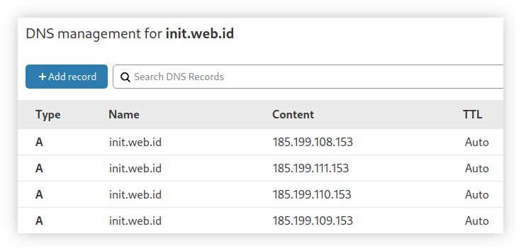

# Custom APEX Domain untuk Github Pages


APEX Domain sering juga disebut bare domain atau Top Level Domain (TLD), merupakan domain utama tanpa imbuhan yang dapat kita pasang pada Github Pages supaya alamat situs web tidak lagi menggunakan subdomain bawaan Github. Kustomisasi domain pada Github Pages cukup mudah, dan mampu memberikan kesan profesional pada situs web.

<!--more-->

## Memilih Provider

Anggaplah kita sudah memiliki sebuah project yang di-_host_ pada Github Pages, misalnya dalam artikel ini saya menggunakan remote repository dari blog [**init.web.id**](https://github.com/anwareset/blog).


Github Pages sebetulnya sudah menyediakan alamat domain bagi situs web Github Pages dengan menggunakan domain <_username_>_.github.io_ tanpa biaya. Namun kita juga dapat merubahnya sesuai keinginan kita, jika telah memiliki TLD sendiri. Saya memutuskan untuk menyewa domain **init.web.id** dan menggunakannya sebagai domain utama dari blog ini, untuk bahan belajar mencoba hal-hal baru.


Terdapat banyak sekali provider layanan sewa domain, dari yang berbayar hingga yang gratis. Karena sebelumnya saya sudah terbiasa berlangganan sewa _VPS (Virtual Private Server) MikroTik CHR_ pada **DewaBiz.com**, saya ingat bahwa provider tersebut juga menyediakan jasa penyewaan domain yang dilengkapi fitur _DNS Management_. Saya akhirnya menggunakan jasa _DewaBiz.com_ lagi, kali ini adalah untuk menyewa domain.
### Pemesanan Domain
Untuk melakukan pemesanan, kita cukup melakukan registrasi akun seperti pada umumnya. Kemudian mencari alamat domain yang ingin kita sewa, jika tersedia maka domain dapat kita pesan. Setelah melakukan pemesanan, maka lakukan pembayaran sesuai ketentuan yang berlaku pada masing-masing provider. Biasanya kita dapat melakukan transfer lewat ATM Bank, Internet Banking hingga lewat _E-Wallet_ seperti _LinkAja_, _GoPay_, atau _OVO_. Jangan lupa untuk melakukan konfirmasi kepada _customer service_ bahwa kalian telah melakukan pembayaran, dengan melampirkan bukti transaksi (biasanya berupa struk dari ATM atau screenshot jika dilakukan secara virtual) dan sebutkan juga nomor _invoice_ dari pemesanan.


---

## Konfigurasi GitHub Pages
Bagian pertama yang perlu dilakukan adalah melakukan beberapa konfigurasi dari sisi Github. Berikut ini adalah beberapa hal yang perlu kita lakukan pada repository Github.

### Membuat CNAME Record
Untuk melakukan _pointing_ domain, sebelumnya kita perlu membuat **`CNAME`** record di repository kita. Buat file baru dengan nama **CNAME** berisikan alamat _custom domain_ yang telah kita sewa, yaitu **`init.web.id`**. 

```bash
$ echo "init.web.id" > CNAME
```

Lakukan _commit_ dan upload perbahan tersebut ke remote repository Github.

```bash
$ git add CNAME
$ git commit -m "Add CNAME record"
$ git push
```

Sehingga direktori repository lokal kita menjadi seperti berikut.

```cfg
blog
├── about
├── categories
├── CNAME <--------- Tambahkan file ini
├── css
├── favicon.ico
├── index.html
├── js
├── lib
├── page
├── posts
├── README.md
├── svg
└── tags
```

### Repository Settings
Masuk ke halaman **Settings** dari repository Github kita untuk melakukan konfigurasi pada repository. 


Lalu _scroll_ ke bawah sampai bagian **Github Pages**, silahkan isi kolom tersebut dengan _custom domain_ yang telah kita sewa.


---

## DNS Management
Sekarang kita menuju pada situs provider tempat kita menyewa domain (atau disebut _registrar_). Misalnya di sini saya menggunakan jasa dari _DewaBiz.com_, maka saya perlu _login_ ke dalam _member area_ lalu masuk ke menu _DNS Management_. Tambahkan beberapa record seperti berikut.



### Pengujian DNS Record
Untuk melakukan pengujian, kita dapat menggunakan _tools_ bernama `dig`. Jalankan perintah berikut pada terminal.

```bash
$ dig init.web.id +noall +answer
```

Jika record DNS berhasil diterapkan, maka akan muncul output seperti berikut.

```cfg
> init.web.id     3600    IN A     185.199.108.153
> init.web.id     3600    IN A     185.199.109.153
> init.web.id     3600    IN A     185.199.110.153
> init.web.id     3600    IN A     185.199.111.153
```


Setelah melakukan semua konfigurasi di atas, pada umumnya akan membutuhkan beberapa waktu sekitar 15 menit hingga record DNS berhasil diterapkan. Jika lebih dari 15 menit tetap tidak berhasil, maka lakukan _clear cache_ pada _web browser_. Namun jika tetap tidak bisa, maka ada konfigurasi yang masih belum tepat.


---

## HTTPS Enforcement
Github Pages menyediakan HTTPS gratis menggunakan **Let's Encrypt** untuk meningkatkan keamanan situs web. Jika kita mengaktifkan fitur _Enforce HTTPS_, maka seluruh _traffic_ akan di-_rewrite_ menuju protokol HTTPS.

### Mengaktifkan Enforce HTTPS
Masuk ke [Github Settings](#repository-settings) lalu centang **_Enforce HTTPS_**



Untuk mengaktifkan _Enforce HTTPS_ biasanya kita perlu menunggu beberapa waktu, karena Github Pages sedang melakukan tahap verifikasi dan _generate_ sertifikat SSL.


### Pengujian Enforce HTTPS
Buka domain yang sudah kita _pointing_ menggunakan _web browser_. Jika berhasil, maka akan muncul tampilan seperti berikut.


---

## Kesimpulan
Dengan menggunakan _custom domain_, maka situs web yang kita terbitkan akan terkesan lebih profesional (setidaknya ada _effort_ lebih dalam membangunnya). Terdapat banyak provider layanan sewa domain yang ada di internet, tidak hanya _DewaBiz.com_, sesuaikan dengan kebutuhan kita. Selain menggunakan APEX domain / TLD, kita juga dapat menggunakan _custom sub-domain_ seperti `blog.<domain>.com` dengan konfigurasi yang relatif sama saja seperti di atas.

---

## Referensi
* [docs.github.com/en/free-pro-team@latest/github/working-with-github-pages/configuring-a-custom-domain-for-your-github-pages-site](https://docs.github.com/en/free-pro-team@latest/github/working-with-github-pages/configuring-a-custom-domain-for-your-github-pages-site)
* [wiki.archlinux.org/index.php/Domain_name_resolution#Lookup_utilities](https://wiki.archlinux.org/index.php/Domain_name_resolution#Lookup_utilities)

