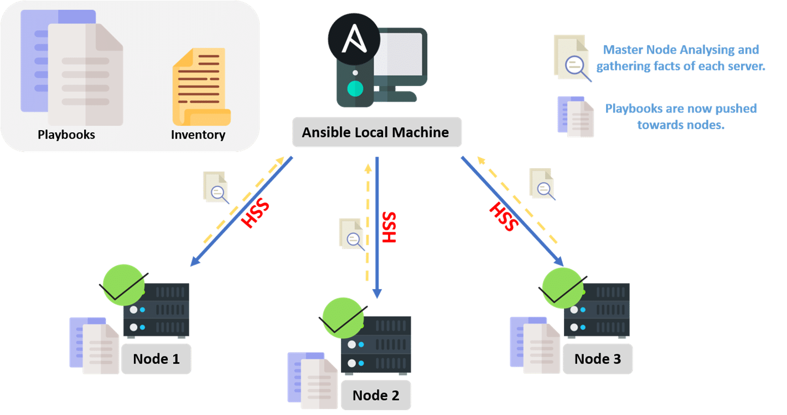
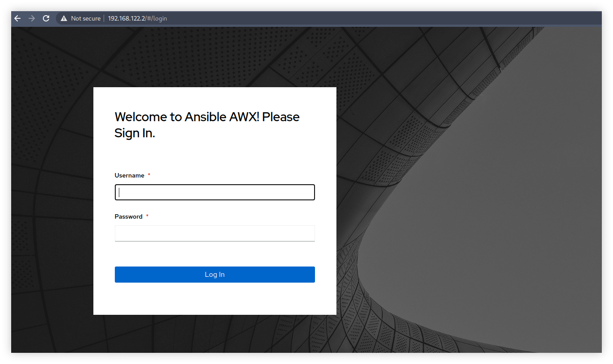
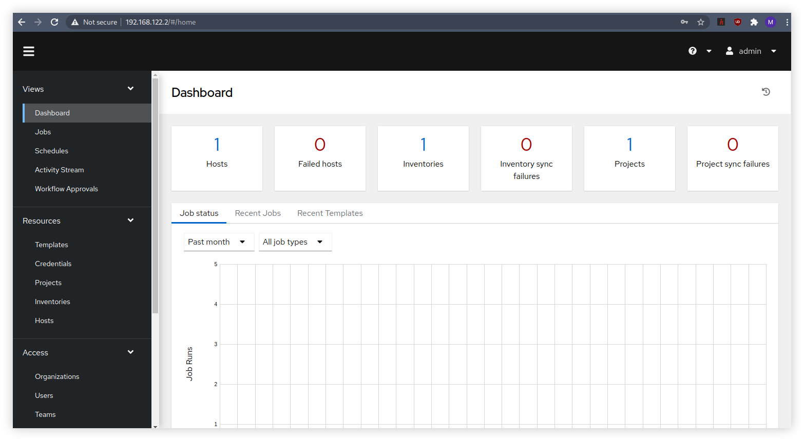

# Deploy Ansible AWX di CentOS


AWX adalah perangkat lunak berbasis web yang digunakan sebagai _user interface_ dan penyedia REST API untuk engine Ansible. AWX merupakan versi _upstream_ dari Ansible Tower, sama seperti biasanya Red Hat selalu mewujudkan representatif layanan berbayarnya dengan project - project open source sebagai _development version_. Jika Ansible Tower membutuhkan biaya untuk subscription, maka AWX sama sekali tidak dipungut biaya.

<!--more-->

## Ansible

**Ansible** adalah perangkat lunak _open source_ yang digunakan untuk melakukan _software provisioning_, _configuration management_, dan _application deployment_ terhadap infrastruktur. Sederhananya, Ansible merupakan bentuk dari IaaC (_Infrastructure as a Code_), yang pakai untuk melakukan konfigurasi infrastruktur secara otomatis. Dalam pengoperasiannya, sering kali digunakan sebuah _markup script_ YAML yang disebut sebagai Playbook atau dapat juga langsung dieksekusi sebagai Ad-Hoc saja. Semua hal tersebut pada umumnya dilakukan dalam perintah berbasis teks (CLI). Ansible juga terkenal karena _agentless_, artinya kita tidak perlu melakukan instalasi _agent_ atau program apapun di perangkat infrastruktur yang akan dikelola. Untuk informasi lebih lanjut terkait Ansible silahkan baca di [**docs.ansible.com**](https://docs.ansible.com/ansible/latest/user_guide/intro_getting_started.html).

### Contoh Kasus
Sebagai contoh misalkan kita memiliki tugas untuk mengganti nameserver menjadi `8.8.8.8` pada puluhan hingga ratusan server. Pada proses tradisional, kita akan melakukan login (misalnya melalui SSH) kemudian memanipulasi file `/etc/resolv.conf` pada masing - masing server, tentu saja mengulang-ulang tugas yang sama adalah hal membosankan. Mungkin kita bisa berusaha membuat sebuah shell script (misalnya `bash`) yang dijalankan sebagai program untuk melakukan itu semua, tapi tidak semua orang mau melakukan _effort_ tersebut. Maka kita dapat menggunakan Ansible sebagai solusi, cukup install Ansible pada _Control Node_ yang dapat terkoneksi dengan list server. Kemudian memasukkan seluruh list hostname atau alamat IP server ke dalam file _inventory_, dan menjalankan Ansible Ad-Hoc berisi instruksi perintah untuk mengganti isi file `/etc/resolv.conf` lalu masalah terselesaikan. Sedangkan untuk tugas yang lebih rumit kita dapat menulisnya ke dalam script YAML untuk kemudian dieksekusi dengan Ansible Playbook.


---

## Prerequisites
Sebelum melanjutkan lebih jauh, pastikan sudah memenuhi beberapa prasyarat berikut.
### System Requirements
Untuk mendapatkan performa yang baik saat pertama kali melakukan deployment, setidaknya dibutuhkan spesifikasi seperti berikut.
- 4 GB Memory
- 2 Core CPU
- 20 GB Storage

Saya akan menggunakan VM Guest CentOS 8 sebagai Control Node. Namun jika ingin menggunakan CentOS 7 setidaknya gunakan CentOS 7.7 atau versi lebih baru.

Dalam artikel ini saya akan mengeksekusi seluruh perintah dengan menggunakan user `root`.


### Disable SELinux
Untuk sementara saya merubah SELinux menjadi `permissive` agar proses deployment berjalan lancar.
```bash
sed -i 's/^SELINUX=.*/SELINUX=permissive/g' /etc/selinux/config
setenforce permissive
```

### EPEL dan Extra Packages
Jalankan perintah berikut ini.
```bash
dnf install https://dl.fedoraproject.org/pub/epel/epel-release-latest-8.noarch.rpm
```

### Instalasi Ansible
Kita membutuhkan Ansible Engine versi 2.8 atau lebih baru. Jalankan perintah berikut ini.
```bash
dnf install ansible
```

### Paket Tambahan
Jalankan perintah berikut ini untuk memasang beberapa paket tambahan.
```bash
dnf install git python3-pip curl \
    wget nodejs gettext lvm2 \
    device-mapper-persistent-data bzip2
```

### Development Tools
AWX membutuhkan beberapa paket lain dari group Development Tools untuk GNU Make.
```bash
dnf group install "Development Tools"
```

### Docker dan Docker Compose
Karena AWX akan dijalankan di container, _by-default_ AWX menyarankan untuk memakai Docker CE.
```bash
dnf config-manager \
    --add-repo \
    https://download.docker.com/linux/centos/docker-ce.repo
dnf install docker-ce docker-ce-cli containerd.io
systemctl enable --now docker
```

Lalu pasang `docker-compose` menggunakan `pip3`.
```bash
pip3 install docker-compose
```


Jika menggunakan tidak menggunakan user `root` maka tambahkan user tersebut ke dalam group `docker` kemudian logout dan login kembali. Menambahkan user ke dalam suatu grup dapat dilakukan dengan perintah `sudo usermod -aG docker user`


---

## Deploy AWX
### Clone Repository
Periksa terlebih dahulu release yang tersedia dari remote repository AWX pada halaman [releases](https://github.com/ansible/awx/releases). Kemudian jalankan clone dengan perintah berikut.
```bash
git clone -b x.y.z https://github.com/ansible/awx.git
```

Untuk `x.y.z` adalah versi yang akan digunakan. Misalnya pada halaman **release** terdapat versi **17.0.1** maka jalankan dengan `git clone -b 17.0.1 https://github.com/ansible/awx.git`. Melakukan clone tanpa definisi versi branch akan diarahkan langsung menuju branch `HEAD` yang berisi versi development, hal tersebut tidak disarankan karena sangat tidak stabil.


### Generate Secret Key
Biasanya AWX membutuhkan Secret Key, kita dapat membuatnya menggunakan `openssl` yang sudah tersedia di CentOS 8.
```bash
openssl rand -hex 32
```
Catat output yang dihasilkan dari perintah diatas.

### Edit Inventory
Buka file inventory yang terdapat dalam direktori instaler AWX misalnya menggunakan `vi`.
```bash
cd awx/installer
vi inventory
```
Cari dan edit beberapa baris yang ada seperti berikut.
```cfg
secret_key=<SECRET_KEY>
admin_password=<PASSWORD_AWX>
project_data_dir=/var/lib/awx/projects
awx_official=true
awx_alternate_dns_servers="8.8.8.8,8.8.4.4"
```

Ganti `SECRET_KEY` dengan output yang tadi dihasilkan oleh `openssl`, dan ganti `PASSWORD_AWX` dengan password untuk login ke dalam user interface.


### Membuat Direktori Project
Karena kita mengaktifkan variabel `project_data_dir` maka kita perlu membuat direktorinya juga.
```bash
mkdir -p /var/lib/awx/projects
```
Direktori tersebut nantinya akan berisi project yang akan kita gunakan dalam AWX.

### Konfigurasi Firewall
Supaya AWX dapat diakses dari luar VM maka kita perlu melakukan beberapa konfigurasi firewall.
```bash
firewall-cmd --zone=public --add-masquerade --permanent
firewall-cmd --add-service=http --add-service=https --permanent
firewall-cmd --reload
```

### Deployment
Eksekusi file YAML bernama `install.yml` menggunakan `ansible-playbook`.
```bash
ansible-playbook -i inventory install.yml
```
Proses akan memakan waktu cukup lama hingga akhirnya selesai. Apabila tidak ada kendala maka akan muncul tampilan seperti berikut.
```cfg
PLAY RECAP ****************************************************************************************
localhost   : ok=21   changed=8    unreachable=0    failed=0    skipped=73   rescued=0    ignored=1   
```

---

## Pengujian
Periksa apakah ada container yang berjalan.
```bash
docker ps
```
Jika berhasil maka akan ada 4 container yang dalam status `Up`.
```cfg
003389b920b6   ansible/awx:17.0.1   "/usr/bin/tini -- /u…"   7 minutes ago   Up 7 minutes   8052/tcp               awx_task
42d2ff79f8e1   ansible/awx:17.0.1   "/usr/bin/tini -- /b…"   7 minutes ago   Up 7 minutes   0.0.0.0:80->8052/tcp   awx_web
3e73bd538074   postgres:12          "docker-entrypoint.s…"   7 minutes ago   Up 7 minutes   5432/tcp               awx_postgres
94ee8bb7949b   redis                "docker-entrypoint.s…"   7 minutes ago   Up 7 minutes   6379/tcp               awx_redis
```
Sekarang coba buka user interface AWX di Web Browser menggunakan alamat IP milik VM. Jika berhasil kita dapat melakukan login memakai username dan password yang sebelumnya telah kita isi pada file `inventory`.



---

## Kesimpulan
Berdasarkan FAQ (Frequently Asked Questions) dikatakan bahwa AWX sangat tidak dianjurkan untuk dipakai di production, namun jika untuk sekedar mempelajari fitur-fitur yang ada saya rasa AWX sudah cukup. Jika sudah terbiasa mengoperasikan AWX, kita bisa saja beralih untuk berlangganan Ansible Tower di production environment. Selama saya mencoba melakukan deployment AWX, saya melihat banyak sekali _issue_ masih dalam status _Open_ di repositori Github milik AWX.

---

## Referensi
- [docs.ansible.com/ansible/latest/user_guide/intro_getting_started.html](https://docs.ansible.com/ansible/latest/user_guide/intro_getting_started.html)
- [github.com/ansible/awx/](https://github.com/ansible/awx/)
- [www.ansible.com/overview/how-ansible-works](https://www.ansible.com/overview/how-ansible-works)
- [www.ansible.com/community/awx-project](https://www.ansible.com/community/awx-project)
- [www.ansible.com/products/awx-project/faq](https://www.ansible.com/products/awx-project/faq)
- [www.redhat.com/en/resources/awx-and-ansible-tower-datasheet](https://www.redhat.com/en/resources/awx-and-ansible-tower-datasheet)

