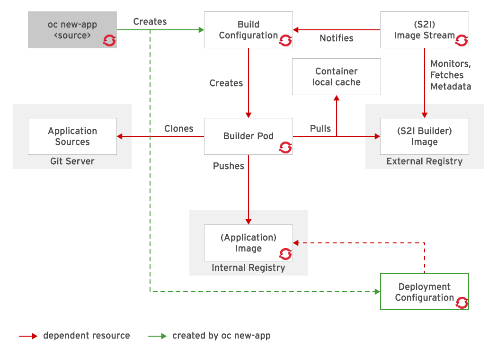
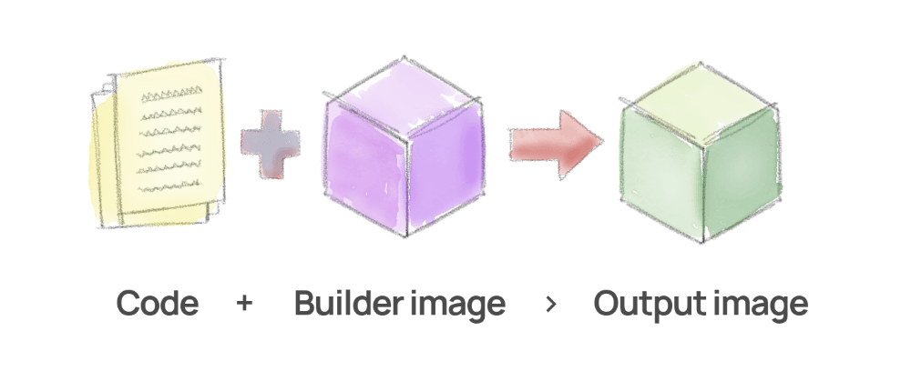
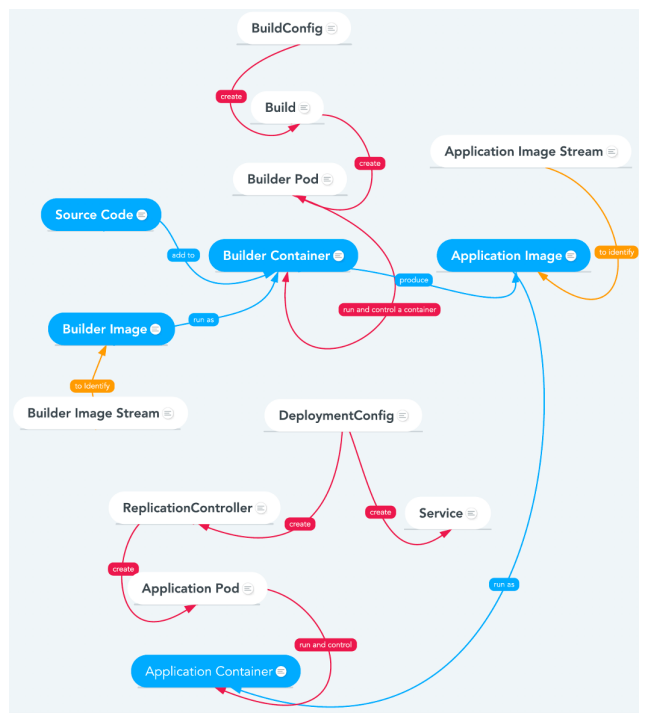

# Deployment dengan S2I Process OpenShift


S2I atau Source to Image adalah sebuah tool untuk mempermudah membangun container images dari source code. Tool ini mengambil source code aplikasi dari repositori Git, melakukan injeksi source code ke dalam _base container_ berdasarkan bahasa pemrograman dan framework tertentu, kemudian memproduksi sebuah container image baru, lalu container image tersebut akan dipakai untuk menjalankan aplikasi yang telah dirakit.

<!--more-->



## Image Stream
OpenShift mendeploy aplikasi versi baru ke dalam pod secara cepat. _Base Image_ (S2I buider image) dibutuhkan untuk membuat aplikasi dengan update terbaru, jika ada perubahan pada source code. Ketika komponen source code aplikasi mengalami perubahan, OpenShift akan menciptakan container image baru. Pod yang telah dibuat dengan container image lama akan digantikan dengan pod yang menggunakan image baru.

Resource **Image Stream** merupakan konfigurasi yang menamai container image secara spesifik yang berkaitan dengan tag _image stream_. OpenShift membangun aplikasi berdasarkan image stream. OpenShift installer telah menyediakan beberapa image stream secara default sejak awal. Untuk menemukan image stream yang tersedia, gunakan perintah `oc get` seperti berikut.

```config
$ oc get is -n openshift

NAME           IMAGE REPOSITORY                      TAGS
dotnet         ...svc:5000/openshift/dotnet          2.0,2.1,latest
nodejs         ...svc:5000/openshift/nodejs          0.10,10,11,4,6,8,latest
perl           ...svc:5000/openshift/perl            5.16,5.20,5.24,5.26,latest
php            ...svc:5000/openshift/php             5.5,5.6,7.0,7.1,latest
python         ...svc:5000/openshift/python          2.7,3.3,3.4,3.5,3.6,latest
ruby           ...svc:5000/openshift/ruby            2.0,2.2,2.3,2.4,2.5,latest
```

OpenShift juga mendeteksi jika image stream berubah dan akan melakukan reaksi berdasarkan perubahan tersebut. Jika sebuah _security issue_ muncul, misalnya (CVE) pada image bernama `nodejs-010-rhel7`, maka OpenShift akan melakukan update secara otomatis.

---

## Build S2I
Membangun sebuah aplikasi menggunakan S2I dapat dilakukan melalui OpenShift CLI maupun OpenShift Web Console. Dalam artikel ini, saya ingin melakukannya melalui CLI.



### Via CLI

Untuk membuat application di dalam project dengan proses S2I kita memakai perintah `oc new-app` sseperti berikut.

```shell
oc new-app --as-deployment-config php~http://my.git.server.com/my-app --name=myapp
```

Argumen `php` di atas dipakai untuk mendefinisikan image stream mana yang akan digunakan, diikuti oleh karakter `~`. Lalu diteruskan dengan lokasi repositori Git `my.git.server.com/my-app`. Selain menggunakan karakter `~` kita dapat menuliskannya menggunakan opsi `-i` seperti berikut.

```shell
oc new-app --as-deployment-config -i php http://services.lab.example.com/app --name=myapp
```

### Repositori Lokal

Jika kita tidak mendefinisikan image stream, maka OpenShift akan mencoba untuk melakukan identifikasi otomatis terhadap source code guna menemukan image stream yang tepat. Command `oc new-app` juga dapat dilakukan ketika kita menggunakan repositori Git lokal. Misalnya jika kita sudah berapa di direktori repositori Git lokal, maka dapat kita jalankan perintah berikut.

```shell
oc new-app --as-deployment-config .
```

Jika menggunakan repositori Git lokal, maka repositori tersebut harus memiliki konfigurasi _remote origin_ yang mengarah ke sebuah URL. Dan URL tersebut harus dapat diakses dari klaster OpenShift.



### Subdirektori

Kita juga dapat menjalankan aplikasi menggunakan subdirektori pada repositori Git seperti berikut.

```shell
oc new-app --as-deployment-config \
  https://github.com/openshift/sti-ruby.git \
  --context-dir=2.0/test/puma-test-app
```

### Branch

Dan tentu saja S2I dapat kita lakukan pada branch atau cabang tertentu dari repositori Git, seperti berikut.

```shell
oc new-app --as-deployment-config \
  https://github.com/openshift/ruby-hello-world.git#beta4
```

---

## Deteksi Otomatis

Seperti yang sebelumnya saya tulis di atas, jika kita tidak mendefinisikan image stream maka OpenShift akan secara otomatis melakukan deteksi secara otomatis. Deteksi tersebut dilakukan berdasarkan beberapa file yang terdapat dalam repositori.

**Bahasa Pemrograman**|**File**
:-----:|:-----:
Ruby|Rakefile Gemfile, config.ru
Java EE|pom.xml
Node.js|app.json package.json
PHP|index.php composer.json
Python|requirements.txt config.py
Perl|index.pl cpanfile

Setelah bahasa pemrograman terdeteksi, OpenShift akan mencari tag image stream yang mendukung, atau yang sesuai dengan nama dari bahasa pemrograman tersebut.

---

## Generate Resource Definition File

Untuk membuat sebuah file definisi resource (jika dibutuhkan) kita dapat menggunakan parameter `-o` kemudian diikuti dengan format yang diinginkan, misalnya `yaml` atau `json`.

```shell
oc -o json new-app --as-deployment-config \
 php~http://services.lab.example.com/app \
 --name=myapp > s2i.json
```

Dan kita akan mendapatkan file bernama `s2i.json` berisi seperti berikut.

### Image Stream Definition

```json
...
{
    "kind": "ImageStream",
    "apiVersion": "image.openshift.io/v1",
    "metadata": {
        "name": "myapp",
        "creationTimestamp": null
        "labels": {
                    "app": "myapp"
                },
                "annotations": {
                    "openshift.io/generated-by": "OpenShiftNewApp"
                }
    },
    "spec": {
        "lookupPolicy": {
            "local": false
        }
    },
    "status": {
        "dockerImageRepository": ""
    }
},
...
```

Dapat kita lihat bahwa terdapat pendefinisian resource `"kind": "ImageStream"` dan resource tersebut akan memakai nama yang sama dengan parameter `--name`.

### Build Configuration Definition

```json
...
{
    "kind": "BuildConfig",
    "apiVersion": "build.openshift.io/v1",
    "metadata": {
        "name": "myapp",
        "creationTimestamp": null,
        "labels": {
            "app": "myapp"
        },
        "annotations": {
            "openshift.io/generated-by": "OpenShiftNewApp"
        }
    },
    "spec": {
        "triggers": [
            {
                "type": "GitHub",
                "github": {
                    "secret": "S5_4BZpPabM6KrIuPBvI"
                }
            },
            {
                "type": "Generic",
                "generic": {
                    "secret": "3q8K8JNDoRzhjoz1KgMz"
                }
            },
            {
                "type": "ConfigChange"
            },
            {
                "type": "ImageChange",
                "imageChange": {}
            }
        ],
        "source": {
            "type": "Git",
            "git": {
                "uri": "http://services.lab.example.com/app"
            }
        },
        "strategy": {
            "type": "Source",
            "sourceStrategy": {
                "from": {
                    "kind": "ImageStreamTag",
                    "namespace": "openshift",
                    "name": "php:7.3"
                }
            }
        },
        "output": {
            "to": {
                "kind": "ImageStreamTag",
                "name": "myapp:latest"
            }
        },
        "resources": {},
        "postCommit": {},
        "nodeSelector": null
    },
    "status": {
        "lastVersion": 0
    }
},
...
```

Di dalam file tersebut kita juga akan mendapati resource `"kind": "BuildConfig"`. Build config atau `bc` bertanggung jawab untuk mendefinisikan parameter input dan _trigger_ yang akan dieksekusi untuk merubah source code menjadi container image.

### Deployment Configuration Definition

```json
...
{
    "kind": "DeploymentConfig",
    "apiVersion": "apps.openshift.io/v1",
    "metadata": {
        "name": "myapp",
        "creationTimestamp": null,
        "labels": {
            "app": "myapp"
        },
        "annotations": {
            "openshift.io/generated-by": "OpenShiftNewApp"
        }
    },
    "spec": {
        "strategy": {
            "resources": {}
        },
        "triggers": [
            {
                "type": "ConfigChange"
            },
            {
                "type": "ImageChange",
                "imageChangeParams": {
                    "automatic": true,
                    "containerNames": [
                        "myapp"
                    ],
                    "from": {
                        "kind": "ImageStreamTag",
                        "name": "myapp:latest"
                    }
                }
            }
        ],
        "replicas": 1,
        "test": false,
        "selector": {
            "app": "myapp",
            "deploymentconfig": "myapp"
        },
        "template": {
            "metadata": {
                "creationTimestamp": null,
                "labels": {
                    "app": "myapp",
                    "deploymentconfig": "myapp"
                },
                "annotations": {
                    "openshift.io/generated-by": "OpenShiftNewApp"
                }
            },
            "spec": {
                "containers": [
                    {
                        "name": "myapp",
                        "image": "myapp:latest",
                        "ports": [
                            {
                                "containerPort": 8080,
                                "protocol": "TCP"
                            },
                            {
                                "containerPort": 8443,
                                "protocol": "TCP"
                            }
                        ],
                        "resources": {}
                    }
                ]
            }
        }
    },
    "status": {
        "latestVersion": 0,
        "observedGeneration": 0,
        "replicas": 0,
        "updatedReplicas": 0,
        "availableReplicas": 0,
        "unavailableReplicas": 0
    }
},
...
```

Resource selanjutnya adalah Deployment Configuration atau `dc` yang bertanggung jawab untuk melakukan preferensi proses deployment di OpenShift. Di dalamnya dapat berisi parameter dan _trigger_ yang diperlukan untuk membuat container, dan diterjemahkan menjadi _replication controller_. Beberapa manfaat yang disediakan oleh objek `DeploymentConfig` adalah sebagai berikut.
- Dapat dilakukannya kustomisasi strategi terhadap deployment.
- Dapat digunakan untuk Rollback ke deployment sebelumnya.
- Dapat dipakai untuk _scaling_ replikasi secara manual.

### Service Definition

```json
...
{
    "kind": "Service",
    "apiVersion": "v1",
    "metadata": {
        "name": "myapp",
        "creationTimestamp": null,
        "labels": {
            "app": "myapp"
        },
        "annotations": {
            "openshift.io/generated-by": "OpenShiftNewApp"
        }
    },
    "spec": {
        "ports": [
            {
                "name": "8080-tcp",
                "protocol": "TCP",
                "port": 8080,
                "targetPort": 8080
            },
            {
                "name": "8443-tcp",
                "protocol": "TCP",
                "port": 8443,
                "targetPort": 8443
            }
        ],
        "selector": {
            "app": "myapp",
            "deploymentconfig": "myapp"
        }
    },
    "status": {
        "loadBalancer": {}
    }
}
```

Terakhir kita akan mendapati resource _Service_ atau `svc` yang berfungsi untuk menghubungkan setiap container yang ada di dalam klaster.


Command `oc new-app` secara default tidak akan membuat resource `route`. Route berfungsi untuk melakukan _ingress_ traffic dari luar klaster supaya dapat mengakses aplikasi. Jika kita menggunakan OpenShift Web Console, maka `route` akan dibuat secara otomatis menggunakan template yang telah tersedia.


---

## Memeriksa Deployment

Setelah membuat application seperti di atas, proses build akan dijalankan. Gunakan command `oc get builds` untuk melihat daftar build aplikasi.

```config
$ oc get builds
NAME               TYPE     FROM          STATUS    STARTED          DURATION
php-helloworld-1   Source   Git@9e17db8   Running   13 seconds ago
```

Kita dapat melihat log dari build menggunakan perintah berikut.

```shell
oc logs build/myapp-1
```


Jika status build belum menampilkan `Running`, atau OpenShift belum mendeploy pod `s2i-build` maka output berupa error akan muncul dari log.


---

## Trigger Build

Kita dapat me-trigger build baru berdasarkan `bc` (Build Config) yang tersedia dengan perintah berikut.

### Melihat BuildConfig

```config
$ oc get buildconfig
NAME           TYPE      FROM      LATEST
myapp          Source    Git       1
```

### Menjalankan Build

```config
$ oc start-build myapp
build "myapp-2" started
```

---

## Kesimpulan



Pod `BuildConfig` dipakai untuk membuat image dalam OpenShift dan melakukan _push_ ke container registry internal. Setiap konten atau source code yang mengalami perubahan biasanya membutuhkan build baru untuk menjamin supaya image terupdate. Pod `DeploymentConfig` digunakan untuk mendeploy pod dalam OpenShift. Hasilnya adalah deployment pod dengan image dari container registry internal. Setiap pod yang sebelumnya telah ada akan di-destroy, tergantung dari bagaimana resource `DeploymentConfig` dibuat. `BuildConfig` dan `DeploymentConfig` tidak berinteraksi secara langsung. `BuildConfig` membuat atau mengupdate container image, sedangkan `DeploymentConfig` akan bereaksi kepada image baru tersebut dan kemudian membuat pod baru darinya.

---

## Referensi
- [access.redhat.com/documentation/en-us/openshift_container_platform/4.5/html-single/builds/build-strategies#build-strategy-s2i_build-strategies](https://access.redhat.com/documentation/en-us/openshift_container_platform/4.5/html-single/builds/build-strategies#build-strategy-s2i_build-strategies)
- [github.com/openshift/source-to-image](https://github.com/openshift/source-to-image)
- [www.youtube.com/watch?v=flI6zx9wH6M](https://www.youtube.com/watch?v=flI6zx9wH6M)

