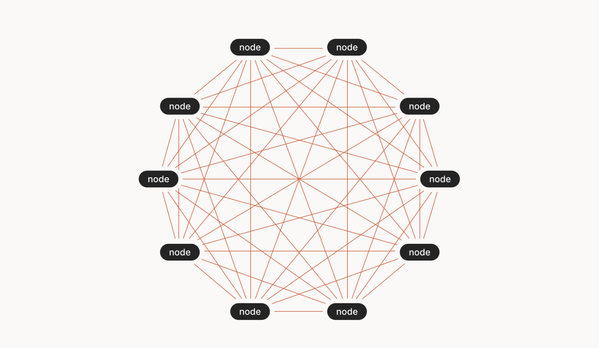
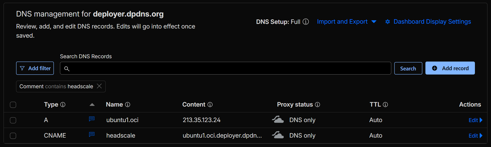
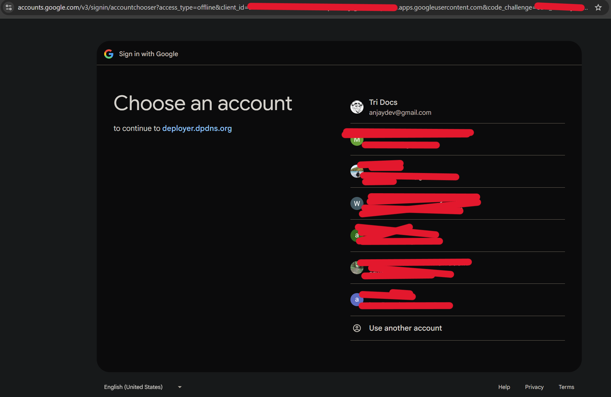
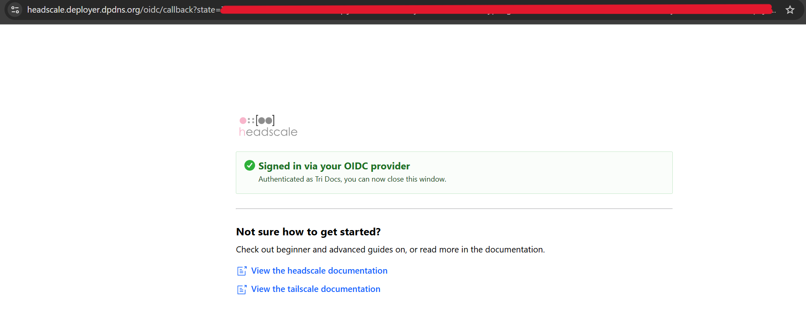
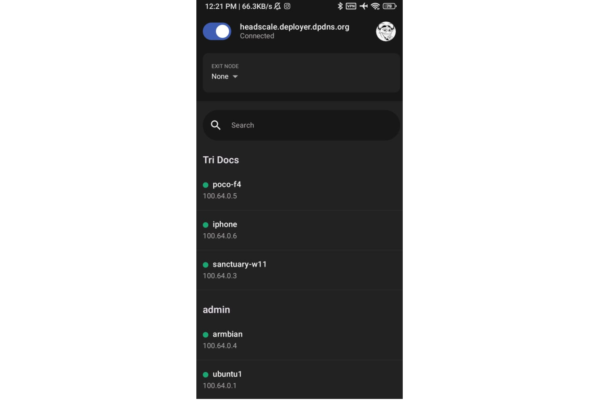

# Headscale Self Hosted sebagai Alternatif Tailscale untuk Zero Trust Mesh Network


Ketika membangun infrastruktur yang terdistribusi, kebutuhan akan konektivitas yang aman, fleksibel, dan terpercaya menjadi prioritas utama. Headscale hadir sebagai solusi self-hosted yang memberikan kebebasan penuh untuk mengelola jaringan mesh private kita sendiri. Berbeda dengan Tailscale yang mengandalkan server terpusat milik vendor, Headscale memungkinkan kita untuk memiliki kontrol penuh, manajemen identitas, dan konfigurasi jaringan. Dalam artikel ini, kita akan mengeksplorasi bagaimana cara mengimplementasikan Headscale lengkap dengan Headplane sebagai web interface, sehingga kita dapat membangun ekosistem zero-trust networking yang aman dan efisien. Implementasi yang akan kita bahas mencakup instalasi di atas container (Docker Compose), konfigurasi SSL/TLS (dengan Caddy), integrasi OIDC (Google ID) untuk autentikasi yang robust, serta praktik operasional untuk mengelola nodes, routes, dan exit nodes. Dengan pendekatan hands-on, kita akan memahami setiap aspek teknis dari Headscale dan bagaimana menerapkannya di environment produksi.

<!--more-->

## Zero Trust Mesh Network



Zero trust networking adalah paradigma keamanan modern yang mengubah cara kita merancang infrastruktur jaringan. Berbeda dengan model tradisional yang membangun perimeter keamanan di sekitar jaringan internal, zero trust mengimplementasikan prinsip "never trust, always verify" untuk setiap komunikasi, baik dari internal maupun eksternal.

### Mesh Network Architecture

Mesh network adalah topologi jaringan di mana setiap node dapat berkomunikasi langsung dengan node lain tanpa harus melalui satu titik pusat (central hub). Dalam konteks zero trust, mesh network memungkinkan:

- **Direct Communication**: Setiap perangkat dapat terhubung langsung dengan perangkat lain, mengeliminasi kebutuhan akan VPN concentrator tradisional.
- **Distributed Resilience**: Jika satu node offline, node lain tetap dapat berkomunikasi melalui rute alternatif.
- **End-to-End Encryption**: Semua komunikasi dienkripsi menggunakan WireGuard protocol, menjamin keamanan data dalam transit.
- **Automatic Network Discovery**: Nodes secara otomatis menemukan satu sama lain melalui control plane tanpa konfigurasi manual yang kompleks.

### Headscale dan Tailscale

**Tailscale** adalah solusi VPN mesh network komersial yang dibangun di atas protokol WireGuard. Tailscale menyediakan layanan managed dengan server kontrol terpusat milik Tailscale Inc. Keuntungannya adalah kemudahan instalasi dan management, namun dengan trade-off: kita harus mempercayai Tailscale dengan metadata jaringan kita.

**Headscale** adalah implementasi open-source dari Tailscale yang memungkinkan kita untuk menjalankan control plane sendiri. Headscale kompatibel dengan klien Tailscale, artinya kita dapat menggunakan aplikasi klien Tailscale yang sudah familiar sambil menjalankan server kontrol milik sendiri. Ini memberikan keuntungan:

- **Full Control**: kita memiliki kontrol penuh atas data dan konfigurasi jaringan.
- **Cost Efficient**: Tidak perlu berlangganan layanan managed.
- **Open Source**: Kode tersedia untuk audit dan customization.
- **Client Compatibility**: Gunakan klien Tailscale resmi tanpa modifikasi.

---

## Arsitektur

```
┌─────────────────────────────────────────┐
│         Internet / OIDC Provider        │
└───────────────────┬─────────────────────┘
                    ▼
                    │
         ┌──────────────────────┐
         │      Caddy (Proxy)   │
         └──┬────────────────┬──┘
            │                │
            ▼                ▼
     ┌────────────┐    ┌──────────────┐
     │ Headscale  │    │  Headplane   │
     │   (API)    │    │   (WebUI)    │
     └────┬───────┘    └──────┬───────┘
          │                   │
          │ (gRPC)            │ (REST/API)
          │                   │
          ▼                   ▼
     ┌──────────────────────────────┐
     │       SQLite Database        │
     │    (Users, Nodes, Routes)    │
     └──────────────────────────────┘
                    ▲
                    │
                    ▼
             ┌──────────────┐
             │   Tailscale  │
             │   Clients    │
             └──────────────┘
```

---

## Prerequisites

Sebelum memulai implementasi Headscale, pastikan beberapa prasyarat berikut terpenuhi.
1. Docker dan Docker Compose sudah terinstall.
2. Akses `sudo` untuk menjalankan commands administratif.
3. FQDN yang valid untuk server Headscale (contoh: `headscale.deployer.dpdns.org`). A Record atau CNAME record yang mengarah ke IP server Headscale. DNS propagation sudah selesai dan resolving dengan benar. Dalam artikel ini saya menggunakan Cloudflare untuk DNS Management.



4. OIDC provider seperti Google, Keycloak, Okta, atau penyedia OIDC lainnya. Dalam artikel ini saya menggunakan Google. Siapkan credentials OIDC (Client ID dan Client Secret) yang akan diintegrasikan dengan Headscale. Contoh redirect URI yang sesuai: `https://<FQDN-HEADSCALE>/oidc/callback` untuk Headscale dan `https://<FQDN-HEADSCALE>/admin/oidc/callback` untuk Headplane.


---

## Instalasi & Konfigurasi Headscale

Pada bagian ini, kita akan mengimplementasikan Headscale beserta Headplane dalam environment Docker dengan SSL/TLS yang proper dan integrasi OIDC.

### Struktur Direktori

Buat struktur direktori untuk Headscale dan konfigurasinya:

```bash
mkdir -p /opt/docker/headscale/{config/certificates,lib,run,headplane/config,headplane/data,secrets}
cd /opt/docker/headscale
```

### Docker Secrets

Buat file secrets yang akan digunakan oleh Docker Secrets feature:

```bash
# Generate random secrets
openssl rand -hex 20 > secrets/headplane_server_cookie_secret
echo "<OIDC_CLIENT_SECRET>" > secrets/oidc_client_secret

# Set proper permissions
chmod 600 secrets/*
```
Ganti `<OIDC_CLIENT_SECRET>` dengan Client Secret dari OIDC provider kita.

### Environment File

Buat file `.env` untuk Docker Compose:

```bash
cat > /opt/docker/headscale/.env << 'EOF'
TZ=Asia/Jakarta
HEADPLANE_LOAD_ENV_OVERRIDES=true
OIDC_CLIENT_ID=<OIDC_CLIENT_ID>
EOF
```
Ganti `<OIDC_CLIENT_ID>` dengan Client ID dari OIDC provider kita.

### Docker Compose Configuration

Buat `docker-compose.yaml` untuk Headscale dan Headplane:

```yaml
services:
  headscale:
    container_name: headscale
    image: headscale/headscale:0.26.1
    networks:
      - net1
    command: "serve"
    restart: unless-stopped
    labels:
      me.tale.headplane.target: headscale
    ports:
      - 50443:50443
    volumes:
      - ./config:/etc/headscale/
      - ./lib:/var/lib/headscale/
      - ./run:/var/run/headscale/
    secrets:
      - oidc_client_secret
    environment:
      - TZ=${TZ}

  headplane:
    image: ghcr.io/tale/headplane:0.6.1
    container_name: headplane
    networks:
      - net1
    ports:
      - :3002
    secrets:
      - headplane_server_cookie_secret
      - oidc_client_secret
      - headscale_api_key
    environment:
      - TZ=${TZ}
      - HEADPLANE_LOAD_ENV_OVERRIDES=${HEADPLANE_LOAD_ENV_OVERRIDES}
      - HEADPLANE_OIDC__CLIENT_ID=${OIDC_CLIENT_ID}
    volumes:
      - ./headplane/config/config.yaml:/etc/headplane/config.yaml
      - ./headplane/data:/var/lib/headplane
      - ./config/config.yaml:/etc/headscale/config.yaml
      - /var/run/docker.sock:/var/run/docker.sock:ro
    depends_on:
      - headscale

secrets:
  headscale_api_key:
    file: ./secrets/headscale_api_key
  headplane_server_cookie_secret:
    file: ./secrets/headplane_server_cookie_secret
  oidc_client_secret:
    file: ./secrets/oidc_client_secret

networks:
  net1:
    name: net1
    external: true
```

### Konfigurasi Headscale

Buat file `/opt/docker/headscale/config/config.yaml`:

```yaml
server_url: https://headscale.deployer.dpdns.org
listen_addr: 0.0.0.0:8080
metrics_listen_addr: 0.0.0.0:9090
grpc_listen_addr: 0.0.0.0:50443
grpc_allow_insecure: false

noise:
  private_key_path: /etc/headscale/noise_private.key

prefixes:
  v4: 100.64.0.0/10

derp:
  server:
    enabled: false
  urls:
    - https://controlplane.tailscale.com/derpmap/default
  paths: []
  auto_update_enabled: true
  update_frequency: 3h

disable_check_updates: false
ephemeral_node_inactivity_timeout: 30m

database:
  type: sqlite
  debug: false
  gorm:
    prepare_stmt: true
    parameterized_queries: true
    skip_err_record_not_found: true
    slow_threshold: 1000
  sqlite:
    path: /var/lib/headscale/db.sqlite
    write_ahead_log: true
    wal_autocheckpoint: 1000

acme_url: https://acme-v02.api.letsencrypt.org/directory
acme_email: "trianwar@protonmail.com"
tls_letsencrypt_hostname: ""
tls_letsencrypt_cache_dir: /var/lib/headscale/cache
tls_letsencrypt_challenge_type: HTTP-01
tls_letsencrypt_listen: ":http"

tls_cert_path: "/etc/headscale/certificates/headscale.deployer.dpdns.org.crt"
tls_key_path: "/etc/headscale/certificates/headscale.deployer.dpdns.org.key"

log:
  level: info
  format: text

policy:
  mode: file
  path: ""

dns:
  magic_dns: true
  base_domain: hs.deployer.dpdns.org
  override_local_dns: true
  nameservers:
    global:
      - 1.1.1.1
      - 1.0.0.1
      - 45.90.28.93
      - 45.90.30.93
    split: {}
  search_domains: []
  extra_records: []

unix_socket: /var/run/headscale/headscale.sock
unix_socket_permission: "0770"

oidc:
  only_start_if_oidc_is_available: true
  issuer: "https://accounts.google.com"
  client_id: <OIDC_CLIENT_ID>
  client_secret_path: "/run/secrets/oidc_client_secret"
  scope: ["openid", "profile", "email"]
  allowed_domains:
    - deployer.dpdns.org
    - headscale.deployer.dpdns.org
    - hs.deployer.dpdns.org
    - gmail.com
  allowed_users:
    - adminheadscale@gmail.com
  pkce:
    enabled: true
    method: S256

logtail:
  enabled: false

randomize_client_port: false
```

### Konfigurasi Headplane

Buat file `/opt/docker/headscale/headplane/config/config.yaml`:

```yaml
server:
  host: "0.0.0.0"
  port: 3002
  cookie_secret_path: "/run/secrets/headplane_server_cookie_secret"
  cookie_secure: true
  cookie_max_age: 86400
  data_path: "/var/lib/headplane"

headscale:
  url: "https://headscale.deployer.dpdns.org"
  config_path: "/etc/headscale/config.yaml"
  config_strict: true

integration:
  agent:
    enabled: false
  docker:
    enabled: true
    container_label: "me.tale.headplane.target=headscale"
    container_name: "headscale"
    socket: "unix:///var/run/docker.sock"
  kubernetes:
    enabled: false
    validate_manifest: true
    pod_name: "headscale"
  proc:
    enabled: false

oidc:
  issuer: "https://accounts.google.com"
  client_id: $HEADPLANE_OIDC__CLIENT_ID
  client_secret_path: "/run/secrets/oidc_client_secret"
  disable_api_key_login: false
  token_endpoint_auth_method: "client_secret_post"
  headscale_api_key_path: "/run/secrets/headscale_api_key"
  redirect_uri: "https://headscale.deployer.dpdns.org/admin/oidc/callback"
```

---

## Caddy

Dalam artikel ini kita menggunakan Caddy untuk reverse proxy sesuai diagram arsitektur di atas.

### Docker Compose Configuration

Buat `docker-compose.yml` untuk Caddy di `/opt/docker/caddy/docker-compose.yml`:

```yaml
services:
  caddy:
    networks:
      - net1
    image: caddy:alpine
    container_name: caddy
    restart: unless-stopped
    ports:
      - 80:80
      - 443:443
    volumes:
      - ./caddy_data:/data
      - ./caddy_config:/config
      - ./Caddyfile:/etc/caddy/Caddyfile
networks:
  net1:
    name: net1
    external: true
```

### Caddyfile Configuration

Buat `Caddyfile` untuk routing:

```
headscale.deployer.dpdns.org {
  reverse_proxy /admin* headplane:3002
  reverse_proxy * {
    to https://headscale:8080
    transport http {
      tls
      tls_insecure_skip_verify
    }
  }
}
```

Terkadang saya perlu menambahkan konfigurasi manual di `/etc/hosts` seperti berikut:

```
127.0.0.1       localhost
213.35.123.24   headscale.deployer.dpdns.org ubuntu1.oci.deployer.dpdns.org
```

---

## Deployment

Buat network Docker terlebih dahulu:

```bash
docker network create net1
```

Start Caddy:

```bash
cd /opt/docker/caddy
docker compose -p caddy up -d
```

Start Headscale dan Headplane:

```bash
cd /opt/docker/headscale
docker compose -p headscale up -d
```

### Verify Installation

Cek status containers:

```bash
docker ps
```

Cek logs untuk memastikan tidak ada error:

```bash
docker logs headscale
docker logs headplane
```

---

## Headscale Administration

### Headscale API Key

Selanjutnya kita akan membuat API Key Headscale untuk keperluan administrasi, misalnya saya menggunakan `--expiration 999d` untuk jangka panjang:

```bash
docker exec -it headscale headscale apikeys create --expiration 999d
```

Catat dam simpan API Key ini, serta masukkan ke dalam Docker Secrets:

```bash
echo "<HEADSCALE_API_KEY>" > /opt/docker/headscale/secrets/headscale_api_key
chmod 600 /opt/docker/headscale/secrets/headscale_api_key
```

### Setup Headscale CLI

Sebelum menjalankan perintah Headscale, setup environment variables untuk CLI:

```bash
export HEADSCALE_CLI_ADDRESS="headscale.deployer.dpdns.org:50443"
export HEADSCALE_CLI_API_KEY=$(cat /opt/docker/headscale/secrets/headscale_api_key)
export HEADSCALE_CLI_INSECURE=0
```

Atau tambahkan ke `~/.bashrc`:

```bash
echo 'export HEADSCALE_CLI_ADDRESS="headscale.deployer.dpdns.org:50443"' >> ~/.bashrc
echo 'export HEADSCALE_CLI_API_KEY=<HEADSCALE_API_KEY>' >> ~/.bashrc
echo 'export HEADSCALE_CLI_INSECURE=0' >> ~/.bashrc
source ~/.bashrc
```

### Membuat User

Setiap node harus tergabung dalam user. Buat user terlebih dahulu:

```bash
headscale users create admin
```

Verifikasi user yang sudah dibuat:

```bash
headscale users list
```

### Menambahkan Node

Langkah selanjutnya adalah menambahkan perangkat (nodes) ke dalam jaringan. Headscale mendukung berbagai metode autentikasi: Pre-Authorization Key (Preauthkey), OIDC, dan ephemeral nodes.


#### Method 1: Pre-Authorization Key (Preauthkey) - Nodes Persisten

Preauthkey adalah cara termudah untuk menambahkan nodes yang tidak menggunakan OIDC. Preauthkey dapat dibuat sebagai reusable (dapat digunakan berkali-kali) atau single-use (hanya sekali).

##### Membuat Preauthkey

Untuk menambahkan nodes yang tidak memiliki Expiration, gunakan preauthkey reusable:

```bash
headscale preauthkeys create \
  --user admin \
  --reusable \
  --expiration 999d
```

Output akan menampilkan key, contoh: `eed8cce8d0c9e5bda3f5e8d5e8c9d5c6`

Catat key ini untuk digunakan saat setup klien.

##### Add Node Menggunakan Preauthkey (Linux/Ubuntu)

**Install Tailscale Client**

```bash
# Ubuntu/Debian
curl -fsSL https://tailscale.com/install.sh | sh
```

**Connect ke Headscale**

```bash
sudo tailscale up \
  --login-server https://headscale.deployer.dpdns.org \
  --authkey eed8cce8d0c9e5bda3f5e8d5e8c9d5c6
```

Ganti dengan IP yang sesuai untuk Ubuntu server. Verifikasi dari Headscale:

```bash
headscale nodes list
```

Nodes baru akan muncul dalam daftar dengan IP dari prefix `100.64.0.0/10`.

##### Add Node Menggunakan Preauthkey (Windows)

**Install Tailscale Client**

Download dan install dari https://tailscale.com/download/windows. Gunakan stable version.

**Connect via Command Prompt (Admin)**

```cmd
C:\Program Files\Tailscale\tailscale.exe up ^
  --login-server=https://headscale.deployer.dpdns.org ^
  --authkey=eed8cce8d0c9e5bda3f5e8d5e8c9d5c6
```

**Atau Menggunakan GUI**

1. Klik Tailscale icon di system tray
2. Klik "Login" atau "Sign in"
3. Pilih "Use custom server" atau lihat opsi "Login Server"
4. Masukkan URL Headscale: `https://headscale.deployer.dpdns.org`
5. Paste preauthkey saat diminta
6. Tunggu hingga connected

#### Method 2: OIDC - Nodes Ephemeral dengan Expiration

Nodes yang login menggunakan OIDC akan memiliki automatic expiration sesuai konfigurasi OIDC.



##### Add Node Menggunakan OIDC (Linux)

```bash
# Install Tailscale
curl -fsSL https://tailscale.com/install.sh | sh

# Connect ke Headscale dengan OIDC
sudo tailscale up \
  --login-server https://headscale.deployer.dpdns.org
```

Perintah ini akan membuka browser dengan OIDC login flow (Google OAuth dalam contoh ini). Setelah login berhasil, node akan secara otomatis ditambahkan ke user yang sesuai berdasarkan email OIDC. Jika berhasil akan muncul seperti berikut:




##### Add Node Menggunakan OIDC (Android)

1. Unduh aplikasi "Tailscale" dari Google Play Store
2. Buka aplikasi
3. Tap "Sign in"
4. Pilih "Use custom server"
5. Masukkan URL: `https://headscale.deployer.dpdns.org`
6. Lanjutkan dengan OIDC login (Google)
7. Approve akses, dan node akan terhubung otomatis

Jika berhasil, akan tampil seperti berikut:



#### Verifikasi Nodes

Lihat semua nodes yang terhubung:

```bash
headscale nodes list
```

Output akan menampilkan:

```
ID | Hostname  | Name          | MachineKey | NodeKey | User     | IP addresses     | Ephemeral | Last seen           | Expiration          | Connected | Expired
1  | ubuntu1   | ubuntu1       | [01fm1]    | [mjpRt] | admin    | 100.64.0.1,      | false     | 2025-12-11 00:27:30 | N/A                 | online    | no
2  | sanctuary | sanctuary-w11 | [LdPRR]    | [6Yxkf] | anjaydev | 100.64.0.3,      | false     | 2025-12-11 01:08:19 | 2026-05-27 12:29:02 | online    | no
3  | armbian   | armbian       | [HG9T3]    | [81gjw] | admin    | 100.64.0.4,      | false     | 2025-12-11 00:48:36 | N/A                 | online    | no
4  | localhost | poco-f4       | [rfgMx]    | [+Z+vk] | anjaydev | 100.64.0.5,      | false     | 2025-12-11 00:28:31 | 2026-05-27 12:48:11 | online    | no
5  | fafafufu  | iphone        | [0U0To]    | [ojNsX] | anjaydev | 100.64.0.6,      | false     | 2025-12-11 00:48:27 | 2026-05-27 12:49:46 | online    | no
```

---

### Exit Node dan Subnet Routes

Headscale mendukung dua tipe route promotion: Exit Node dan Subnet Routes. Kedua fitur ini memungkinkan traffic dari nodes lain untuk melalui node tertentu.

#### Exit Node

Exit Node adalah node yang berperan sebagai gateway untuk seluruh traffic nodes lain. Semua traffic internet dari nodes yang menggunakan Exit Node akan diroute melalui Exit Node tersebut.

##### Use Case Exit Node

- Memberikan akses internet dengan IP yang sama
- Mengubah lokasi geografis traffic
- Centralized traffic filtering dan monitoring
- Backup connectivity jika node kehilangan akses internet langsung

##### Promote Node sebagai Exit Node

Dari daftar nodes di atas, `ubuntu1` dan `armbian` dilabelkan untuk exit node. Untuk promote node sebagai exit node:

```bash
# Check current routes yang advertised oleh node
headscale nodes list-routes

# Untuk ubuntu1
headscale routes enable --identifier 1 --route 0.0.0.0/0

# Untuk armbian
headscale routes enable --identifier 3 --route 0.0.0.0/0
```

Setelah di-promote, nodes lain dapat memilih untuk menempatkan traffic mereka melalui exit node ini.

##### Menggunakan Exit Node dari Klien

**Linux/macOS**

```bash
# List available exit nodes
sudo tailscale exit-node list

# Use specific exit node (by IP atau hostname)
sudo tailscale set --exit-node=100.64.0.1  # ubuntu1

# Disable exit node
sudo tailscale set --exit-node=
```

**Windows (via GUI)**

1. Klik Tailscale icon di system tray
2. Settings → Exit node
3. Pilih node yang ingin digunakan
4. Traffic akan mulai diroute melalui exit node

**Android/iOS**

1. Buka aplikasi Tailscale
2. Settings / Gear icon
3. Pilih "Exit nodes" atau "Route all traffic"
4. Pilih exit node yang tersedia

#### Subnet Routes

Subnet Routes memungkinkan nodes untuk promote subnets tertentu sehingga nodes lain dapat mengakses resources di subnet tersebut. Berbeda dari exit node yang meroute semua traffic, subnet routes hanya meroute traffic untuk subnets spesifik.

##### Use Case Subnet Routes

- Share local subnets dengan nodes lain dalam mesh (contoh: LAN lokal)
- Access resources di private networks (contoh: internal servers, database)
- Multi-location connectivity untuk distributed infrastructure
- IoT devices discovery dan management

##### Promote Node sebagai Subnet Route

Dari contoh nodes, `armbian` mempromote dua subnets: `192.168.200.0/24` dan `192.168.254.0/24`. Untuk promote subnets:

```bash
# Pertama, verifikasi routes yang available di node
# Command ini biasanya dilakukan dari node itu sendiri

# Dari control plane, enable specific routes
headscale routes enable --identifier 3 --route 192.168.200.0/24
headscale routes enable --identifier 3 --route 192.168.254.0/24
```

Dari output `headscale nodes list-routes`, terlihat bahwa `armbian` (ID 3) mempromote:
- **Approved & Available**: `192.168.200.0/24`, `192.168.254.0/24`
- **Serving (Primary)**: `192.168.200.0/24`, `192.168.254.0/24`

Ini berarti perangkat lain dalam mesh dapat mengakses resources di kedua subnet tersebut melalui node `armbian`.

##### Mengakses Resources via Subnet Routes

Setelah subnet routes di-enable, nodes lain dapat secara otomatis mengakses resources di subnets tersebut menggunakan IP address lokal:

```bash
# Dari node lain dalam mesh, ping resource di promoted subnet
ping 192.168.200.5

# Atau SSH ke resources
ssh user@192.168.254.10

# Atau akses HTTP service
curl http://192.168.200.20:8080
```

Klien Headscale secara otomatis mengupdate routing table untuk mengarahkan traffic ke subnet ke exit node yang appropriate. Tapi pada klien CLI, bisa jadi kita perlu menambahkan `--accept-routes` dengan perintah berikut:

```bash
sudo tailscale set --accept-routes
```

---

## Testing Jaringan Headscale Mesh

Setelah semua nodes terhubung dan routes dikonfigurasi, langkah berikutnya adalah verifikasi bahwa jaringan mesh berfungsi dengan baik.

### Verifikasi Node Connectivity

#### Ping antar Nodes

Dari node manapun dalam mesh, test ping ke node lain menggunakan IP Headscale mereka:

```bash
# Dari ubuntu1 (100.64.0.1), ping ke sanctuary (100.64.0.3)
ping 100.64.0.3

# Dari sanctuary, ping ke armbian (100.64.0.4)
ping 100.64.0.4

# Dari armbian, ping ke poco-f4 (100.64.0.5)
ping 100.64.0.5
```

Expected output: packets diterima dengan latency yang reasonable (tergantung network path).

#### Check Connectivity Status via CLI

```bash
# List nodes dengan status koneksi
headscale nodes list --output json | jq '.nodes[] | {name: .name, ip: .ipaddresses, connected: .online}'
```

### Test Direct Communication

#### SSH antar Nodes

```bash
# Setup SSH pada nodes terlebih dahulu
# Pada node target, pastikan SSH daemon running
sudo systemctl status ssh

# Dari node lain, SSH ke node target menggunakan Tailscale IP
ssh user@100.64.0.4  # Connect ke armbian

# Verifikasi tracer
traceroute 100.64.0.4
```

#### File Transfer

```bash
# Menggunakan scp untuk transfer file via Tailscale network
scp file.txt user@100.64.0.5:/tmp/
scp -r user@100.64.0.3:/home/user/documents ~/downloads/
```

### Test Exit Node

Jika exit nodes sudah di-configure:

```bash
# Dari node yang menggunakan exit node
curl https://ipinfo.io/

# IP address yang dikembalikan harus adalah IP dari exit node server
```

### Test Subnet Routes

Jika subnet routes sudah di-promote:

```bash
# Dari node dalam mesh, access resource di promoted subnet
ping 192.168.200.1

# Traceroute untuk verify routing path
traceroute 192.168.200.1

# Test aplikasi di subnet (web server, database, dll)
curl http://192.168.200.50:8080
telnet 192.168.254.5 5432
```

### Monitor Network Performance

#### Check Latency dan Packet Loss

```bash
# Gunakan mtr untuk monitoring latency dan packet loss
mtr 100.64.0.3

# Atau ping dengan statistik
ping -c 10 100.64.0.4
```

#### Monitor Headscale Metrics

Headscale expose Prometheus metrics di port 9090:

```bash
# Query metrics
curl http://localhost:9090/metrics

# Lihat metrik yang relevan
curl http://localhost:9090/metrics | grep headscale
```

### Check Node Routes dan Policies

```bash
# List routes dengan details
headscale nodes list-routes

# Check ACL/Policy jika menggunakan policy file
headscale policy view
```

### Test dari Different OS

Untuk memastikan compatibility di berbagai OS, test dari:

- **Linux desktop** (Ubuntu, Fedora)
- **Windows** (desktop atau server)
- **macOS** (Intel atau Apple Silicon)
- **Mobile** (Android, iOS)
- **ARM devices** (Raspberry Pi, Armbian)

### Long-running Stability Test

```bash
# Ping continuous untuk 24 jam dan monitor stability
ping 100.64.0.3 > ping_results.txt &

# Monitor disk usage dan memory pada headscale container
docker stats headscale --no-stream

# Check logs untuk error atau warnings
docker logs headscale | tail -100
```

---

## Headplane

Headplane adalah web-based management interface untuk Headscale yang memudahkan administrasi jaringan melalui GUI daripada command-line interface. Headplane bertindak sebagai **control plane user interface** yang menyederhanakan manajemen Headscale.


**Peran utama Headplane:**
- User authentication via OIDC
- Node management (view, approve, remove nodes)
- Route management (enable/disable routes)
- API key management
- Monitoring dashboard
- Integration dengan Docker containers

### Akses Headplane Web Interface

Headplane dapat diakses melalui URL:

```
https://headscale.deployer.dpdns.org/admin
```

### Login ke Headplane

#### Login via OIDC (Recommended)

1. Buka `https://headscale.deployer.dpdns.org/admin`
2. Klik "Sign in with OIDC" atau "Google" button
3. Lakukan Google OAuth flow
4. Setelah approved, akan redirect ke Headplane dashboard
5. Session akan aktif untuk durasi yang dikonfigurasi (default: 24 jam)

#### Login via API Key

Jika OIDC tidak tersedia atau untuk akses programmatic:

1. Dapatkan API key dari `/run/secrets/headscale_api_key`
2. Pada login screen, masukkan API key sebagai credentials
3. Sistem akan validate key dan grant access

---

## Summary

Headscale memberikan alternatif yang powerful untuk Tailscale dengan memberikan kontrol penuh atas mesh network kita sendiri. Dengan implementasi yang telah dibahas dalam artikel ini, kita telah membangun infrastruktur yang:

- **Secure**: End-to-end encryption dengan WireGuard, authentication via OIDC
- **Scalable**: Support multiple nodes dari berbagai OS, dan database teroptimasi
- **Manageable**: Web interface via Headplane, kontrol penuh dari CLI
- **Flexible**: Custom routing, exit nodes, subnet routes
- **Resilient**: Distributed mesh architecture dengan redundancy

Implementasi Headscale cocok untuk berbagai use case:
- **Remote Work**: Secure access ke corporate resources
- **Distributed Teams**: Mesh connectivity antar lokasi yang berbeda
- **IoT Management**: Pengelolaan terpusat untuk IoT devices
- **Hybrid Cloud**: Seamless connectivity di multi-cloud environment
- **Privacy-focused**: Kontrol penuh tanpa ketergantungan pada third-party

Dengan monitoring, best practices, dan regular maintenance, Headscale dapat berjalan stabil dalam production environment dengan jumlah nodes dan user yang massif.

---

## References

- https://headscale.net/
- https://github.com/tale/headplane
- https://tailscale.com/kb/1133/tailscale-architecture/
- https://www.wireguard.com/
- https://www.cloudflare.com/learning/security/glossary/what-is-zero-trust/
- https://docs.docker.com/
- https://letsencrypt.org/how-it-works/
- https://openid.net/connect/
- https://caddyserver.com/docs/
- https://tailscale.com/kb/

