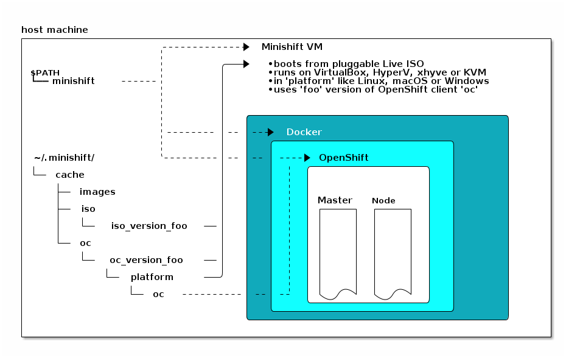

# Instalasi Lokal Minishift OKD


Minishift menjalankan OKD (OpenShift) di komputer lokal dengan membangun klaster _single-node_ OKD pada VM (Virtual Machine) yang berdiri di atas Hypervisor.

<!--more-->

## OpenShift dan OKD
**OpenShift** adalah distribusi dari **Kubernetes** yang memiliki fungsi serupa, namun memiliki beberapa fitur tambahan. Seiring Dengan berjalannya ide teknologi _cloud_, berbagai evolusi komputasi telah terjadi. Salah satunya adalah metode-metode dalam mengembangkan dan _delivery_ aplikasi untuk sampai ke hadapan user. Kini seringkali aplikasi/_product_ digital akan dikemas dalam bentuk _container_ untuk alasan kemudahan, keamanan, dan kecepatan pengembangan. Kubernetes awalnya diinisialisasi oleh Google dan kini dikembangkan oleh [CNCF](https://www.cncf.io/), sedangkan OpenShift dinaungi oleh [Red Hat](https://www.openshift.com/) menawarkan kemampuan manajemen _workloads_ aplikasi serta otomatisasi secara deklaratif. OpenShift merupakan _paid-product_, namun kita juga dapat menggunakan versi _free of charge_ bernama **OKD** sebagai alternatif. Sebelumnya OKD pernah bernama **OpenShift Origin** sebelum mengalami pergantian nama. Ketika artikel ini diterbitkan, OpenShift telah berkembang menjadi beberapa macam, yaitu **OpenShift Container Platform**, **OpenShift Dedicated**, hingga **OpenShift Dedicated**.


### Katalog OKD
OKD 3 _by-default_ telah menyediakan dukungan bagi aplikasi dengan beberapa bahasa pemrograman. OKD 3 memiliki _kickstart template_ seperti berikut :
* **Rails** untuk Ruby
* **Django** untuk Python
* **Node.js**
* **CakePHP** untuk PHP
* **Dancer** untuk Perl
* **Maven** untuk Java

Sedangkan untuk basis data, OKD 3 juga telah menyediakan beberapa diantaranya :
* **MySQL**
* **MongoDB**
* **PosgreSQL**

Tidak hanya itu saja, OKD 3 juga telah menawarkan fitur _CI/CD Pipeline_ yang siap di-integrasikan dengan **Jenkins**, sebuah Middleware **Apache**, hingga _Reverse-proxy_ **NGINX**.

### Minishift
**Minishift** adalah sebuah _tool_ yang membantu kita untuk menjalankan OpenShift di komputer lokal. Jika bermain dengan Kubernetes, biasanya kita akan menjumpai _tool_ serupa bernama **Minikube**. Minishift akan membuat dan menjalankan sebuah VM di atas **Hypervisor** yang tersedia di komputer kita. Saat artikel ini diterbitkan, Minishift hanya mendukung OKD versi 3.11 atau OpenShift 3.



---

## Prerequisites
Pastikan bahwa komputer lokal kita memiliki spesifikasi yang cukup untuk memasang OKD/OpenShift. Secara _default_ Minishift akan membuat sebuah VM dengan spesifikasi seperti berikut.

| Resources | Value |
|:-----:|:----:|
| CPUs          | 2 core    |   
| Memory        | 4 GB      |   
| Storage       | 20 GB     | 

---

## Mempersiapkan Environment Virtualiasi
Minishift mendukung beberapa **Hypervisor** untuk membuat dan menjalankan VM. Beberapa diantaranya adalah sebagai berikut.

| Sistem Operasi | Hypervisor |
|:-----:|:----:|
| Microsoft Windows | Hyper-V       |   
| GNU/Linux         | KVM           |   
| MacOS             | hyperkit      |
| All Platform      | VirtualBox    |   

Karena saya menggunakan GNU/Linux, maka dalam artikel ini kita akan menggunakan KVM sebagai _environment_ virtualiasi Minishift. Atau lebih tepatnya, saya menggunakan distro GNU/Linux Arch-based.

### Konfigurasi libvirt
1. Pasang paket-paket yang dibutuhkan untuk virtualisasi 
```bash
$ sudo pacman -Sy virt-manager kvm libvirt-runit qemu qemu-guest-agent-runit ebtables bridge-utils
```

2. Tambahkan user ke dalam grup `kvm` dan `libvirt`
```bash
$ sudo usermod -aG kvm,libvirt $(whoami)
$ newgrp libvirt
$ id
```

Jika sudah benar, seharusnya akan keluar output seperti berikut


3. Merubah konfigurasi qemu
Ganti konfigurasi `/etc/libvirt/qemu.conf` agar menggunakan group `kvm`.
```bash
$ sudo sed -ri 's/.?group\s?=\s?".+"/group = "kvm"/1' /etc/libvirt/qemu.conf
```

4. Menjalankan service libvirt
```bash
$ sudo ln -s /etc/runit/sv/libvirtd /run/runit/service
$ sudo ln -s /etc/runit/sv/virtlockd /run/runit/service
$ sudo ln -s /etc/runit/sv/virtlogd /run/runit/service
```

Saya menggunakan `runit` sebagai sistem init di komputer lokal. Jika memakai `systemd` maka silahkan menggunakan perintah `systemctl` untuk mengelola service.


5. Menjalankan jaringan libvirt
Periksa status jaringan yang tersedia saat ini.
```bash
$ sudo virsh net-list --all
```

Maka akan muncul output seperti berikut.
```cfg
Name                 State      Autostart     Persistent
---------------------------------------------------------
default              inactive     no           yes
```

Artinya kita memiliki sebuah jaringan bernama **default**. Maka aktifkan dan buat supaya jaringan tersebut berjalan secara otomatis dengan perintah seperti berikut.
```bash
$ sudo virsh net-start default
$ sudo virsh net-autostart default
```

---

## Memasang Minishift
Pasang paket-paket yang dibutuhkan.
```bash
$ yay -Sy minishift docker-machine-kvm origin-client
```

Pada distro Arch-based, `minishift` dan beberapa paket pendukung lainnya telah tersedia pada **AUR** (Arch User Repository). Untuk melakukan instalasi paket dari AUR, saya menggunakan _AUR Helper_ bernama `yay`.


---

## Menjalankan OKD dengan Minishift
Jalankan perintah seperti berikut.
```bash
$ minishift start
```
Atau kita dapat memberikan _flags_ ketika menjalankan minishift untuk membuat VM dengan spesifikasi yang kita butuhkan. Misalnya saya ingin Minishift membuat VM dengan memory sebesar 3 GB, CPU sebanyak 1 core, dan Storage sebesar 8 GB saja. Jalankan perintah seperti berikut.
```bash
$ minishift start --disk-size 8g --memory 3072 --cpus 1
```

Jika berhasil maka akan muncul output seperti berikut.


### Pengujian Minishift
Periksa apakah VM benar-benar berhasil dibuat.
```bash
$ sudo virsh list
```
Akan muncul output seperti berikut jika benar.
```cfg
Id   Name        State
---------------------------
 4    minishift   running
```
Memeriksa status Minishift dengan perintah berikut.
```bash
$ minishift status
```
Jika OKD berjalan maka kurang lebih akan muncul output seperti berikut.
```cfg
Minishift:  Running
Profile:    minishift
OpenShift:  Running (openshift v3.11.0+1cd89d4-542)
DiskUsage:  43% of 6.9G (Mounted On: /mnt/sda1)
CacheUsage: 1.707 GB (used by oc binary, ISO or cached images)
```

### SSH Remote Access
Untuk mencoba mengakses VM Minishift melalui SSH kita dapat menjalankan perintah berikut.
```bash
$ minishift ssh
```


### Menghentikan Minishift
Untuk menghentikan Minishift kita dapat menjalankan perintah berikut.
```bash
$ minishift stop
```

### Menghapus Minishift
Jika ingin menghapus seluruh _resource_ termasuk VM yang telah dibuat, kita dapat menjalankan perintah berikut.
```bash
$ minishift delete --force
```
---

## Pengujian
### Web Console
Seperti yang telah kita lihat [sebelumnya](#menjalankan-okd-dengan-minishift). Bahwa _web console_ telah dijalankan pada alamat [https://192.168.42.192:8443/console](https://192.168.42.192:8443/console). Sekarang buka alamat tersebut menggunakan web browser untuk memeriksa apakah _web console_ benar-benar berjalan.


### Command Line
**origin client** atau **`oc`** adalah program berbasis teks yang digunakan untuk mengelola OKD (OpenShift) lewat terminal. Kita dapat melihat status OKD dengan perintah seperti berikut
```bash
$ oc status
```
Karena masih kosong, dan OKD belum kita perintah untuk menjalankan layanan apapun maka akan muncul output seperti berikut.
```cfg
In project My Project (myproject) on server https://192.168.42.156:8443

You have no services, deployment configs, or build configs.
Run 'oc new-app' to create an application.
```

---

## Kesimpulan
Jika dibandingkan dengan Minikube, maka seharusnya Minishift bisa dikatakan memiliki fungsi yang serupa. Sayangnya saat artikel ini dibuat Minishift hanya dapat digunakan untuk membangun OKD 3 (OpenShift 3), sedangkan untuk membangun OpenShift 4 di komputer lokal kita dapat menggunakan _tool_ lain bernama [**CodeReady**](https://developers.redhat.com/products/codeready-containers/overview). Sayangnya [**CodeReady membutuhkan spesifikasi komputer yang cukup besar**](https://access.redhat.com/documentation/en-us/red_hat_codeready_containers/1.19/html/getting_started_guide/installation_gsg#minimum-system-requirements-hardware_gsg). Setelah kita perhatikan, _By-default_ OKD yang dibangun oleh Minishift berjalan pada VM Centos 7 Core untuk melakukan instalasi _cluster_. OKD adalah versi _upstream_ dari pengembangan _project_ OpenShift.

---

## Referensi
* [wiki.archlinux.org/index.php/OpenShift](https://wiki.archlinux.org/index.php/OpenShift)
* [wiki.archlinux.org/index.php/Libvirt](https://wiki.archlinux.org/index.php/Libvirt)
* [www.okd.io/#v3](https://www.okd.io/#v3)
* [docs.okd.io/3.11/architecture/index.html](https://docs.okd.io/3.11/architecture/index.html)
* [docs.okd.io/3.11/minishift/getting-started](https://docs.okd.io/3.11/minishift/getting-started/)
* [docs.okd.io/3.11/minishift/using/index.html](https://docs.okd.io/3.11/minishift/using/index.html)
* [www.openshift.com/blog/oc-command-newbies](https://www.openshift.com/blog/oc-command-newbies)
* [kubernetes.io/docs/concepts/overview/what-is-kubernetes](https://kubernetes.io/docs/concepts/overview/what-is-kubernetes/)

