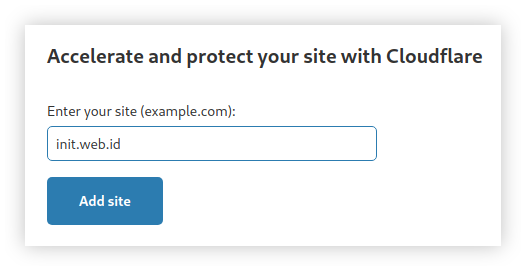

# Integrasi Github Pages dengan Cloudflare CDN


Github Pages biasanya digunakan sebagai hosting untuk situs web dengan konten statis, maka diperlukan caching untuk mempercepat load-time. Cloudflare dapat dimanfaatkan sebagai CDN (Content Delivery Network) yang berfungsi untuk menyimpan cache apabila belum ada perubahan yang signifikan pada situs web.

<!--more-->

## CDN
**CDN** (Content Delivery Network) merupakan sekelompok server yang ditempatkan diberbagai lokasi untuk mendistribusikan konten situs web ke sejumlah wilayah geografis yang luas. Salah satu contohnya adalah **Cloudflare**, yang menyediakan beberapa layanan baik berbayar maupun bebas biaya seperti yang telah saya gunakan pada situs web ini. CDN bekerja untuk menyimpan cache dari _Origin Server_ (misalnya server **Github Pages**) dan menyimpannya di berbagai _CDN Server_ pada berbagai belahan dunia. Contohnya ketika pengguna dari benua Asia mencoba mengakses situs web yang dikenal memiliki basis server di benua Amerika, _CDN Server_ yang terletak pada lokasi terdekat dengan penggunalah yang akan menjawab _request_ pengguna tersebut.


### Manfaat Cloudflare
Selain mempercepat load-time situs web, terdapat beberapa manfaat lain yang dapat kita peroleh dengan mengintegrasikan Cloudflare pada situs web. Dengan menggunakan Cloudflare kita dapat lebih menghemat _bandwith_, meningkatkan keamanan server dari serangan _DDoS_ dari pihak tidak bertanggung jawab, hingga memperoleh layanan SSL HTTPS terpercaya.


---


## Prerequisites
Sebelum melaksanakan beberapa langkah lebih lanjut, pastikan sudah memenuhi beberapa prasyarat berikut ini.

1. Saya sudah memiliki akun Cloudflare dengan paket layanan bebas biaya, apabila belum memilikinya maka sebaiknya lakukan registrasi akun terlebih dahulu pada [**dash.cloudflare.com/sign-up**](https://dash.cloudflare.com/sign-up).
2. Memiliki akses _registrar_ dari domain yang digunakan oleh situs web. _Registrar_ akan kita gunakan untuk melakukan _pointing_ menuju nameserver Cloudflare. Dalam artikel ini saya telah memiliki sebuah domain yang disediakan oleh DewaBiz.com.
3. Sebuah situs web yang menggunakan Github Pages sebagai hosting. Contohnya seperti yang telah saya tulis pada artikel [**Custom APEX Domain untuk Github Pages**](../custom-apex-domain-untuk-github-pages).


---


## Nameserver Cloudflare

### Tambahkan Situs Web
Login ke dalam halaman dashboard Cloudflare menggunakan akun yang sebelumnya telah dibuat. Kemudian tambahkan situs web dengan memasukkan alamat domainnya.

Lalu pilih paket yang akan digunakan seperti berikut ini.


### Konfigurasi Nameserver Clouflare
Setelah menambahkan situs web, kita perlu melaukan konfigurasi DNS kemudian kita akan mendapatkan sepasang nameserver seperti berikut ini.

IP pada `A` records merupakan IP miliki Github yang saya dapatkan dari [**docs.github.com**](https://docs.github.com/en/github/working-with-github-pages/managing-a-custom-domain-for-your-github-pages-site#configuring-an-apex-domain).
```cfg
185.199.108.153
185.199.109.153
185.199.110.153
185.199.111.153
```
Yang perlu dicatat adalah nameserver yang telah kita dapatkan dari Cloudflare, seperti berikut.
```cfg
penny.ns.cloudflare.com
sri.nds.cloudflare.com
```


---


## Registrar Domain
Sekarang login ke dalam registrar domain kalian untuk merubah nameserver.

Biasanya perubahan nameserver akan memakan waktu beberapa saat, sebaiknya tunggu terlebih dahulu sekitar 15 menit dan lakukan _flush_ cache dns.


---


## Konfigurasi HTTPS
Kita perlu mengaktifkannya terlebih dahulu pada menu **SSL/TLS** di dashboard Cloudflare.

Kemudian masuk ke **Settings** pada Github Pages dan centang **Enforce HTTPS**


---


## Konfigurasi Cache
Ini adalah salah satu fitur yang paling dicari di Cloudflare, kita dapat menemukannya pada menu **Caching**. Di sini saya hanya mengaktifkan **Caching Level** seperti berikut.

Untuk mengetahui lebih jelasnya kita dapat melihat kegunaan dari setiap properties tersebut pada dokumentasi resmi Cloudflare dari halaman [**support.cloudflare.com**](https://support.cloudflare.com/hc/en-us/articles/200168256-Understand-Cloudflare-Caching-Level).


---


## Page Rules
Selanjutnya buka **Page Rules** untuk membuat 3 _rules_ baru bagi domain kita.
1. Always Use HTTPS
2. Forwarding URL
3. Cache Level


Untuk menerapkan semua konfigurasi yang telah dibuat, saya menghapus semua cache yang telah tersimpan di Cloudflare dengan menggunakan **Purge Everything** pada menu **Caching** di dashboard Cloudflare.


---


## Pengujian
Untuk melakukan pengujian saya menggunakan perintah `dig` dan hasilnya sebagai berikut.
```bash
$ dig init.web.id
```

Jika registrar domain telah menggunakan nameserver Cloudflare maka akan muncul tampilan seperti berikut.
```cfg
Name Server:penny.ns.cloudflare.com
Name Server:sri.ns.cloudflare.com
```
Lalu jika SSL Cloudflare telah berhasil diterapkan, maka pada overview registrar domain DewaBiz.com akan menampilkan informasi berikut.


---


## Kesimpulan
Dengan menggunakan nameserver milik Cloudflare saya merasa fitur Konfigurasi DNS yang terdapat pada registrar domain kini dapat dikelola melalui dashboard Cloudflare. Perubahan kecepatan load-time situs web memang benar-benar terasa. Kita dapat melihat analisis secara mudah lewat menu Analytics, serta menguji kecepatan situs web dengan fitur Speed pada dashboard Cloudflare. Di lain kesempatan saya ingin mencoba untuk bermigrasi ke Netlify untuk mereasakan perbandingannya.


---


## Referensi
- [en.wikipedia.org/wiki/Cloudflare](https://en.wikipedia.org/wiki/Cloudflare)
- [blog.cloudflare.com/secure-and-fast-github-pages-with-cloudflare](https://blog.cloudflare.com/secure-and-fast-github-pages-with-cloudflare/)
- [support.cloudflare.com/hc/en-us/articles/204144518-SSL-FAQ](https://support.cloudflare.com/hc/en-us/articles/204144518-SSL-FAQ)
- [support.cloudflare.com/hc/en-us/articles/200168256-Understand-Cloudflare-Caching-Level](https://support.cloudflare.com/hc/en-us/articles/200168256-Understand-Cloudflare-Caching-Level)
- [docs.github.com/en/github/working-with-github-pages/managing-a-custom-domain-for-your-github-pages-site](https://docs.github.com/en/github/working-with-github-pages/managing-a-custom-domain-for-your-github-pages-site)

