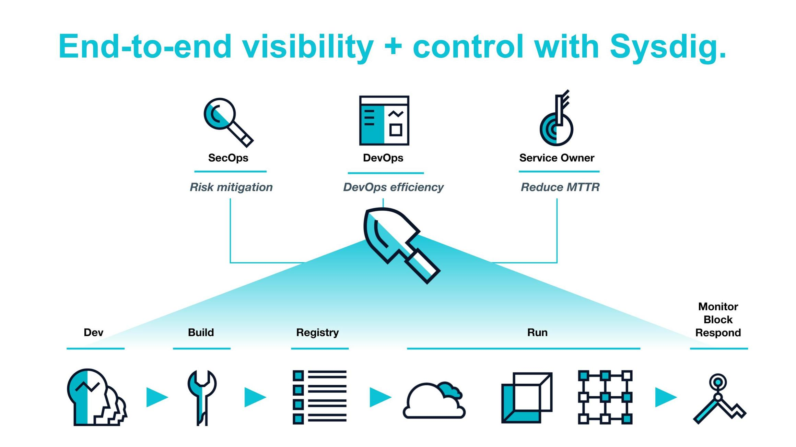
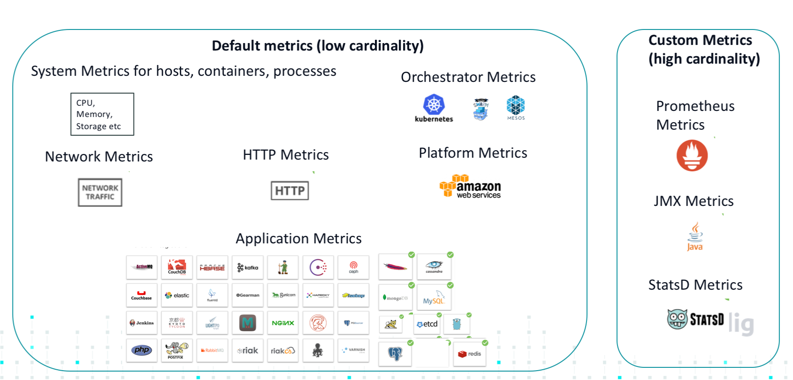
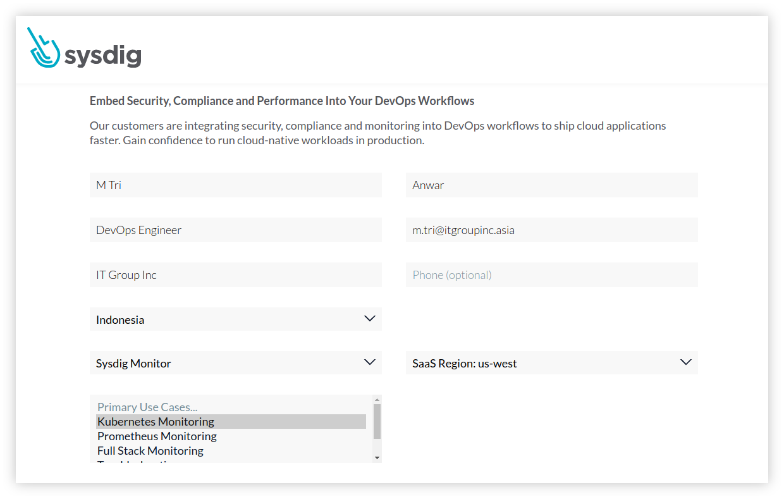
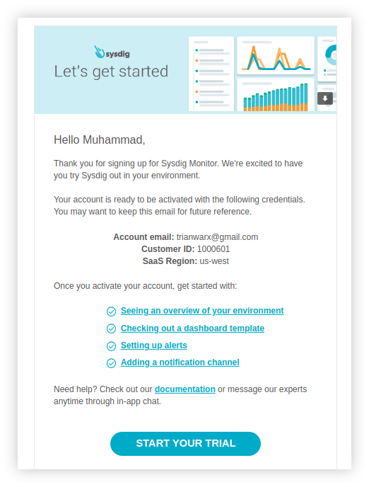
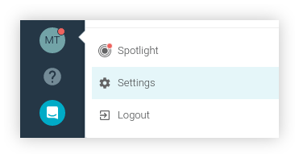
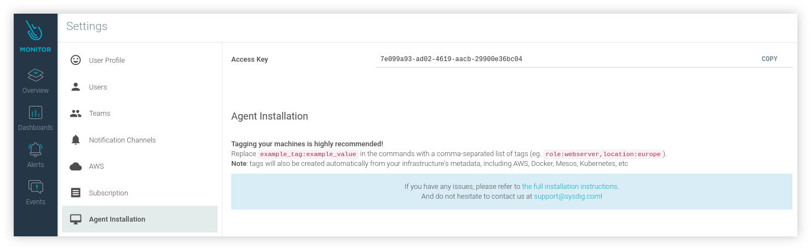
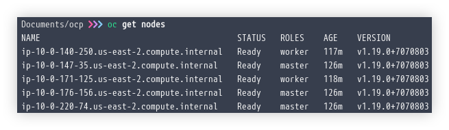
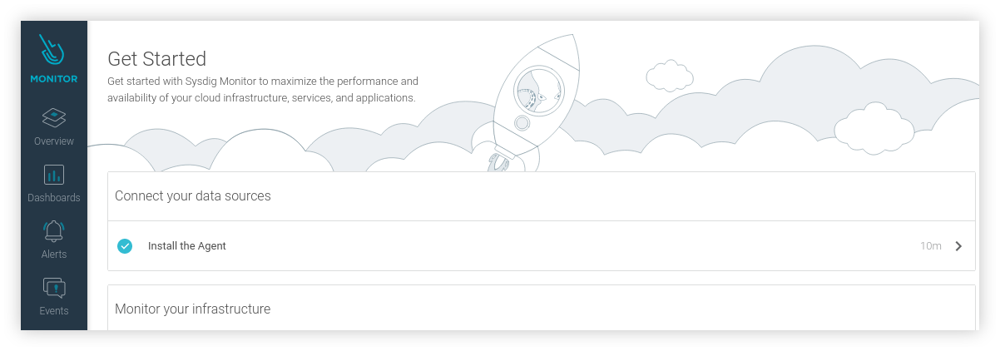
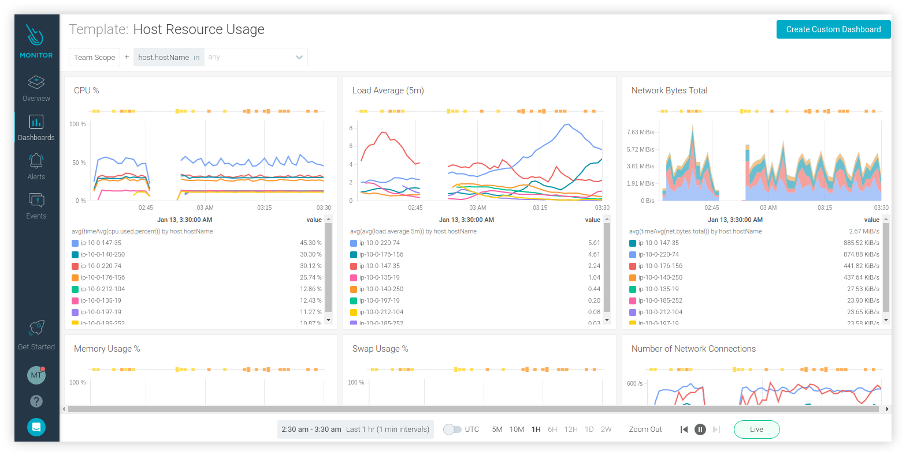
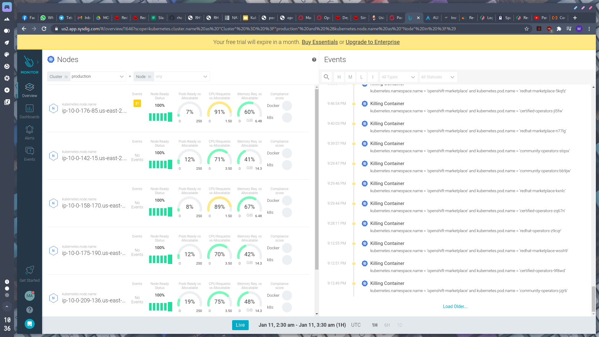

# Integrasi Sysdig Monitor di OpenShift


Sysdig mampu menyediakan _Cloud Monitoring_ yang memungkinkan kita untuk memaksimalkan performa dan ketersediaan dari infrastruktur, layanan, dan aplikasi berbasis _cloud_. Pada artikel ini saya akan mencoba mengintegrasikan layanan Sysdig Monitor dengan klaster OpenShift Cloud Platform.

<!--more-->

## Sysdig
**Sysdig** adalah sebuah _Software as a Service (SaaS)_ yang bertugas untuk mengambil _timeseries data_ atau biasa disebut _metric_ dari klaster atau _cloud native environment_ kemudian mengolah lalu menampilkannya secara _real time_ untuk berbagai kebutuhan, misalnya akselerasi _troubleshooting_, monitoring _at scale_, menyederhanakan visibilitas _metric_, membangun _dashboard_ monitoring yang fleksibel, hingga memberikan _alert_ dengan respon cepat. Sysdig membagi produknya menjadi beberapa jenis, yaitu **Sysdig Monitor**, **Sysdig Secure**, dan gabungan dari keduanya yang disebut dengan **Sysdig Platform** atau **Sysdig Secure DevOps Platform**. Semua produk tersebut sebenarnya adalah komersil, namun kita dapat mencobanya dengan _free-trial_ selama satu bulan. Pada artikel ini saya hanya akan mencoba mengintegrasikan Sysdig Monitor saja.



### Metrics
**Metric** adalah nilai kuantitatif atau ukuran yang dapat dikelompokkan atau dibagi dengan label. _Metric_ dari Sysdig Monitor dibagi menjadi dua jenis seperti berikut.
1. **Default metrics**, yaitu _metric_ yang berhubungan dengan sistem atau _host_, _container_, _orchestrator_, _HTTP_, dan infrastruktur jaringan.
2. **Custom metrics**, berhubungan dengan _metric_ yang didapat dari aplikasi pihak ketiga seperti _JMX_, _StatsD_, _Prometheus_ dan beberapa _metric_ dari aplikasi lain yang terintegrasi.

Sysdig secara otomatis mengambil _metric_ dari berbagai tipe, dan melabelinya secara otomatis. _Custom Metric_ juga dapat dilabeli sesuai kebutuhan pengguna. Biasanya _metric_ akan berguna untuk membuat Dashboard hingga Alerts.



### Sysdig Agent
Untuk dapat berjalan pada lingkungan _cloud native_ yang kita miliki, Sysdig menggunakan _agent_ yang disebut dengan **Sysdig Agent**, di mana _agent_ tersebut diwujudkan sebagai sebuah _container_ atau sebuah _service_ yang dapat di-_deploy_ dengan atau tanpa _container orchestrator_ seperti **Kubernetes** atau **Mesos**.


---


## Prerequisites
Pastikan beberapa syarat ini terpenuhi sebelum melakukan tahap lebih lanjut.

### Membuat Akun
Kita memerlukan sebuah akun _free-trial_ untuk mencoba Sysdig. Akun ini kita perlukan agar dapat mengoperasikan dashboard _front end_ Sysdig Monitor dari klaster OpenShift kita. Silahkan membuat akun Sysdig dengan [alamat berikut](https://sysdig.com/company/free-trial/).



Isi beberapa data yang dibutuhkan seperti nama, jabatan pekerjaan, alamat email, nama perusahaan, dan negara. Kemudian pilih **Trial Offer** yang dibutuhkan, misalnya **Sysdig Monitor**. Untuk **SaaS Region** dapat dipilih berdasarkan di mana letak infrastruktur kita berada. Karena saya menggunakan layanan AWS di Amerika Serikat untuk menjalankan klaster OpenShift, maka saya memilih Region **us-west**. Kemudian untuk **Primay Use Cases** dapat di pilih apapun, misalnya **Kubernetes Monitoring**.



Jika kata sandi sudah dibuat, biasanya kita perlu menunggu sekitar 15 menit untuk dapat masuk ke _front-end_ dari  Setelah membuat akun, tunggu beberapa saat dan kita akan mendapatkan sebuah email untuk membuat kata sandi baru.

### Mendapatkan Access Key
Untuk mendapatkan _access key_ kita perlu masuk ke situs _front end_ Sysdig. Kita dapat mengaksesnya dengan URL sesuai dengan Region yang kita gunakan.

| Region | URL |
|:-----:|:----:|
| US East (North Virginia)   | [app.sysdigcloud.com/#/login](https://app.sysdigcloud.com/#/login) |   
| US West (Oregon)           | [us2.app.sysdig.com/#/login](https://us2.app.sysdig.com/#/login)   | 
| European Union             | [eu1.app.sysdig.com/#/login](https://eu1.app.sysdig.com/#/login)   |

Setelah login, lalu masuk ke halaman **Settings** seperti berikut ini.



Kemudian, pilih **Agent Installation** maka akan terdapat _Access Key_ yang nanti akan kita gunakan.



### Klaster OpenShift
Di sini saya telah memiliki klaster OpenShift 4 dari hasil instalasi dengan metode IPI seperti yang telah saya tulis pada artikel sebelumnya ([**Quick Install OKD 4 di AWS**](../quick-install-okd-4-di-aws)). Dan pastikan bahwa OpenShift dapat dikelola dari komputer lokal kita menggunakan perintah `oc` atau `origin-client`.




---


## Konfigurasi OpenShift
Jika prasyarat sebelumnya telah terpenuhi, maka kita dapat melanjutkan beberapa tahap berikut.

### Membuat Project Baru
Buat sebuah project baru untuk _deployment_ Sysdig Agent seperti berikut.

```bash
$ oc adm new-project sysdig-agent --node-selector='app=sysdig-agent'
```

### Melabeli Node
Labeli semua node dengan _node selector_ seperti berikut ini.

```bash
$ oc label node --all "app=sysdig-agent"
```

### Pindah Project
Sekarang kita akan berpindah menuju project yang baru saja dibuat, jalankan perintah berikut.

```bash
$ oc project sysdig-agent
```

### Membuat Service Account
Kita perlu membuat _service account_ baru untuk project **sysdig-agent**.

```bash
$ oc create serviceaccount sysdig-agent
```

### Previlege Security Context Constraints
Tambahkan _service account_ sebelumnya ke **previleged** Security Context Constraint dengan perintah berikut ini.

```bash
$ oc adm policy add-scc-to-user privileged -n sysdig-agent -z sysdig-agent
```

### Cluster Role
Tambahkan _service account_ sebelumnya ke Cluster Role `cluster-reader` seperti berikut.

```bash
$ oc adm policy add-cluster-role-to-user cluster-reader -n sysdig-agent -z sysdig-agent
```


---


## Memasang Sysdig Agent
Pada tahap ini saya akan menggunakan **Helm** untuk mempermudah dan mempercepat pemasangan Sysdig Agent pada klaster.

### Pasang Paket Helm
Sebelumnya pasang terlebih dahulu paket `helm` di komputer lokal kita dengan perintah seperti berikut.

```bash
$ sudo pacman -Sy helm
```


Saya menggunakan sistem GNU/Linux dengan distro Arch-based, maka di sini saya memakai _package manager_ `pacman`. Silahkan sesuaikan dengan distro yang kalian gunakan.


### Menambah Repositori
Tambahkan repositori Helm dari Sysdig ke komputer lokal.

```bash
$ helm repo add sysdig https://charts.sysdig.com
$ helm repo update
```

### Pasang Sysdig Agent dengan Helm
Jalankan perintah berikut ini untuk memasang Sysdig Agent melalui Helm.

```bash
$ helm install sysdig-agent \
    --set sysdig.accessKey=<access key> \
    --set sysdig.settings.collector=ingest-us2.app.sysdig.com \
    --set sysdig.settings.collector_port=6443 \
    --set sysdig.settings.k8s_cluster_name=<nama klaster> \
    --set sysdig.settings.ssl=true \
    --set sysdig.settings.ssl_verify_certificate=false \
    sysdig/sysdig
```

Sesuaikan **accessKey** dengan yang kita dapat dari _front-end_ Sysdig di tahap [sebelumnya](#mendapatkan-access-key). Sesuaikan juga **k8s_cluster_name** dengan nama klaster OpenShift kita. Sedangkan untuk **collector** dan **collector_port** disesuaikan dengan region dari akun Sysdig yang kita gunakan, di sini saya memakai `ingest-us2.app.sysdig.com:6443` karena saya menggunakan akun Sysdig dengan region **us-west**. Untuk informasi selengkapnya dari masing-masing region, silahkan melihat [alamat kolektor dari Sysdig](https://docs.sysdig.com/en/saas-regions-and-ip-ranges.html).


---


## Pengujian
Jika tahap-tahap sebelumnya telah dilakukan, sekarang kita akan menguji apakah Sysdig Agent berhasil terpasang pada klaster.

### Pods
Coba periksa _pods_ milik Sysdig Agents dengan perintah berikut.

```bash
$ oc get pods
```

Jika berhasil, maka kurang lebih akan muncul tampilan seperti berikut.

```cfg
NAME                                READY   STATUS    RESTARTS   AGE
sysdig-agent-2wcsj                  1/1     Running   0          32m
sysdig-agent-45hgx                  1/1     Running   0          32m
sysdig-agent-559z9                  1/1     Running   0          32m
sysdig-agent-89wqp                  1/1     Running   0          32m
sysdig-agent-b5vbn                  1/1     Pending   0          32m
sysdig-agent-b9rlt                  1/1     Running   0          32m
sysdig-agent-image-analyzer-2rjht   1/1     Running   0          32m
sysdig-agent-image-analyzer-5vmp2   1/1     Running   0          32m
sysdig-agent-image-analyzer-m6xkb   1/1     Running   0          32m
sysdig-agent-image-analyzer-mhgb7   1/1     Running   0          32m
sysdig-agent-image-analyzer-n8xm2   1/1     Running   0          32m
sysdig-agent-image-analyzer-pgr9p   1/1     Running   0          32m
sysdig-agent-image-analyzer-pn8kv   1/1     Running   0          32m
sysdig-agent-image-analyzer-q4mvv   1/1     Running   0          32m
sysdig-agent-image-analyzer-rstz5   1/1     Running   0          32m
sysdig-agent-n4wqv                  1/1     Running   0          32m
sysdig-agent-pd745                  1/1     Running   0          32m
sysdig-agent-vsr4b                  1/1     Running   0          32m
```

### Front End
Buka kembali dashboard _front-end_ Sysdig, apabila Sysdig Agent berhasil terpasang maka seharusnya pada halaman **Get Started** akan muncul tampilan seperti berikut.



Selanjutnya coba buka **Dashboard** kemudian misalnya pilih saja **Host Resource Usage**, seharusnya akan tampil informasi penggunaan _resource_ dari klaster seperti berikut ini.



Sedangkan untuk menampilkan **Overview** kita perlu menunggu beberapa saat karena Sysdig membutuhkan waktu yang cukup lama untuk mengolah _metric_ dari klaster. Jika sudah bisa ditampilkan, maka kurang lebih akan seperti berikut.




---


## Kesimpulan
Jika kita ingin melakukan inspeksi lebih lanjut terhadap container yang ada pada klaster, sebenarnya kita dapat memilih menggunakan **Sysdig Platform** di mana kita juga akan mendapatkan **Sysdig Secure** untuk keperluan forensik atau kebutuhan lain terkait keamanan pada klaster. Pada bagian Settings di Sysdig Monitor kita akan mendapati beberapa fitur _Notification Channels_ yang lumayan berguna. Fitur tersebut dapat kita kombinasikan dengan menu _Alerts_ untuk mengirimkan pemberitahuan langsung melalui beberapa macam layanan seperti Email, Slack, hingga WebHook. Sebagai alternatif lain dari Sysdig kita dapat menggunakan tools lain seperti misalnya **GAP** (**Grafana**, **Alertmanager**, **Prometheus**) atau **DataDog**. Sebelumnya saya mencoba untuk mengintegrasikan Sysdig pada OKD namun menemui [issue pada pod Sysdig Agent](https://github.com/draios/sysdig/issues/1728), selanjutnya saya putuskan untuk mencobanya di klaster OpenShift dan Sysdig Monitor dapat berjalan tanpa kendala.


---


## Referensi
* [docs.sysdig.com/en/getting-started-with-sysdig-monitor.html](https://docs.sysdig.com/en/getting-started-with-sysdig-monitor.html)
* [docs.sysdig.com/en/host-requirements-for-agent-installation.html](https://docs.sysdig.com/en/host-requirements-for-agent-installation.html)
* [docs.sysdig.com/en/steps-for-openshift.html](https://docs.sysdig.com/en/steps-for-openshift.html)
* [charts.sysdig.com/](https://charts.sysdig.com/)
* [docs.sysdig.com/en/saas-regions-and-ip-ranges.html](https://docs.sysdig.com/en/saas-regions-and-ip-ranges.html)
* [docs.openshift.com/container-platform/4.6/cli_reference/helm_cli/getting-started-with-helm-on-openshift-container-platform.html](https://docs.openshift.com/container-platform/4.6/cli_reference/helm_cli/getting-started-with-helm-on-openshift-container-platform.html)
* [www.openshift.com/blog/monitoring-openshift-three-tools](https://www.openshift.com/blog/monitoring-openshift-three-tools)
* [kubernetes.io/docs/concepts/cluster-administration/system-metrics/](https://kubernetes.io/docs/concepts/cluster-administration/system-metrics/)

