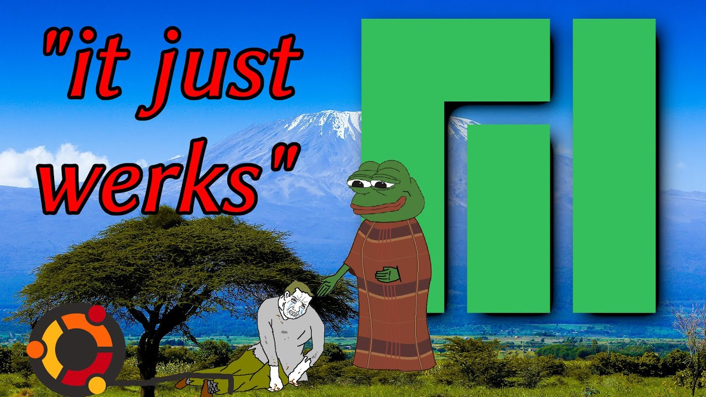

# Linux dan Elitisme

Ada sebuah anggapan di lingkup pengguna komputer bahwa GNU/Linux user mempunyai sikap elitis dan berpikir bahwa mereka lebih baik daripada orang lain yang tidak menggunakan distro GNU/Linux. Untuk mengetahui apakah seseorang itu elitis atau tidak, ada kriteria yang perlu kita perhatikan tentang bagaimana user ini beropini tentang dirinya sendiri dan user lainnya.

<!--more-->

## Prolog
Mungkin dari kita semua pernah merasa seperti dipaksa lalu merasa bingung atau tidak mengerti mengenai apa yang diucapkan seseorang, entah itu dari internet maupun secara langsung. Meskipun begitu, ada juga orang yang tidak peduli terhadap ucapan tersebut.

Misalnya, Si **A** pernah berkata "_Udahlah, objek **X** bloated, insecure, dan non-FLOSS. Pakai **Y** saja._" dan sebagainya.

Apakah itu dapat dianggap suatu perilaku pemaksaan? Belum tentu, itu bisa kita anggap sebagai tindakan persuasif yang harus kita olah sebijak mungkin dengan mencari tahu sumber referensi yang jelas dan tentunya sesuai kebutuhan setiap individu melalui berbagai riset.


Sebelum lebih lanjut, saya tegaskan bahwa di bawah ini yang dimaksud sebuah sistem operasi [GNU/Linux](https://www.gnu.org/gnu/linux-and-gnu.en.html) (atau sering disebut Linux) sebenarnya dikemas sebagai distribusi Linux. Lihat juga [kernel Linux](https://en.wikipedia.org/wiki/Linux_kernel).


---

## Linux dan Elitisme
"**Linux dan Elitisme**". Apakah keduanya memiliki keterkaitan satu sama-lain? Mengapa begitu banyak pengguna sistem operasi Linux mempunyai sikap elitis? Memang, pada beberapa aspek pengguna sistem operasi Linux dapat disebut sebagai elit.

1. Berdasarkan data statistik dari [gs.statcounter.com](https://gs.statcounter.com/os-market-share/desktop/worldwide), kurang dari 2% di dunia yang menggunakan sistem operasi Linux di platform desktop, sedangkan jika disaring dalam semua platform mereka hanya kurang dari 1%. Itu adalah fakta bukan sebuah sikap saja. Android juga menggunakan mainstream kernel Linux, tetapi ditambahkan driver maupun fitur untuk perangkat spesifik sehingga dibedakan kategorinya. Biasanya driver/fitur tambahan tersebut akan diterapkan ke kernel Linux jika komunitas menyetujuinya dan memang mungkin untuk memodifikasinya.

2. Rata-rata mereka lebih terampil, menguasai dan memiliki pengetahuan mendalam mengenai komputer daripada pengguna sistem operasi lain karena seringnya mencari dan membaca serta mengolah informasi. Mayoritas dari mereka sadar akan seluk-beluk dalam sistem operasi yang jarang terdengar. Contohnya HFS (Hierarchical File System), init system, user-group permission, kernel, bootloader, package manager, process scheduling, desktop environment, dan masih banyak lagi.

3. Pada awalnya sistem operasi Linux banyak digunakan untuk keutamaan seperti kegiatan ilmiah [eksperimen DØ](https://www-d0.fnal.gov/) yang menggunakan [Scientific Linux](https://scientificlinux.org/), server produksi, seorang penghobi, programmer/developer, engineer, pentester. Bahwa berarti pada awalnya Linux bukanlah untuk mayoritas konsumsi rumahan. Namun, sekarang sistem operasi Linux sudah berusaha dikembangkan secara pesat (karena _open-source_) untuk konsumsi publik yang lebih ramah pengguna. 

4. Pengguna sistem operasi linux yang [AVID](https://www.merriam-webster.com/dictionary/avid) biasanya tidak melihat [pragmatisme](https://id.wikipedia.org/wiki/Pragmatisme) dari kebanyakan pengguna biasa. Mereka sangat terpesona dan penasaran sehingga ingin untuk mampu memodifikasi setiap hal kecil di sistem operasi yang mereka gunakan setiap harinya.

Tidak semua pengguna komputer memenuhi beberapa aspek di atas. Dengan demikian, pengguna sistem operasi Linux dapat dianggap sebagai Elit dan memiliki hak untuk membedakan diri dari mayoritas pengguna komputer meskipun tidak dengan sombong. Namun, pada kenyataannya sikap elitisme adalah suatu kesalahpahaman yang besar. Itu sama sekali tidak memiliki keterkaitan dengan penggunaan sistem operasi Linux sama sekali, tetapi berasal dari ketidaksepakatan mendasar dengan pola pikir dan cara komputasi terhadap komputer modern.

---

## Opini
Jadi bagaimana pendapat saya tentang user sistem operasi lain? Ini sedikit mengejutkan, sebetulnya saya tidak berpikir bahwa pengguna sistem operasi lain benar-benar bodoh atau IQ-nya lebih rendah daripada pengguna sistem operasi Linux. Saya juga tidak berpikir bahwa pengguna sistem operasi Linux adalah seorang jenius yang hidup diantara orang-orang bodoh, walaupun terkadang kenyataannya begitu. Jika kita mau melihat pada data perkembangan IQ di masa lampau hingga masa kini, kita dapat memperhatikan bahwa rata-rata IQ meningkat pada setiap populasi manusia. Kita melihat bahwa literasi semakin meningkat, matematika yang kompleks menjadi lebih "_biasa_", setiap orang memiliki _smartphone_ dan punya akses ke hampir seluruh teknologi hanya dengan menggerakkan jari mereka.

Fakta-fakta ini membuat saya ragu, bahwa apakah semua orang di luar pengguna sistem operasi Linux itu bodoh atau mempunyai IQ rendah. Jadi apa yang menyebabkan mereka tidak elit? **Apatis**, apatisme menjadi sangat biasa dan dinormalisir jika dibandingkan pada masa lalu, ini disebabkan oleh semua kemudahan yang bisa diakses oleh orang-orang sampai mereka tidak peduli tentang apapun, mereka tidak mau berusaha, mereka lebih memilih mencari dopamine, seperti film porno, sosial media, menggemari idola, video game, hingga sumber-sumber dopamine lainnya untuk menjadi santapan otak sehari-hari. Otak mereka sudah terlalu penuh untuk melakukan hal lainnya yang sedikit lebih sulit.

### It Just Werks

Saya menolak semua pernyataan "_yang penting bisa digunakan_"  dan menganggapnya sebagai kata-kata yang bodoh, yang diberikan seseorang ketika tidak mau repot-repot menggerakkan tubuh dan akal sehatnya. Bukan karena suka dengan sesuatu yang rumit, tetapi saya menginginkan agar sesuatu bekerja seperti apa yang saya harapkan. Sejujurnya, saya juga tidak ingin mereka menggunakan objek **Y** karena dipaksakan. Berusaha sekuat tenaga sebagai orang-orang yang hidup di realitas alternatif dari apa yang disebut [_software piracy_](https://id.wikipedia.org/wiki/Pembajakan_perangkat_lunak), dan berusaha tidak peduli terhadap apapun selama itu disebut "_yang penting bisa dipakai_".

Ketika manusia telah memiliki _basic needs_, seperti tempat tinggal, air, dan makanan di perut mereka, mereka tidak lagi memikirkan cara bertahan hidup dan ekstensinya. Ketika mereka telah mencapai kenyamanan itu, tanpa _deeper meaning_ atau _goal_ untuk memicu mereka, mereka akan menjadi apatis. Apatisme inilah yang menyebabkan orang-orang berkata bahwa instalasi Linux itu sulit, padahal belum tentu sesulit itu. Tapi karena sekarang kita hidup di masa mesin-mesin OEM, dimana Cortana melakukan semuanya untuk pengguna setelah membelinya dari toko. Tapi yah memang benar bahwa sistem operasi Linux sedikit banyak lebih sulit dibandingkan dengan itu.

### Analogi

Mari coba membayangkan, seumpama sistem operasi adalah mobil. Ada dua macam orang yang membeli mobil yang berbeda. Ayo sejenak berasumsi _performance_ mobilnya sama (iya saya tahu bahwa Linux jauh memiliki _performance_ yang lebih bagus daripada sistem operasi **W**, tapi mari anggap saja begitu dulu). Yang satu terus-terusan merekam obrolan pengguna, musik, makanan favorit, tujuan pergi dan semua datanya dikirim ke _dealer_ untuk kepentingan penjualan (misalnya iklan). Dan juga, user tersebut tidak diperbolehkan mengganti komponen mobilnya, user tidak dapat memodifikasi mobil tersebut untuk memaksimalkan potensinya, jika ingin lebih maka harus membeli mobil baru. Sedangkan lawannya adalah sebuah mobil DIY (iya saya mengerti jika Linux belum tentu serumit itu, tapi mari anggap saja begitu terlebih dahulu), mobil tersebut bebas dimodifikasi, tanpa ada proses-proses yang membuat mobil itu lebih payah _performance-nya_.

Jadi dari analogi diatas, sepertinya memang semakin memvalidasi elitisme pengguna sistem operasi Linux, mereka menggunakan OS yang elit, mereka berjam-jam untuk melakukan konfigurasi OS. Dan yang terpenting, mereka _took action_ dengan melalui itu semua. Tidak seperti pengguna sistem operasi lain yang terus-menerus hanya bisa disuapi. Tidak semua orang mempunyai _skill-set_ itu, beberapa orang terbukti lebih _superior_ daripada orang lain dan tidak semua orang adalah _equal_ walapun mayoritas media hingga masyarakat kita mengatakan itu. Paham bahwa semua orang itu setara hanyalah opini juga, karena beberapa orang terbukti lebih baik dalam suatu hal tertentu atau bahkan dalam banyak hal sekaligus daripada orang lain.

---

## Epilog
Apapun yang kita lakukan, jika hanya untuk menjadi "keren" atau "ikut-ikutan" tetapi sulit dalam menyesuaikan lingkungan. Sesungguhnya itu tidaklah keren, melainkan menyakiti diri sendiri. Marilah mencoba berbagai hal yang kita temui jika itu bermanfaat bagi individu masing-masing. Permasalahannya adalah seberapa banyak orang dapat meluangkan waktu mereka untuk melakukan hal-hal seperti itu dengan tepat dan cepat.

---

## Referensi
- [www.linuxsec.org/2021/03/linux-dan-elitisme.html](https://www.linuxsec.org/2021/03/linux-dan-elitisme.html)
- [www.distrotube.com/blog/why-linux-users-have-elitist-attitude](https://www.distrotube.com/blog/why-linux-users-have-elitist-attitude)
- [www.youtube.com/watch?v=TxDFjGPqYog](https://www.youtube.com/watch?v=TxDFjGPqYog)

