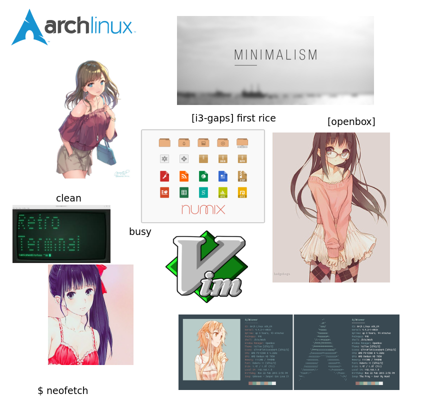
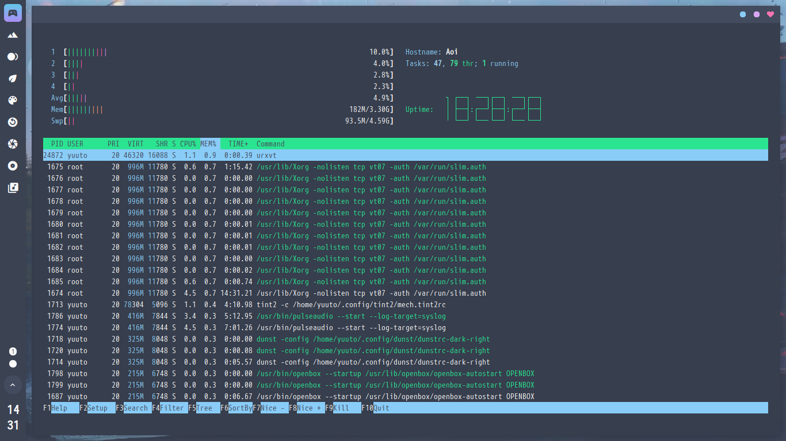

# Membahas Linux Ricing

Istilah rice/ricing pasti tidak asing lagi bagi orang yang suka mengkustomisasi desktop sistem operasi [Unix-like](https://en.wikipedia.org/wiki/Unix-like), khususnya pada GNU/Linux yang aktivitasnya biasa disebut "**Ricing / Linux Rice**". Mereka gemar berdiskusi di [komunitas reddit](https://www.reddit.com/r/unixporn/) dan [Linuxer Desktop Art](https://web.facebook.com/groups/linuxart/) untuk sharing atau hanya sekedar melihat-lihat indahnya sistem operasi unix-like.

<!--more-->

---

## Pengenalan "Linux Rice"
Pertama-tama saya akan sedikit menjelaskan mengenai apa yang disebut "**Linux Rice**". Linux Rice berasal dari 2 kata "**Linux**" yaitu sistem operasi GNU/Linux itu sendiri dan "**Rice**" yaitu ~~beras~~. Bukan! yang dimaksud "**Rice**" disini bukanlah beras yang biasa kita makan, tapi akronim dari "**Race Inspired Cosmetic Enhancements**".

**Race Inspired Cosmetic Enhancements. (R.I.C.E.)** adalah istilah yang merujuk pada mobil sport buatan Asia (biasanya Honda Civic) yang memiliki banyak modifikasi kosmetik dan sedikit atau tanpa modifikasi internal. Intinya disini kata "**Rice**" awalnya digunakan untuk modifikasi pada mobil.

")

Apa hubungannya modifikasi mobil dengan sistem operasi GNU/Linux? Dari sini jelas bahwa kata "**Rice**" artinya modifikasi, kemudian istilah tersebut diserap oleh mereka yang gemar memodifikasi tampilan desktop di sistem operasi GNU/Linux menjadi "**Ricing**".

---

## Komponen dasar dalam Ricing
Ada banyak sekali cara untuk mengkustomisasi desktop di sistem operasi GNU/Linux. Dimulai dari pengenalan sebuah **Window Manager** atau disingkat **WM**.

### Window Manager
**Window Manager** adalah sistem perangkat lunak yang mengontrol tata letak dan tampilan _window_ dalam sistem windowing yang merupakan salah satu dari komponen [Desktop Environment](https://en.wikipedia.org/wiki/Desktop_environment) pada GUI.

WM sendiri dibagi menjadi 3 jenis.
1. **Stacking** adalah Window Manager yang sistem window-nya bertumpuk antara satu dengan yang lain. Kita biasa merasakan _workflow_ WM jenis ini misalnya pada DE GNOME3 yang menggunakan Mutter dan KDE yang menggunakan Kwin. Namun tidak semua WM dapat berdiri sendiri (standalone) contoh yang WM yang dapat berdiri sendiri dengan mudahnya adalah [`openbox`](http://openbox.org/wiki/Main_Page), [`fluxbox`](http://fluxbox.org/), hingga `xfwm` pada DE XFCE.

2. **Tiling** adalah Window Manager yang sistem window-nya tersusun kotak-kotak antara satu dengan lainnya secara otomatis meskipun masih terdapat sistem _floating/stacking_, disebut _tiling_ karena memiliki _workflow_ seperti susunan ubin. Contohnya [`i3wm`](https://i3wm.org/), dan [`bspwm`](https://github.com/baskerville/bspwm).

3. **Dynamic**. Seperti pada namanya, jenis Window Manager ini dapat berganti-ganti diantara Stacking maupun Tiling sesuai selera pengguna. Contohnya [`dwm`](https://dwm.suckless.org/) dan [`awesomewm`](https://awesomewm.org/).

### Panel / Bar / Dock
**Panel / Bar / Dock** adalah program yang digunakan untuk menampilkan informasi baterai, daftar aplikasi yang dibuka, _system tray_, dan waktu. Jika pada sistem operasi Micros\*ft Wind\*ws, kita biasa menyebutnya _Taskbar_. Di GNU/Linux contohnya adalah [`plank`](https://launchpad.net/plank), [`tint2`](https://gitlab.com/o9000/tint2), [`polybar`](https://github.com/polybar/polybar), [`dzen2`](http://robm.github.io/dzen/), dan [`lemonbar`](https://github.com/LemonBoy/bar).

### Application Launcher
**Application Launcher** adalah program yang digunakan untuk membuka atau menjalankan suatu program selain menggunakan Terminal Emulator. Contohnya adalah [`dmenu`](https://tools.suckless.org/dmenu/) lalu ada penggantinya yang lebih menawarkan banyak fitur, yaitu [`rofi`](https://github.com/davatorium/rofi).

### Notification Daemon
**Notification Daemon** (lebih suka saya sebut sebagai **Notify Daemon**) adalah program yang digunakan sebagai penampil notifikasi. Contohnya adalah [`dunst`](https://dunst-project.org/), `xfce4-notifyd` milik XFCE, dll.

### Terminal Emulator
**Terminal Emulator** adalah program yang digunakan untuk berinteraksi dengan sesi [Unix Shell](https://en.wikipedia.org/wiki/Unix_shell) seperti mengatur sistem, hingga menjalankan program, dengan mengetikkan perintah berbasis teks (CLI). _TE_ merupakan komponen terpenting digunakan untuk Ricing. Contoh Terminal Emulator ada banyak sekali, misalnya [`rxvt-unicode`](http://software.schmorp.de/pkg/rxvt-unicode.html) (`urxvt`), `xfce4-terminal` pada XFCE, [`termite`](https://github.com/thestinger/termite), [simple terminal](https://st.suckless.org/) (`st`), [`kitty`](https://sw.kovidgoyal.net/kitty/), dan masih banyak lagi.

### Display Manager (Optional)
**Display Manager** atau **DM** adalah program yang digunakan untuk masuk ke sesi GUI bagi sistem operasi GNU/Linux. Setelah masuk ke DM, kendali sepenuhnya diberikan kepada WM. DM menyediakan fitur seperti memilih sesi DE/WM yang akan digunakan, serta terdapat juga fitur reboot, halt, dan suspend. Meski sering digunakan karena kemudahannya bagi pengguna, tetapi tidak sedikit pula orang yang menggunakan sistem operasi GNU/Linux tanpa DM. Biasanya mereka menggunakan `startx` langsung (`xorg-xinit`). Contoh DM adalah [`lightdm`](https://github.com/canonical/lightdm), `gdm` milik GNOME, dan `slim`.

### Window Compositor (Optional)
**Compositor** adalah program yang berfungsi untuk mengatur animasi seperti bayangan dan tranparansi pada WM. Contohnya adalah [`compton`](https://github.com/chjj/compton), lalu penerusnya yaitu [`picom`](https://github.com/yshui/picom).

---

## Alasan memilih WM daripada DE
Dari semua penjelasan diatas, mengapa saya lebih memilih WM dengan _custom environment_, daripada DE yang sudah lengkap (instant) tinggal digunakan? Seringkali banyak yang bilang **_Ribet sekali jadi orang!_** 

Ada beberapa alasan mengapa menggunakan WM lebih baik daripada menggunakan DE (<u>menurut saya</u>).  
1. Ingin belajar lebih dalam mengenai _workflow_ desktop pada sistem operasi GNU/Linux.
2. Mengetahui bahwa GUI pada sistem operasi GNU/Linux dapat diminimalisir komponen-komponen penyusunnya (_dependencies_), karena banyak sekali komponen yang tidak pernah saya perlukan pada DE namun sudah _pre-installed_. 
3. Dengan alasan <u>nomor 2</u> jelas sekali bahwa WM akan sangat ringan dan tidak menyita banyak _resources_ seperti RAM dan processor.
4. Kebebasan memilih komponen penyusun desktop seperti yang saya sudah jelaskan di atas.

---

---

## Apa yang saya gunakan?
Karena saya masih terbiasa dengan WM jenis stacking yang terkesan <u>normal</u>, serta dikarenakan resolusi layar minim (`1600 x 900`). Berbeda dengan WM tiling yang lebih dioptimalkan untuk _developer_ dengan layar lebarnya. Saya memutuskan memilih `openbox` dengan segala kesederhanaanya serta dukungan yang luas.

---

## Penutup
Cukup rumit dan membingungkan bukan? Bagi pemula biasanya akan lebih mudah untuk memulai dari menggunakan [**_dotfiles_**](https://wiki.archlinux.org/index.php/Dotfiles) milik orang lain. Dengan begitu kita tidak terlalu banyak melakukan konfigurasi dari dasar, dan tidak perlu membuat _theme_, _icon_ hingga _artwork_ sendiri. Setelah merasa cukup familiar dengan _environment_ tersebut barulah mencoba membangun _environment_ kalian sendiri. Jika sudah merasa mampu menyusun dokumentasi _environment_ dengan baik, maka lanjutkan belajar membuat _dotfiles_ sendiri. Selama proses belajar, tak perlu malu untuk berbagi screenshot ke komunitas seperti _Linuxer Desktop Art_, atau _Dotfiles Indonesia_ untuk meminta pendapat dari sesama pegiat _Desktop Ricing_.

---

## Referensi
- [0xlt.me](https://0xlt.me)
- [dwarmstrong.org/openbox](https://www.dwarmstrong.org/openbox/)
- [devpy.me/your-guide-to-a-comfortable-linux-desktop-with-openbox](https://www.devpy.me/your-guide-to-a-comfortable-linux-desktop-with-openbox/)
- [openbox.org](http://openbox.org/wiki/Main_Page)
- [addy-dclxvi.github.io](https://addy-dclxvi.github.io/)
- [bandithijo.github.io](https://bandithijo.github.io/)
- [wiki.archlinux.org/Desktop_environment](https://wiki.archlinux.org/index.php/Desktop_environment)
- [Linuxer Desktop Art](https://web.facebook.com/groups/linuxart)
- [Dotfiles Indonesia](https://www.t.me/dotfiles_id)

