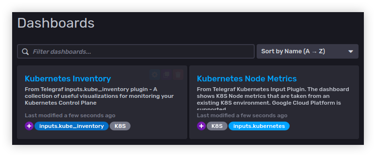

# Monitoring Kubernetes dengan InfluxDB v2


InfluxDB merupakan time-series database yang dibangun menggunakan bahasa pemrograman Go, dan dikembangkan oleh InfluxData. InfluxDB dioptimasi agar mampu berjalan dengan cepat dan mendukung konsep high-availability untuk menerima time-series data yang dipakai dalam hal monitoring, application metrics, data Internet of Things, hingga analisa secara real-time.

<!--more-->

## InfluxDB
InfluxData memiliki beberapa macam produk, salah satunya yang akan kita gunakan adalah InfluxDB OSS (Open Source Software). Selain InfluxDB OSS, sebenarnya terdapat produk lain yang berbayar seperti InfluxDB Cloud dengan model SaaS (Software as a Service) dan InfluxDB Enterprise. Sedangkan untuk versi, saat artikel ini dibuat InfluxDB v2 adalah yang paling baru dan sudah diklaim sebagai versi stabil. InfluxDB Enterprise dapat mendukung high-availability sehingga kita dapat membangunnya menjadi seperti sebuah cluster, sedangkan InfluxDB OSS tidak mendukung fitur tersebut.


### TICK Stack
Bagi pemula atau orang awam, perbedaan dari InfluxDB v1 dan InfluxDB v2 adalah dalam hal modulnya. InfluxDB v1 lebih modular, dalam artian masing-masing komponen perlu dipasang untuk dapat berjalan menjadi satu tumpukan teknologi yang dalam sering disebut sebagai TICK Stack. TICK merupakan singkatan dari Telegraf InfluxDB Chronograf Kapacitor, keempat komponen tersebut memiliki tugas masing-masing. Telegraf akan melakukan mengumpulkan data, InfluxDB untuk menampung data yang telah dikumpulkan, Chronograf dipakai untuk visualisasi dan pengelolaan data, lalu Kapacitor digunakan untuk melakukan alerting.
Untuk InfluxDB v2 beberapa komponen sebelumnya di-bundle menjadi single-binary yang disebut sebagai InfluxDB saja. Beberapa komponen tersebut adalah InfluxDB, Chronograf, dan Kapacitor. Sedangkan untuk Telegraf masih terpisah, karena Telegraf bisa saja dijalankan di perangkat terpisah dan berfungsi untuk mengumpulkan data yang bisa saja lebih dari satu perangkat.


### Planning
Dalam artikel ini InfluxDB akan saya jalankan di atas cluster Kubernetes menggunakan objek StatefulSet sehingga persistent volume diperlukan supaya database tidak akan terhapus ketika pod mengalami restart atau terhapus. Lalu Telegraf akan saya jalankan sebagai objek DaemonSet supaya dapat mengambil data dari semua Nodes yang bergabung pada cluster. Untuk mempermudah proses deploy InfluxDB, sudah ada [Helm chart](https://github.com/influxdata/helm-charts/) yang disediakan. Namun karena saat artikel ini dibuat, Helm bagi InfluxDB masih belum stable saya lebih memilih menulis dalam bentuk YAML, dan hanya menggunakan Helm untuk men-deploy Telegraf saja.

---

## Deploy InfluxDB
Sebelum lebih lanjut, saya membuat sebuah namespace khusus bernama `monitoring` yang akan berisi seluruh objek terkait InfluxDB.
### Membuat Namespace
```shell
kubectl create namespace monitoring
```
### Deploy InfluxDB
Silahkan sesuaikan script YAML berikut ini dengan environment yang ada.
```yaml
---
apiVersion: v1
kind: Secret
metadata:
    labels:
        app: influxdb
    name: influxdb-auth
    namespace: monitoring
type: Opaque
data:
# Random alphanumeric 32 karakter dengan base64
# Contoh:
#   cat /dev/urandom | tr -dc 'a-zA-Z0-9' | fold -w 32 | head -n 1
#     g71Kv9SUBnk7yqUQLw8UJV08jq3i4Vcl
#   echo -n 'g71Kv9SUBnk7yqUQLw8UJV08jq3i4Vcl' | base64
#     ZzcxS3Y5U1VCbms3eXFVUUx3OFVKVjA4anEzaTRWY2w=
    admin-token: ZzcxS3Y5U1VCbms3eXFVUUx3OFVKVjA4anEzaTRWY2w=
# Ubah plaintext password ke bae64
# Contoh:
#   echo -n 'administrator' | base64
#       YWRtaW5pc3RyYXRvcg==
    admin-password: YWRtaW5pc3RyYXRvcg==
---
# PDB Untuk menjaga jumlah replikasi
# https://kubernetes.io/docs/concepts/workloads/pods/disruptions/#pod-disruption-budgets
apiVersion: policy/v1beta1
kind: PodDisruptionBudget
metadata:
    name: influxdb
    labels:
        app: influxdb
        namespace: monitoring
spec:
    minAvailable: 1
#    maxAvailable: 1
    selector:
        matchLabels:
            app: influxdb
---
apiVersion: apps/v1
kind: StatefulSet
metadata:
    labels:
        app: influxdb
    name: influxdb
    namespace: monitoring
spec:
    replicas: 1
    selector:
        matchLabels:
            app: influxdb
    serviceName: influxdb
    template:
        metadata:
            labels:
                app: influxdb
        spec:
            containers:
              - image: influxdb:2.0.6
                name: influxdb
                ports:
                  - containerPort: 8086
                    name: influxdb
                volumeMounts:
                  - mountPath: /var/lib/influxdb2
                    name: data
                env:
                  - name: DOCKER_INFLUXDB_INIT_MODE
                    value: setup
                  - name: DOCKER_INFLUXDB_INIT_ORG
                    value: influxdata
                  - name: DOCKER_INFLUXDB_INIT_BUCKET
                    value: demo
                  - name: DOCKER_INFLUXDB_INIT_RETENTION
                    value: 12h
                  - name: DOCKER_INFLUXDB_INIT_USERNAME
                    value: admin
                  - name: DOCKER_INFLUXDB_INIT_PASSWORD
                    valueFrom:
                        secretKeyRef:
                            name: influxdb-auth
                            key: admin-password
                  - name: DOCKER_INFLUXDB_INIT_ADMIN_TOKEN
                    valueFrom:
                        secretKeyRef:
                            name: influxdb-auth
                            key: admin-token
    volumeClaimTemplates:
      - metadata:
            name: data
            namespace: monitoring
        spec:
            accessModes:
              - ReadWriteOnce
            resources:
                requests:
                    storage: 1Gi
---
apiVersion: v1
kind: Service
metadata:
    name: influxdb
    namespace: monitoring
spec:
    type: ClusterIP
    ports:
      - name: influxdb
        port: 8086
        targetPort: 8086
    selector:
        app: influxdb
---
apiVersion: networking.k8s.io/v1
kind: Ingress
metadata:
    name: influxdb
    namespace: monitoring
    labels:
        name: influxdb
spec:
    rules:
        - host: tick.k8s.local
          http:
            paths:
                - path: /
                  pathType: Prefix
                  backend:
                    service:
                        name: influxdb
                        port:
                            number: 8086
```

Simpan script tersebut, misalnya dengan nama `influxdb.yaml` dan jalankan perintah declarative berikut.
```shell
kubectl apply -f influxdb.yaml
```

### Memeriksa Objek InfluxDB

Silahkan periksa apakah semua objek telah berhasil dibuat.
```shell
kubectl -n monitoring get all; kubectl -n monitoring get pvc; kubectl -n monitoring get ingress
```

Jika StatefulSet telah membuat sebuah Pod, Service, PersistentVolumeClaim, dan Ingress telah terbuat maka kurang lebih akan muncul tampilan seperti berikut.
```log
NAME             READY   STATUS    RESTARTS   AGE
pod/influxdb-0   1/1     Running   0          49s

NAME               TYPE        CLUSTER-IP     EXTERNAL-IP   PORT(S)    AGE
service/influxdb   ClusterIP   10.104.71.97   <none>        8086/TCP   49s

NAME                        READY   AGE
statefulset.apps/influxdb   1/1     49s
NAME              STATUS   VOLUME                                     CAPACITY   ACCESS MODES   STORAGECLASS   AGE
data-influxdb-0   Bound    pvc-8b746bbc-2bf8-4d3a-9358-a66442bb6c88   1Gi        RWO            standard       49s
NAME       CLASS    HOSTS            ADDRESS         PORTS   AGE
influxdb   <none>   tick.k8s.local   192.168.39.26   80      49s
```


Saya menggunakan [NGINX Ingress Controller](https://kubernetes.github.io/ingress-nginx/) untuk mengekspos Service dengan objek Ingress, serta PersistentVolume berjenis [hostPath](https://kubernetes.io/docs/concepts/storage/persistent-volumes/#persistentvolumes-typed-hostpath), silahkan sesuaikan dengan kebutuhan di environment.


### InfluxDB Secret

File YAML tersebut juga akan membuat sebuah objek Secret bernama `influxdb-auth` untuk menyimpan `admin-password` dan `admin-token`. Nantinya token akan dipakai oleh agent Telegraf untuk melakukan store data ke InfluxDB, sedangkan password akan kita pakai untuk masuk ke dalam UI InfluxDB. Jalankan perintah berikut untuk menampilkan `admin-password` dalam bentuk plain-text.
```shell
echo $(kubectl get secret influxdb-auth -o "jsonpath={.data['admin-password']}" \
    --namespace monitoring | base64 --decode)
```

Jalankan perintah berikut untuk menampilkan `admin-token` dalam bentuk plain-text.
```shell
echo $(kubectl get secret influxdb-auth -o "jsonpath={.data['admin-token']}" \
    --namespace monitoring | base64 --decode)
```

## Deploy Telegraf
Entah saya belum terlalu memahami atau apa, Telegraf membutuhkan dua macam Helm chart supaya dapat berjalan di kubernetes yang akan membuat dua macam objek (DaemonSet dan Deployment).

### Add Repo Helm
Karena kita akan men-deploy Telegraf menggunakan Helm chart, mari kita siapkan terlebih repository influxdata terlebih dahulu.
```shell
helm repo add influxdata https://helm.influxdata.com/
```

### Values
Kita perlu mempersiapkan value untuk menampung beberapa argumen. Pertama mari membuat file `values-ds.yaml` berisi script seperti berikut.
```yaml
config:
  outputs:
    - influxdb_v2:
        urls:
          - "http://influxdb.monitoring.svc.cluster.local:8086"
        bucket: "demo"
        token: "g71Kv9SUBnk7yqUQLw8UJV08jq3i4Vcl"
        organization: "influxdata"
  monitor_self: true
```

Kemudian kita buat lagi file lain bernama `values-inventory.yaml` berisi script berikut.
```yaml
service:
  enabled: true
  type: ClusterIP
metrics:
  health:
    enabled: true
rbac:
  create: true
  clusterWide: true
  rules:
    - apiGroups:
        - "*"
      resources:
        - "*"
      verbs:
        - "*"
    - nonResourceURLs:
        - "*"
      verbs:
        - "get"
        - "list"
        - "watch"
config:
  outputs:
    - influxdb_v2:
        urls:
          - "http://influxdb.monitoring.svc.cluster.local:8086"
        bucket: "demo"
        token: "g71Kv9SUBnk7yqUQLw8UJV08jq3i4Vcl"
        organization: "influxdata"
  inputs:
    - kube_inventory:
        url: "https://kubernetes.default"
        bearer_token: "/run/secrets/kubernetes.io/serviceaccount/token"
        insecure_skip_verify: true
        namespace: ""
  monitor_self: true
```

Sesuaikan **config** pada bagian `bucket`, `token`, dan `organization` seperti yang kita definisikan pada file `influxdb.yaml`. Sedangkan untuk `urls` dilihat berdasarkan URL dari objek Service yang telah kita buat, gunakan perintah berikut untuk mencari tahu.
```shell
kubectl -n monitoring describe services influxdb
```

Biasanya URL dari service akan berbentuk seperti berikut:
`<service-name>.<namespace>.svc.cluster.local:<service-port>`


Jika semua file value sudah terbuat, sekarang saatnya kita jalankan Helm chart.
```shell
helm upgrade -n monitoring --install telegraf-ds -f telegraf/values-ds.yaml influxdata/telegraf-ds
helm upgrade -n monitoring --install telegraf-inventory -f telegraf/values-inventory.yaml influxdata/telegraf
```

---

### Memeriksa Objek Telegraf
Kita dapat memeriksa apakah semua objek Telegraf telah berjalan dengan perintah berikut.
```shell
kubectl -n monitoring get all
```

Jika sudah berjalan maka kurang lebih akan muncul tampilan seperti berikut.
```logs
NAME                                      READY   STATUS    RESTARTS   AGE
pod/influxdb-0                            1/1     Running   0          49m
pod/telegraf-ds-8rzbh                     1/1     Running   0          4m17s
pod/telegraf-inventory-56d799f599-k74zg   1/1     Running   0          2m59s

NAME                         TYPE        CLUSTER-IP       EXTERNAL-IP   PORT(S)    AGE
service/influxdb             ClusterIP   10.104.71.97     <none>        8086/TCP   49m
service/telegraf-inventory   ClusterIP   10.100.248.149   <none>        8888/TCP   2m59s

NAME                         DESIRED   CURRENT   READY   UP-TO-DATE   AVAILABLE   NODE SELECTOR   AGE
daemonset.apps/telegraf-ds   1         1         1       1            1           <none>          4m17s

NAME                                 READY   UP-TO-DATE   AVAILABLE   AGE
deployment.apps/telegraf-inventory   1/1     1            1           2m59s

NAME                                            DESIRED   CURRENT   READY   AGE
replicaset.apps/telegraf-inventory-56d799f599   1         1         1       2m59s

NAME                        READY   AGE
statefulset.apps/influxdb   1/1     49m
```

Apabila kurang yakin silahkan periksa log dari kedua Pod Telegraf diatas.

---

## InfluxDB UI
URL dari InfluxDB dapat kita lihat dari objek Ingress.
```shell
kubectl -n monitoring get ingress
```

Di sini misalnya akan muncul output seperti berikut.
```logs
NAME       CLASS    HOSTS            ADDRESS         PORTS   AGE
influxdb   <none>   tick.k8s.local   192.168.39.26   80      55m
```

Kita dapat mengakses [http://tick.k8s.local](http://tick.k8s.local) menggunakan web browser dan login menggunakan username dan password yang telah kita definisikan sesuai file `influxdb.yaml` sebelumnya.


### Template Boards Kubernetes
Tersedia template boards untuk Kubernetes yang bisa kita dapatkan tanpa biaya. Pada InfluxDB UI buka menu **Settings** > **Templates** > **Browse Community Templates**, maka kita akan diarahkan menuju GitHub Repository. Di sana kita dapat mencari sebuah template bernama **Kubernetes Dashboards** yang dikembangkan oleh [bonitoo.io](http://boonito.io). Ikuti saja alur petunjuk pemasangan template, jika berhasil akan muncul tampilan seperti berikut.


Selanjutnya jika kita buka menu **Boards** akan muncul dua Dashboard seperti berikut.



Silahkan coba buka kedua Dashboard tersebut, namun jangan lupa untuk merubah **Variables** dari `_monitoring` menjadi `demo` seperti nama _bucket_ yang telah kita buat pada file `influxdb.yaml` sebelumnya.


Jika sudah benar, seharusnya akan muncul tampilan dari kedua Dashboard seperti berikut.


---

## Uninstall

Jika ingin menghapus objek yang telah kita buat, kita dapat menghapusnya secara bertahap seperti berikut.
```shell
helm uninstall -n monitoring telegraf-inventory
helm uninstall -n monitoring telegraf-ds
kubectl delete -f influxdb.yaml
```

Karena InfluxDB di-deploy sebagai StatefulSet maka PVC tidak akan terhapus secara otomatis, apabila kita ingin menghapusnya kita harus melakukannya secara manual.
```shell
kubectl -n monitoring delete pvc data-influxdb-0
```

Selanjutnya kita hapus bagian terakhir, yaitu namespace.
```shell
kubectl delete namespace monitoring
```

---

## Kesimpulan
InfluxDB dapat kita gunakan sebagai alternatif monitoring dan logging cluster Kubernetes, namun menggunakan versi OSS (Open Source Software) atau Community tidaklah bijak bagi production environment, terutama kita akan kekurangan layanan customer support secara langsung dari InfluxData. Dalam file `influxdb.yaml` kita perlu melakukan beberapa penyesuaian, misalnya adalah peningkatan kapasitas storage karena saya hanya menulisnya sebanyak `1Gi` dan retention hanya `12h`. Masih ada banyak hal yang perlu saya explore terkait InfluxDB, terutama dalam melakukan query terhadap data yang ada dalam bucket.

---

## Referensi
- [docs.influxdata.com/influxdb/v2.0/install/?t=Kubernetes](https://docs.influxdata.com/influxdb/v2.0/install/?t=Kubernetes)
- [github.com/influxdata/helm-charts](https://github.com/influxdata/helm-charts/)
- [github.com/influxdata/telegraf/tree/master/plugins/inputs/kube_inventory](https://github.com/influxdata/telegraf/tree/master/plugins/inputs/kube_inventory)
- [kubernetes.io/docs/concepts/storage/persistent-volumes/#persistentvolumes-typed-hostpath](https://kubernetes.io/docs/concepts/storage/persistent-volumes/#persistentvolumes-typed-hostpath)
- [github.com/influxdata/community-templates/tree/master/k8s](https://github.com/influxdata/community-templates/tree/master/k8s)
- [kubernetes.github.io/ingress-nginx/deploy](https://kubernetes.github.io/ingress-nginx/deploy/)
- [helm.sh/docs/intro/using_helm](https://helm.sh/docs/intro/using_helm/)
- [www.gojek.io/blog/diy-set-up-telegraf-influxdb-grafana-on-kubernetes](https://www.gojek.io/blog/diy-set-up-telegraf-influxdb-grafana-on-kubernetes)
- [www.influxdata.com/blog/introducing-the-next-generation-influxdb-2-0-platform](https://www.influxdata.com/blog/introducing-the-next-generation-influxdb-2-0-platform/)

