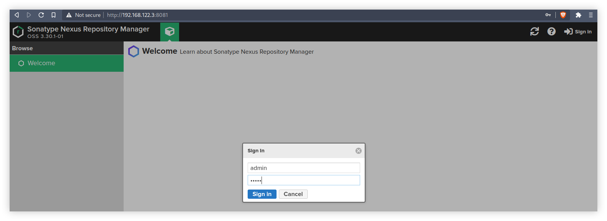
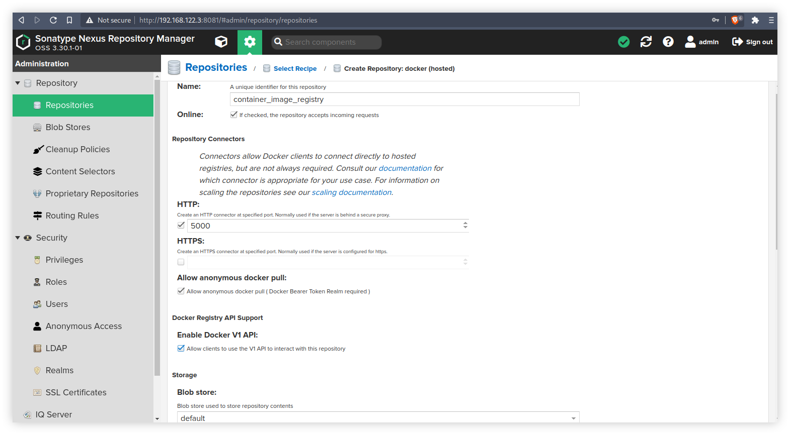
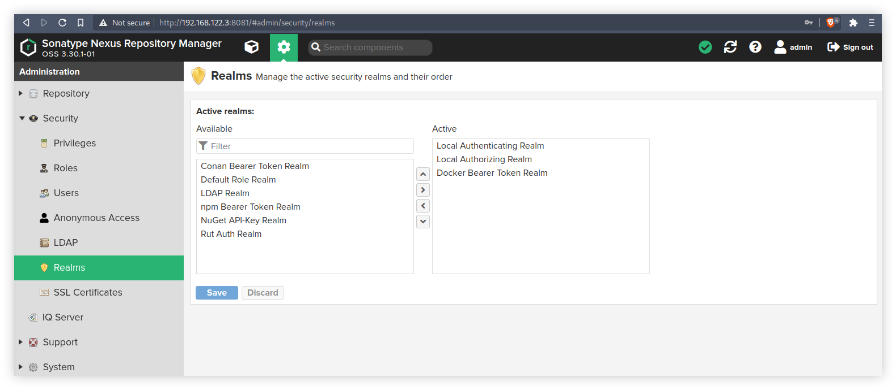
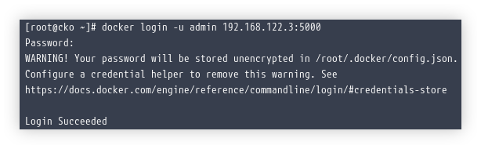
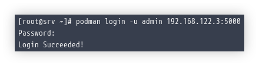
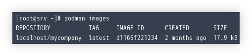
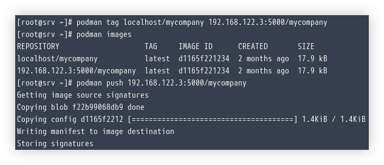
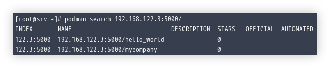

# NXRM untuk Private Image Registry


NXRM atau Nexus Repository Manager merupakan open source tool yang digunakan untuk mengelola repository multi-guna, meliputi Docker Image Registry, Java Maven, NPM, Rubygems, YUM, hingga APT. Private Repository sangat berguna bagi environment lokal yang tidak terhubung ke internet secara langsung, selain itu juga dapat digunakan untuk mengurangi penggunaan bandwidth internet, atau meningkatkan kecepatan _push and pull_ image bagi container.

<!--more-->

## Sonatype NXRM


Sonatype merilis NXRM menjadi dua macam, yaitu OSS (Open Source Software) yang dapat digunakan tanpa biaya, dan Pro yang memiliki beberapa fitur unggulan tambahan. Terkait komparasi antara kedua versi tersebut dapat dilihat pada link [berikut](https://www.sonatype.com/products/repository-oss-vs-pro-features) atau [ini](https://sonatype.drift.click/oss-vs-pro).

---


## Prerequisites
Nexus memerlukan beberapa prasyarat yang harus dipenuhi sebelum instalasi seperti berikut.

### Hardware Specifications
Pada saat artikel ini ditulis, saya akan menggunakan Nexus Repository Manager 3. NXRM membutuhkan spesifikasi hardware minimum seperti berikut:
- 8GB RAM
- 4 CPUs
- 500GB disk space

Terdengar lumayan besar, namun hal ini adalah hal yang wajar dalam membangun sebuah repository server. Image Registry akan membutuhkan storage yang besar, dan disk space yang kurang besar akan dengan mudah menjadi penuh nantinya. Tetapi karena dalam artikel ini saya hanya ingin melakukan percobaan saja, maka _saya cukup menggunakan 20GB storage_ saja.

### System Requirements
Nexus dapat dipasang langsung diatas VM/OS atau bisa juga dijalankan di dalam container, dalam artikel ini saya akan langsung memasangnya diatas VM yang menggunakan distro **RHEL 8**. Sebelum lebih lanjut, kita perlu melakukan beberapa hal berikut agar NXRM dapat berjalan.

#### Dedicated User
Buat sebuah user, misalnya bernama `nexus` dengan perintah berikut.
```shell
sudo useradd nexus
``` 
Kemudian berikan password pada user tersebut.
```shell
sudo passwd nexus
```
Kita hendaknya tidak pernah menjalankan Nexus menggunakan user `root`. Nantinya user `nexus` inilah yang akan kita pakai untuk menjalankan Nexus.

#### File Handle Limits
Tambahkan batasan _file handle_ pada file `/etc/security/limits.conf` bagi user yang telah kita buat.
```config
nexus - nofile 65536
```

#### Instal Java Runtime Environment
NXRM membutuhkan setidaknya JRE 8 untuk berjalan, jika belum ada maka pasang terlebih dahulu.
```shell
sudo dnf install -y java-1.8.0-openjdk
```
Di artikel ini saya menggunakan OpenJDK 1.8.0 sebagai Java Runtime Environment.

---

## Instalasi
Berikut ini adalah langkah-langkah yang dilakukan untuk memasang dan menjalankan NXRM pada RHEL 8.

### Download NXRM
Jalankan perintah berikut untuk mengunduh NXRM. Kemudian extract ke direktori `/opt` seperti berikut.
```shell
wget https://download.sonatype.com/nexus/3/latest-unix.tar.gz 
sudo tar xvf latest-unix.tar.gz -C /opt/
```

### Edit Konfigurasi NXRM
Ubah beberapa konfigurasi yang diperlukan pada `/opt/nexus*/bin/nexus.rc` untuk memasukkan user yang akan digunakan untuk menjalankan proses.
```config
run_as_user="nexus"
```
Sedangkan `/opt/nexus*/bin/nexus.vmoptions` akan digunakan untuk konfigurasi yang berkaitan dengan Runtime Environment.

### SELinux Label dan File Permission
Ubah user dan group owner pada direktori nexus.
```shell
sudo hown -R nexus:nexus /opt/nexus*
sudo chown -R nexus:nexus /opt/sonatype-work
```

Tambahkan SELinux label yang sesuai pada direktori nexus tersebut.
```shell
sudo semanage fcontext -a -t initrc_t "/opt/nexus*(/.*)?"
sudo semanage fcontext -a -t initrc_exec_t "/opt/nexus*(/.*)?"
sudo restorecon -Rv /opt/nexus*
```

### Membuat Service Systemd
Jika kita memakai Systemd sebagai init system, maka kita perlu membuat sebuah file service baru.
```shell
sudo vi /etc/systemd/system/nexus.service
```
Di dalamnya bisa diisi konfigurasi seperti berikut.
```config
[Unit]
Description=Nexus Service
After=network.target
  
[Service]
Type=forking
LimitNOFILE=65536
ExecStart=/opt/nexus-3.30.1-01/bin/nexus start
ExecStop=/opt/nexus-3.30.1-01/bin/nexus stop
User=nexus
Group=nexus
Restart=on-abort
TimeoutSec=600
  
[Install]
WantedBy=multi-user.target
```
Dengan menjadikan NXRM sebagai Service, maka NXRM dapat berjalan secara otomatis apabila OS mengalami reboot. Pastikan juga file systemd service tersebut mempunyai permission yang benar.
```shell
sudo chmod 644 /etc/systemd/system/nexus.service
```

### chkconfig
Jalankan perintah `chkconfig` seperti berikut.
```shell
sudo chkconfig nexus on
```

### Buka Port untuk NXRM
Karena by-default `firewalld` tidak memperbolehkan akses port dari luar, maka kita perlu membukanya.
```shell
sudo firewall-cmd --permanent --add-port=8081/tcp
sudo firewall-cmd --reload
```
NXRM akan listening pada port 8081 supaya dapat diakses melalui web browser.

### Enable Service NXRM
Enable service NXRM supaya ikut berjalan otomatis bersama OS saat pertamakali dihidupkan.
```shell
sudo systemctl daemon-reload
sudo systemctl enable --now nexus.service
```

### Mengganti Password Admin
Dapatkan password bawaan dari NXRM untuk login melalui web browser yang disimpan pada `/opt/sonatype-work/nexus3/admin.password` seperti berikut.
```shell
sudo cat /opt/sonatype-work/nexus3/admin.password
```
Lalu buka alamat IP port 8081 pada web browser, dan login menggunakan user `admin` dan password diatas.



`192.168.122.3` merupakan IP dari VM yang saya jalankan untuk memasang NXRM, sesuaikan dengan environment kalian masing-masing.


### Create Repository
Buat repository baru yang akan kita gunakan sebagai image registry. Silahkan centang sesuai gambar berikut.

Pada artikel ini, saya akan menggunakan port 5000 untuk Image Registry.

### Realm
Aktifkan _Docker Bearer Token Realm_.


### Buka Port Image Registry
Kita perlu membuka port 5000 supaya dapat diakses dari luar.
```shell
sudo firewall-cmd --permanent --add-port=5000/tcp
sudo firewall-cmd --reload
```

---

## Pengujian
Dari sini saja harusnya kita sudah dapat menggunakan Image Registry di dalam NXRM yang sudah kita buat.

### Insecure Registry
Karena kita tidak mengaktifkan SSL yang sah pada repository Image Registry maka kita perlu menambahkan address Registry tersebut ke dalam Insecure Registry. Jika **memakai Docker** sebagai Container Runtime, maka buat file `/etc/docker/daemon.json` dan isi seperti berikut.
```json
{
	"insecure-registries": [ "192.168.122.3:5000" ]
}
```

Lalu restart Docker Service jika menggunakan Systemd.
```shell
sudo systemctl restart docker.service
```

Jika **menggunakan Podman** sebagai Container Runtime, maka buka file `/etc/containers/registries.conf` kemudian edit isinya pada bagian berikut.
```config
[registries.insecure]
registries = ['192.168.122.3:5000']
```
Karena Podman merupakan _daemonless_ maka kita tidak perlu melakukan restart service apapun.

### Login Image Registry
Sekarang coba login ke dalam Image Registry menggunakan user `admin` dan password yang sudah kita buat.
```shell
docker login -u admin 192.168.122.3:5000
```
Jika berhasil maka akan muncul tampilan seperti berikut.


Sedangkan jika menggunakan Podman adalah seperti berikut.


### Push Container Image
Sebelumnya saya telah memiliki sebuah Container Image bernama `localhost/mycompany` dan akan coba saya push ke Image Registry.


Pertama saya akan merubah tag Image tersebut.
```shell
podman tag localhost/mycompany 192.168.122.3:5000/mycompany
podman images
```
Kemudian kita push container image tersebut menuju Image Registry.
```shell
podman push 192.168.122.3:5000/mycompany
```
Jika berhasil, maka kira-kira akan muncul tampilan seperti berikut.


### Search Container Image
Kita dapat mencari container image yang tersedia pada NXRM langsung melalui Docker atau Podman.
```shell
podman search 192.168.122.3:5000/
```
Akan terlihat container image yang tersedia di dalam image registry pada NXRM.


---

## Kesimpulan
Sebenarnya masih banyak yang fitur yang tersedia dan perlu saya coba pada NXRM, namun saya rasa artikel kali ini sudah cukup panjang dan membosankan. Salah satu yang menarik adalah kita dapat menerapkan konsep _High Availability_ dengan membangun sebuah Nexus Cluster menggunakan beberapa server sekaligus, sayangnya saya belum dapat mencobanya karena keterbatasan _resource_. Dari pengalaman saya di tempat kerja, Nexus dari Sonatype memang sangat sering digunakan oleh perusahan baik _Telco_ maupun _Banking_ untuk membangun sebuah Private Repository Manager, tidak cuma meng-_handle_ Image Registry namun juga YUM Repository bagi distro RHEL yang berjalan sebagai node pada cluster container oschestration seperti Kubernetes.

---

## Referensi
- [https://help.sonatype.com/repomanager3/installation/system-requirements](help.sonatype.com/repomanager3/installation/system-requirements)
- [https://help.sonatype.com/repomanager3/installation/run-as-a-service](help.sonatype.com/repomanager3/installation/run-as-a-service)
- [https://help.sonatype.com/repomanager3/formats/docker-registry/pushing-images](help.sonatype.com/repomanager3/formats/docker-registry/pushing-images)
- [https://help.sonatype.com/repomanager3/installation/configuring-the-runtime-environment](help.sonatype.com/repomanager3/installation/configuring-the-runtime-environment)
- [https://www.redhat.com/sysadmin/manage-container-registries](www.redhat.com/sysadmin/manage-container-registries)
- [http://docs.podman.io/en/latest/markdown/podman-pull.1.html](docs.podman.io/en/latest/markdown/podman-pull.1.html)

