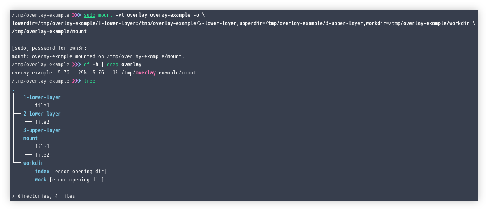
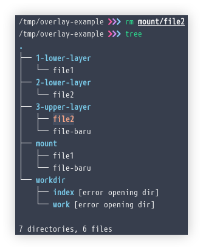

# Penerapan Linux OverlayFS pada Container Image


Adalah tidak mungkin untuk menggunakan container tanpa container image. Artikel ini akan mengulas bagaimana kombinasi mounting filesystem dan penerapannya pada teknologi container dalam membangun container image.

<!--more-->

## Overlay Filesystem
**Overlay** filesystem juga sering disebut sebagai [union filesystem](https://git.kernel.org/pub/scm/linux/kernel/git/torvalds/linux.git/tree/Documentation/filesystems/overlayfs.rst) memungkinkan pembuatan kombinasi dua atau lebih direktori, yang akan menjadi list dari yang biasa dijuluki sebagai direktori _lower_ dan direktori _upper_. Direktori _lower_ biasanya memiliki permission _read only_, sedangkan direktori _upper_ dapat diberikan permission _read-write_. Saya teringat, salah satu _use case_ Overlay filesystem yang pernah saya lakukan adalah memakainya untuk membuat [_extroot_](https://openwrt.org/docs/guide-user/additional-software/extroot_configuration) atau external root pada OpenWrt guna memperluas filesystem sebuah wireless router dengan cara menaruh penyimpanannya ke media eksternal seperti USB storage.

Untuk memahami Overlay filesystem kita dapat mempraktekannya dengan bantuan perintah `mount` pada sistem operasi GNU/Linux. Mari melihat apa yang dimaksud dengan pernyataan sebelumnya dengan mencobanya.

### Membuat Overlay Filesystem
Saya akan membuat beberapa folder dan mengkombinasikannya. Pertama saya ingin membuat sebuah folder bernama `mount` dimana nantinya akan berisikan gabungan dari keseluruhan folder lainnya. Kemudian saya membuat sebuah sekelompok folder bernama `1-lower-layer`, `2-lower-layer`, dan `3-upper-layer`. Dan akhirnya saya membuat sebuah folder bernama `workdir` yang diperlukan oleh overay filesystem untuk dapat bekerja dengan benar.

```shell
cd /tmp && mkdir overlay-example && cd overlay-example
mkdir -v mount 1-lower-layer 2-lower-layer 3-upper-layer workdir
ls -l
```


Sekarang mari membuat beberapa file dalam folder `1-lower-layer` `2-lower-layer` memakai perintah `echo`. Untuk folder `3-upper-layer` akan kita biarkan kosong sebagai contoh dari direktori _upper_ saja. Kita akan melihat bagaimana nantinya mereka akan bekerja.

```shell
echo "ini layer 1" > ./1-lower-layer/file1
echo "ini layer 2" > ./2-lower-layer/file2
tree
```


Pada akhirnya, mari kita jalankan perintah `mount` pada mereka.

```shell
sudo mount -vt overlay overay-example -o \
lowerdir=/tmp/overlay-example/1-lower-layer:/tmp/overlay-example/2-lower-layer,upperdir=/tmp/overlay-example/3-upper-layer,workdir=/tmp/overlay-example/workdir \
/tmp/overlay-example/mount
df -h | grep overlay
tree
```

Jika berhasil kita dapat melihatnya seperti output berikut ini.


Sebagaimana kita mengharapkannya, seluruh konten dari folder `1-lower-layer` dan `2-lower-layer` dapat dikombinasikan dan dimuat ke dalam folder `mount`. Mari kita periksa konten dari file tersebut yang sebelumnya telah kita tuliskan sebuah string menggunakan perintah `echo`.
```shell
cat mount/file2
```

Sudah dipastikan bahwa memang file tersebut identik dengan apa yang sudah kita ciptakan sebelumnya.


Lalu bagaimana jika kita membuat sebuah file baru pada folder mount? mari kita coba.
```shell
echo "Ini adalah file baru" > ./mount/file-baru
tree
```


Terlihat bahwa file baru yang kita ciptakan di folder `mount` akan tersimpan pada _upper layer_ atau di sini kita menamai foldernya dengan nama `3-upper-layer`. Lalu bagaimana jika kita menghapus salah satu file milik _lower layer_, misalnya adalah `file2`.
```shell
rm mount/file2
tree
```



File tersebut berhasil dihapus dari folder `mount`, tapi ternyata `file2` masih utuh dan baik-baik saja di dalam folder `2-lower-layer`. Kemudian jika diperhatikan, akan muncul sebuah file baru pada folder `3-upper-layer` bernama `file2` sesuai dengan yang baru saja kita hapus. Mari kita periksa file tersebut.

```shell
ls -lhtra 3-upper-layer
```


File baru di dalam folder `3-upper-layer` ternyata adalah sebuah _character file_. File semacam ini seringkali disebut sebagai file _whiteout_ dan begitulah overlay filesystem menampilkan berkas yang akan dihapus.

### Menarik Kesimpulan
Sebagaimana yang saya bicarakan pada awal tadi, overlay filesystem memungkinkan kita untuk membuat sebauh _union_ atau kesatuan beberapa direktori. Dalam kasus kita saat ini _union_ dibuat pada folder `mount` dan di dalamnya akan berisi konten kolaborasi dari direktori _layer_ yaitu folder `1-lower-layer` dan `2-lower-layer` sebagai lapisan direktori _lower_, serta folder `3-upper-layer` sebagai lapisan direktori _upper_.

Setiap perubahan yang kita lakukan pada _union_ (membuat, menghapus, atau mengedit konten) akan dicatat pada _upper layer_. Ini adalah alasan kenapa lapisan _upper_ sering juda disebut sebagai lapisan _diff_. Fakta lainnya adalah, berkas-berkas dari _upper layer_ akan merupakan bayangan dari _lower layer_, contohnya ketika kita membuat file atau folder pada _upper layer_ dengan nama yang sama dengan yang ada di _lower layer_ maka berkas tersebutlah yang akan ditampilkan pada _union_.


---

## Container Image
**Container Image** sebenarnya adalah sebuah _tarfile_ dengan root filesystem dan beberapa metadata. Kita mungkin pernah mendengar tentang karakteristik _image layer_ dan setiap baris dari **Dockerfile** (sebuah textfile yang berisi baris perintah untuk membangun container image) akan membuat layer baru. Contohnya seperti berikut, dimana dia akan membuat tiga layer untuk setiap baris perintahnya.
```Dockerfile
FROM scratch
ADD my-files /doc
ADD hello /
CMD ["/hello"]
```

Jadi apa yang sebenarnya terjadi saat kita menjalankan perintah `docker run`. Banyak hal yang sebenarnya terjadi, tapi untuk kepentingan artikel kali ini kita akan meluruskan ketertarikan kita pada container image.


Secara pandangan _high level_, docker akan mengunduh _tarball_ untuk image, kemudian melakukan unpack pada setiap layer menjadi beberapa direktori terpisah dan kemudian menggunakan overlay filesystem untuk mengkombinasinya menjadi sebuah kesatuan direktori _upper_ kosong yang akan digunakan oleh container untuk menuliskan segala perubahan ketika tengah berjalan. 

Ketika kita melakukan suatu perubahan, seperti membuat atau menghapus file di dalam container, perubahan tersebut akan disimpan pada direktori kosong di _upper layer_. Ketika container dihentikan, docker akan membersihkan folder tersebut. Itulah alasannya kenapa setiap perubahan yang kita lakukan di dalam container _by default_ tidak disimpan permanen.

### Layer Cache

Ini adalah metode yang digunakan oleh overlay filesystem untuk memungkinkan _host_ melakukan _caching_ container image secara efektif. Sebagai contoh, jika kita mendefinisikan dua container image, mereka berdua dapat menggunakan beberapa layer yang sama. Sehingga _host_ tidak perlu mengunduh kembali atau menyimpan salinannya berkali-kali pada disk.

### OCI format 
Menjalankan sebuah container dapat dianalogikan menjadi dua langkah proses: membangun image dan menjalankan container dari image tersebut. Popularitas container telah meyakinkan orang-orang untuk melakukan standarisasi kedua langkah proses tersebut. Karena _open source_, kedua langkah proses tersebut dapat dikembangkan secara terpisah. **Open Container Initiative (OCI)** merupakan sebuah project dari [Linux Foundation](https://www.linuxfoundation.org/projects) yang mengelola standarisasi container supaya dapat disesuaikan dengan lingkungan industri.

Saat artikel ini dibuat, OCI memiki dua macam spesifikasi: Runtime Specification (runtime-spec) dan Image Specification (image-spec). Runtime Specification menguraikan cara untuk menjalankan "filesystem bundle" yang dapat dibongkar pada disk. Penerapan OCI seperti mengunduh OCI Image kemudian melakukan _unpack_ image tersebut ke dalam OCI Runtime filesystem bundle. Pada titik ini OCI Runtime Bundle akan dijalankan oleh sebuah OCI Runtime.

Standarisasi tersebut memperbolehkan setiap orang untuk mengembangkan custom container builder dan custom runtime. Sebagai contoh, ada jessfraz/img, buildah, hingga Skopeo yang mampu kita pakai untuk membangun container image tanpa perlu bergantung pada Docker. Banyak tool lain yang juga bisa kita gunakan untuk menjalankan container (disebut container runtime) seperti runC (yang dipakai oleh Docker) dan rkt.

---

## Overlay Filesystem Lainnya

Docker tidak cuma mampu menggunakan Overlay untuk melakukan kombinasi filesystem. Ada beberapa lainnya yang memiliki potensi untuk dapat digunakan seperti AuFS, Btrfs, ZFS, hingga Device mapper.

---

## Build Container Image

Misalkan kita memiliki sebuah Dockerfile seperti berikut untuk membangun image. Apa yang sebenarnya terjadi?
```Dockerfile
FROM centos:7
RUN yum install -y wget
...
```
Pada pandangan _high level_, inilah yang akan terjadi dari Dockerfile tersebut.
1. Docker mengunduh tarball untuk image karena perintah `FROM` dan membongkarnya. Ini akan menjadi layer paling bawah dari container image.
2. Memuat _union_ filesystem. Berkas yang sebelumnya telah terunduh pada langkah pertama akan dipakai sebagai _lower layer_.
3. Menjalankan shell command di dalam environment `chroot` karena perintah `RUN`. Perintah tersebut adalah `/bin/sh -c "yum install -y wget`.
4. Ketika baris perintah terakhir telah dijalankan, container runtime akan membuat _upper layer_. Ini adalah lapisan baru dari image yang kita bangun.
5. Jika Dockerfile mengandung perintah lainnya, maka proses pada langkah kedua akan diulangi sebagai _lower layer_ dan berikutnya hingga selesai.

Tentu anggapan ini cenderung terlalu menyederhanakan workflow dimana saya tidak menyinggung perintah lain seperti `ENV` hingga `ENTRYPOINT`. Perintah tersebut akan disimpan di dalam metadata dan kemudian dikemas bersama ke dalam layer.

---

## Kesimpulan
Gagasan untuk merangkum keseluruhan root filesystem menjadi sebuah tarfile dan memisahkan setiap layer menjadi begitu _powerful_. Ini tidak hanya dipakai pada teknologi container, tapi konsep ini juga dapat digunakan pada konteks lainnya. Saya kira, di masa mendatang akan semakin banyak tools yang memanfaatkan hal serupa.

---

## Referensi
- [git.kernel.org/pub/scm/linux/kernel/git/torvalds/linux.git/tree/Documentation/filesystems/overlayfs.rst](https://git.kernel.org/pub/scm/linux/kernel/git/torvalds/linux.git/tree/Documentation/filesystems/overlayfs.rst)
- [openwrt.org/docs/guide-user/additional-software/extroot_configuration](https://openwrt.org/docs/guide-user/additional-software/extroot_configuration)
- [docs.docker.com/develop/develop-images/dockerfile_best-practices](https://docs.docker.com/develop/develop-images/dockerfile_best-practices/)
- [opencontainers.org/faq](https://opencontainers.org/faq/)
- [github.com/opencontainers/runtime-spec/blob/master/spec.md](https://github.com/opencontainers/runtime-spec/blob/master/spec.md)
- [github.com/opencontainers/image-spec/blob/master/layer.md](https://github.com/opencontainers/image-spec/blob/master/layer.md)

