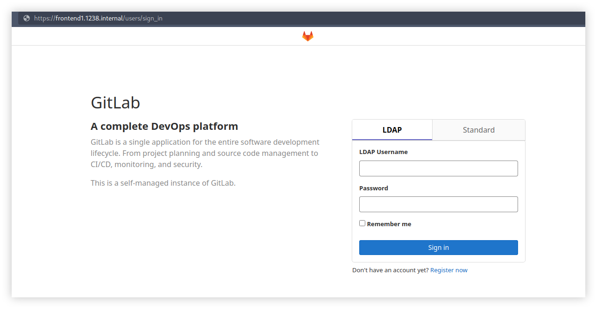
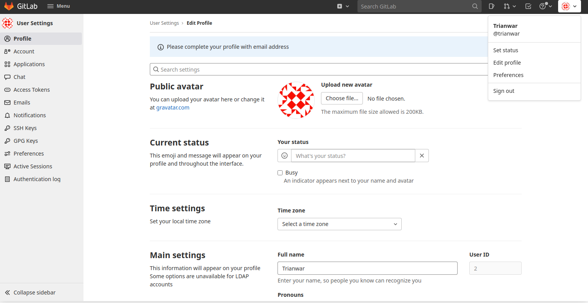
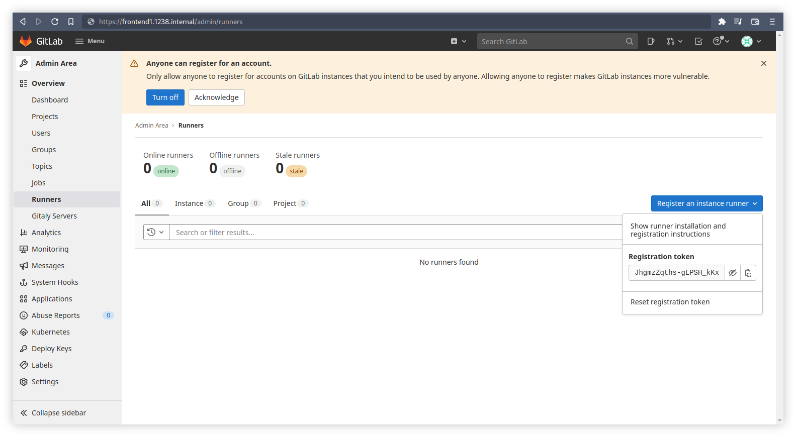
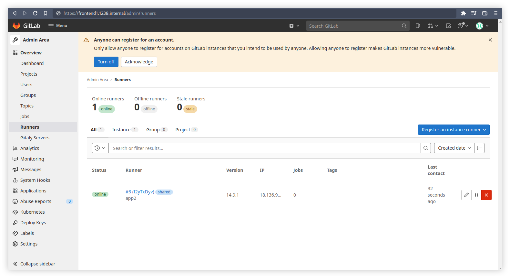

# Setup Gitlab Server with Ansible


Selain Gitlab [SaaS](https://glossary.cncf.io/software_as_a_service/) yang biasa kita akses dari [gitlab.com](https://gitlab.com), kita dapat membangun server Gitlab secara manual ataupun otomatis, salah satunya adalah menggunakan Ansible Playbook. Gitlab dapat di-install dengan beberapa metode seperti Docker dengan Docker Compose, Helm charts jika ingin berjalan di atas Kubernetes, Operator jika berjalan di atas OpenShift, hingga instalasi dari sourcecode untuk dapat berjalan di atas berbagai platform yang tidak didukung oleh official Gitlab. Pada artikel kali ini saya akan menggunakan package official untuk distro Linux, dan sebagian besar proses akan dilakukan secara otomatis menggunakan Ansible.

<!--more-->

## Outset
Sekilas detail dari environment yang akan saya gunakan untuk instalasi Gitlab CE (Community Edition).
### Arsitektur
Secara default Gitlab menyediakan semua komponen yang dibutuhkan dalam binary package nya, namun kita bisa juga menggunakan komponen eksternal jika dibutuhkan. Contohnya adalah database server dengan PostgreSQL, dan server LDAP yang akan diintegrasikan dengan server Gitlab. Dalam artikel ini, keseluruhan server yang saya punya adalah VM (Virtual Machine) dengan RHEL 7.7 Maipo.
```txt
                                                    Managed Hosts
  
                                    +------------------------------------------+
                                    |                                          |
                                    |    +------------+                        |
                                    |    |            |                        |
                           +--------+----+   GitLab   | frontend.1238.internal |
                           |        |    |   Server   |                        |
                           |        |    |            |                        |
                           |        |    +------------+                        |
                           |        |                                          |
                           |        |    +------------+                        |
                           |        |    |            |                        |
                           +--------+----+ PostgreSQL | appdb1.1238.internal   |
     Controller Host       |        |    |   Server   |                        |
                           |        |    |            |                        |
      +------------+       |        |    +------------+                        |
      |            |       |        |                                          |
      |  Bastion   +-------+        |                                          |
      |            |       |        |                                          |
      +------------+       |        |    +------------+                        |
                           |        |    |            |                        |
   bastion.1238.internal   |        |    |    LDAP    | app1.1238.internal     |
                           +--------+----+   Server   |                        |
                           |        |    |            |                        |
                           |        |    +------------+                        |
                           |        |                                          |
                           |        |    +------------+                        |
                           |        |    |            |                        |
                           +--------+----+   GitLab   | app2.1238.internal     |
                                    |    |   Runner   |                        |
                                    |    |            |                        |
                                    |    +------------+                        |
                                    |                                          |
                                    +------------------------------------------+
  ```

### Inventory
Berikut ini adalah list server yang saya masukan ke dalam inventory untuk Ansible.
```ini
[gitlab]
frontend1.1238.internal

[ldap]
app1.1238.internal

[runner]
app2.1238.internal

[db]
appdb1.1238.internal

[bastion]
bastion.1238.internal

[allserver:children]
gitlab
ldap
runner
db
bastion

[allserver:vars]
timeout=60
ansible_user=ec2-user
ansible_ssh_private_key_file="~/.ssh/1238key.pem"
ansible_ssh_common_args="-o StrictHostKeyChecking=no"
```

Pada umumnya kita semestinya sudah mempersiapkan sebuah dedicated user dengan kemampuan `sudoers` pada tiap server yang akan kita manage. Dalam kasus kali ini, saya menggunakan user bernama `ec2-user` dan dapat diakses melalui `ssh` secara passwordless. Untuk `sudo` juga sudah dikonfigurasi agar tidak perlu menginput password.

---
## Setup PostgreSQL Server
Untuk database yang akan digunakan oleh server Gitlab, harus dikonfigurasi sesuai dengan requirements yang telah ditentukan di [dokumentasi berikut](https://docs.gitlab.com/ee/install/installation.html#6-database). Berikut ini adalah beberapa hal yang mungkin perlu dicatat.

### User Service
Saya buat terlebih dahulu dedicated user untuk server `appdb1.1238.internal` yang akan kita gunakan khusus untuk mengakses service PostgreSQL.
```shell
sudo useradd -s /usr/sbin/nologin -c 'GitLab' git
echo 'rahasiabanget' | sudo passwd git --stdin
```

### Package Dependency
Pada RHEL 7.7 atau CentOS 7.7 saya mendapati dependency dari package PostgreSQL yang tidak ada dalam official repository, yaitu `llvm-toolset-7-clang` di mana packge ini dapat kita dapatkan dari package SCLo RH repository bernama `centos-release-scl-rh` seperti berikut.
```shell
curl -k -O http://mirror.centos.org/centos/7/extras/x86_64/Packages/centos-release-scl-rh-2-3.el7.centos.noarch.rpm
sudo rpm -iv centos-release-scl-rh*.rpm
```
Dan nantinya dependency akan dapat dipasang.

### Install Packages
Kita akan langsung mengikuti panduan dari situs official PostgreSQL seperti berikut.
```shell
sudo yum install -y https://download.postgresql.org/pub/repos/yum/reporpms/EL-7-x86_64/pgdg-redhat-repo-latest.noarch.rpm
sudo yum install -y postgresql12 postgresql12-contrib postgresql12-devel postgresql12-libs postgresql12-server
```

### Allow Remote Connection
Karena service PostgreSQL akan diakses dari luar server `appdb1.1238.internal` maka kita perlu ubah konfigurasi file `postgresql.conf` milik PostgreSQL.
```shell
sudo sed -i "s/#listen_addresses = 'localhost'/listen_addresses = '*'/g" $(sudo find / -name "postgresql.conf")
```
Ada satu file lagi bernama `pg_hba.conf` yang perlu kita ubah.
```shell
echo "host    all    all    0.0.0.0/0    md5" | sudo tee -a $(sudo find / -name "pg_hba.conf")
```

### Enable Service
Sebelum menyalakan service kita perlu menginiasi terlebih dahulu.
```shell
sudo postgresql-12-setup initdb
```
Barulah kita bisa menyalakan servicenya.
```shell
sudo systemctl enable --now postgresql-12
```

### Create DB User
Kita akan membuat user database yang akan digunakan oleh GitLab server.
```shell
sudo -u postgres psql -d template1 -c "CREATE USER git CREATEDB;"
sudo -u postgres psql -U postgres
```
Lalu set password baru untuk user database yang baru kita buat.
```sql
ALTER USER git with password 'rahasiabanget';
\q
```
Jangan lupa untuk restart service.
```shell
sudo systemctl restart postgresql-12
```

### Create DB and Extensions
Ada beberapa extension yang perlu kita buat sesuai dengan [requirement GitLab](https://docs.gitlab.com/ee/install/requirements.html#database).
```shell
sudo -u postgres psql -d template1 -c "CREATE EXTENSION IF NOT EXISTS pg_trgm;"
sudo -u postgres psql -d template1 -c "CREATE EXTENSION IF NOT EXISTS btree_gist;"
```
Lalu buat sebuah database baru.
```shell
sudo -u postgres psql -d template1 -c "CREATE DATABASE gitlabhq_production OWNER git;"
```

---

## Setup LDAP Server
Saya akan menggunakan `Free IPA` untuk server LDAP. Lalu karena saya tidak mempunyai DNS, maka cukup dengan menambahkan baris konfigurasi pada `/etc/hosts` di server `app1.1238.internal` seperti berikut.

### Host File
```shell
echo "192.168.0.7    app1.1238.internal" | sudo tee -a /etc/hosts
```
Pastikan juga hostname server sudah sesuai.
```shell
sudo hostnamectl set-hostname app1.1238.internal
```
### Install Packages
Kemudian install package yang dibutuhkan
```shell
sudo yum install -y ipa-server
```

### Configure FreeIPA
Pertama jalankan command berikut untuk menginisiasi service FreeIPA.
```shell
sudo ipa-server-install
```
Akan muncul beberapa pertanyaan, kurang lebih seperti berikut.
```txt
[ec2-user@app1 ~]$ sudo ipa-server-install
Do you want to configure integrated DNS (BIND)? [no]: no
Server host name [app1.1238.internal]: app1.1238.internal
Please confirm the domain name [1238.internal]: 1238.internal
Please provide a realm name [1238.INTERNAL]: 1238.INTERNAL
Directory Manager password: rahasiabanget
Password (confirm): rahasiabanget
IPA admin password: rahasiabanget
Password (confirm): rahasiabanget
Continue to configure the system with these values? [no]: yes
Done.
Client hostname: app1.1238.internal
Realm: 1238.INTERNAL
DNS Domain: 1238.internal
IPA Server: app1.1238.internal
BaseDN: dc=1238,dc=internal
```

Jika kita mempunyai service firewall yang berjalan pada server ini, maka ijinkan beberapa port terkait service LDAP. Dibawah ini jika kita menggunakan `firewalld` untuk mengelola firewall.
```shell
sudo firewall-cmd --permanent --add-service={dns,freeipa-ldap,freeipa-ldaps}
sudo firewall-cmd --reload
```
Aktifkan juga modul `pam_oddjob_mkhomedir` agar home directory terbuat otomatis.
```shell
sudo authconfig --enablemkhomedir --update
```

### Create LDAP User
Kita akan mencoba membuat sebuah user LDAP, namun pertama kita perlu mendapatkan ticket Kerberos untuk dapat mengoperasikan command `ipa` seperti berikut.
```shell
kinit admin
```
Masukkan password yang sebelumnya telah kita setup, kemudian kita bisa membuat user baru.
```shell
ipa user-add trianwar --cn=Trianwar --first=Tri --last=Anwar --email=trianwar@protonmail.com --shell=/usr/bin/bash --homedir=/home/trianwar --password
```
Jika sudah, uji apakah user berhasil terbuat.
```txt
[ec2-user@app1 ~]$ ssh trianwar@localhost
The authenticity of host 'localhost (<no hostip for proxy command>)' can't be established.
ECDSA key fingerprint is SHA256:ky80bwa7by4uqlsVOIV08mVwhsCVcBYPuJpOyaxscNo.
ECDSA key fingerprint is MD5:b6:d0:f1:22:ed:12:15:10:6d:63:65:d2:1f:c1:c5:88.
Are you sure you want to continue connecting (yes/no)? yes
Warning: Permanently added 'localhost' (ECDSA) to the list of known hosts.
Password: rahasiabanget
Password expired. Change your password now.
Current Password: rahasiabanget
New password: rahasiabanget
Retype new password: rahasiabanget
Creating home directory for trianwar.
[trianwar@app1 ~]$
```
Biasanya pada login pertama, kita akan dipaksa untuk mengganti password. Namun kita dapat memasukkan password lama agar tidak terganti.

---

## Setup GitLab
Akhirnya kita telah sampai pada bagian ini, pertama kita perlu mempersiapkan certificate untuk service GitLab server. Sebenarnya playbook Ansible bisa membuatnya secara otomatis saat dijalankan, namun kali ini saya ingin membuatnya secara mandiri. Perlu diperhatikan bahwa sekarang saya sedang berada pada server `frontend1.1238.internal` yang akan menjadi server GitLab.

### Prepare Self-signed Certificate
Saya menggunakan `easy-rsa` untuk membuat certificate.
```shell
sudo yum install -y easy-rsa
mkdir -p ~/easy-rsa; cd ~/easy-rsa
ln -s /usr/share/easy-rsa/* ~/easy-rsa
./easyrsa init-pki
touch -f vars
```
Edit file vars sesuai kebutuhan kita, kurang lebih seperti berikut.
```txt
set_var EASYRSA_REQ_COUNTRY    "ID"
set_var EASYRSA_REQ_PROVINCE   "Jakarta"
set_var EASYRSA_REQ_CITY       "South Jakarta"
set_var EASYRSA_REQ_ORG        "GitLab"
set_var EASYRSA_REQ_EMAIL      "trianwar@protonmail.com"
set_var EASYRSA_REQ_OU         "Community"
set_var EASYRSA_ALGO           "rsa"
set_var EASYRSA_DIGEST         "sha512"
```
Kemudian kita lanjutkan dengan command berikut.
```shell
./easy-rsa build-ca nopass
```
Akan muncul beberapa tampilan berikut, masukkan saja informasi yang diperlukan seperti domain name yang akan dipakai untuk mengakses GitLab dan password untuk certificate.
```txt
[ec2-user@frontend1 ~/easy-rsa]$ ./easyrsa build-ca
Common Name (eg: your user, host, or server name) [Easy-RSA CA]: frontend1.1238.internal

CA creation complete and you may now import and sign cert requests.
Your new CA certificate file for publishing is at:
/home/ec2-user/easy-rsa/pki/ca.crt
```

Salin file yang berhasil di-generate untuk digunakan.
```shell
cat ~/easy-rsa/pki/ca.crt | sudo tee /etc/pki/ca-trust/source/anchors/frontend1.1238.internal.crt
sudo update-ca-trust
openssl req -new -key frontend1.1238.internal.key -out frontend1.1238.internal.req -subj /C=ID/ST=Jakarta/L=South\ Jakarta/O=init.web.id/OU=Community/CN=frontend1.1238.internal/emailAddress=trianwar@protonmail.com
./easyrsa import-req frontend1.1238.internal.req.req frontend1.1238.internal
./easyrsa sign-req server frontend1.1238.internal
sudo mkdir -p /etc/gitlab/ssl
cat frontend1.1238.internal.key | sudo tee /etc/gitlab/ssl/frontend1.1238.internal.key
cat pki/issued/frontend1.1238.internal.crt | sudo tee /etc/gitlab/ssl/frontend1.1238.internal.crt
```

### Playbook
Clone Playbook dari repository Git yang sudah saya siapkan.
```shell
cd ~
git clone https://github.com/anwareset/ansible-gitlab-setup.git
cd ansible-gitlab-setup
```
Playbook ini sebenarnya adalah Roles yang awalnya dibuat oleh [`geerlingguy`](https://galaxy.ansible.com/geerlingguy/gitlab), kita dapat menggunakannya dalam bentuk Roles. Tapi saya memodifikasi sedikit sesuai kebutuhan saya. Kurang lebih struktur Playbook yang akan kita gunakan.
```txt
.
├── ansible.cfg            <---- Ansible Configuration File
├── gitlab-setup.yml       <---- Playbook
├── hosts                  <---- Inventory
├── LICENSE
├── README.md
├── templates
│   ├── backup.sh.j2       <---- Custom shell script for autobackup
│   └── gitlab.rb.j2       <---- Gitlab Configuration File
└── vars
    ├── Debian.yml
    ├── main.yml           <---- User Variables
    └── RedHat.yml
```
Edit file `vars/main.yml` dan sesuaikan dengan beberapa server yang telah kita konfigurasi sebelumnya (LDAP dan PostgreSQL), jangan lupa untuk merubah opsi certificate. Kurang lebihnya seperti berikut.
```yaml
# General Configuration
gitlab_domain: frontend.1238.internal

# Database Configuration
postgresql_enable: true
postgresql_host: "appdb1.1238.internal"
postgresql_port: 5432
postgresql_username: "git"
postgresql_password: "rahasiabanget"

# LDAP Configuration
gitlab_ldap_enabled: true
gitlab_ldap_host: "app1.1238.internal"
gitlab_ldap_port: 389
gitlab_ldap_uid: "uid"
gitlab_ldap_encryption: "plain"
gitlab_ldap_verify_certificates: false
gitlab_ldap_bind_dn: "CN=admin,DC=1238,DC=internal"
gitlab_ldap_password: "rahasiabanget"
gitlab_ldap_active_directory: ""
gitlab_ldap_base: "DC=1238,DC=internal"
gitlab_ldap_user_filter: ""
gitlab_ldap_lowercase_username: false
gitlab_ldap_allow_email: true

# SSL Configuration
gitlab_redirect_http_to_https: true
gitlab_ssl_certificate: "/etc/gitlab/ssl/{{ gitlab_domain }}.crt"
gitlab_ssl_certificate_key: "/etc/gitlab/ssl/{{ gitlab_domain }}.key"
gitlab_ssl_protocols: "TLSv1.1 TLSv1.2"

# SSL Self-signed Certificate Configuration
gitlab_create_self_signed_cert: false
```

Jika sudah dirasa cukup, kita lanjutkan untuk menjalankan Ansible Playbook dengan command berikut.
```shel
ansible-playbook gitlab-setup.yml --syntax-check
ansible-playbook gitlab-setup.yml -vv
```

Untuk durasi dari proses setup sangat variatif tergantung dari spesifikasi dan koneksi yang dimiliki oleh server. Jika berhasil, kita dapat melakukan pengecekan seperti berikut.
```shell
sudo gitlab-ctl status
```
Kurang lebih outputnya seperti berikut.
```txt
run: alertmanager: (pid 16114) 440s; run: log: (pid 14417) 639s
run: gitaly: (pid 16107) 440s; run: log: (pid 11898) 792s
run: gitlab-exporter: (pid 18438) 266s; run: log: (pid 13953) 663s
run: gitlab-kas: (pid 18292) 288s; run: log: (pid 12454) 772s
run: gitlab-workhorse: (pid 15997) 445s; run: log: (pid 13566) 687s
run: grafana: (pid 18440) 266s; run: log: (pid 15289) 495s
run: logrotate: (pid 11610) 809s; run: log: (pid 11619) 805s
run: nginx: (pid 19808) 64s; run: log: (pid 13696) 680s
run: node-exporter: (pid 16025) 445s; run: log: (pid 13841) 669s
run: postgres-exporter: (pid 16121) 440s; run: log: (pid 14568) 633s
run: postgresql: (pid 12167) 779s; run: log: (pid 12254) 777s
run: prometheus: (pid 16084) 443s; run: log: (pid 14249) 646s
run: puma: (pid 18536) 262s; run: log: (pid 13345) 699s
run: redis: (pid 11714) 802s; run: log: (pid 11777) 799s
run: redis-exporter: (pid 16078) 444s; run: log: (pid 14084) 656s
run: sidekiq: (pid 18196) 312s; run: log: (pid 13480) 693s
```

Coba buka domain yang kita gunakan untuk server Gitlab pada web browser. Jika berhasil maka kurang lebih akan seperti berikut. Coba untuk login menggunakan user LDAP yang telah kita buat sebelumnya.



### Reset Root Password
Sedangkan untuk password user `root` kita perlu melakukan reset terlebih dahulu menggunakan `Rake` task.
```shell
sudo gitlab-rake "gitlab:password:reset"
```

---


## Setup GitLab Runner
Selanjutnya kita akan menggunakan Playbook lain untuk registrasi Gitlab Runner.
```shell
cd ~
git clone https://github.com/anwareset/ansible-gitlab-runner-setup.git
cd ansible-gitlab-runner-setup
```

Dan karena server Gitlab tadi menggunakan self-signed certificate, maka kita perlu menyalinnya ke tempat yang bisa dijangkau oleh VM Gitlab Runner.
```shell
cat ~/easy-rsa/pki/issued/frontend1.1238.internal.crt > /tmp/frontend1.1238.internal.pem
cat ~/easy-rsa/frontend1.1238.internal.key > /tmp/frontend1.1238.internal.pem
ansible -m file -a "path=/etc/ssl/private state=directory mode='0755'" runner
ansible -m copy -a "src=/tmp/frontend1.1238.internal.pem dest=/etc/ssl/private/frontend1.1238.internal.pem mode='0644'" runner
```

Dapatkan _registration token_ dari Gitlab server di web browser.


Edit file `vars/main.yml` sesuaikan beberapa variabel seperti domain server Gitlab dan registration token.
```yaml
# GitLab coordinator URL
gitlab_runner_coordinator_url: 'https://frontend1.1238.internal/'
# GitLab registration token
gitlab_runner_registration_token: 'JhgmzZqths-gLPSH_kKx'
# A list of runners to register and configure
gitlab_runner_runners:
    state: present
    executor: 'docker'
    tls_ca_file: "/etc/ssl/private/frontend1.1238.internal.pem"
```

Jika sudah langsung saja kita run dengan command seperti berikut.
```shell
ansible-playbook gitlab-runner.yml --syntax-check
ansible-playbook gitlab-runner.yml -vv
```

Setelah berhasil, akan bisa kita cek di web browser dan hasilnya seperti seperti berikut.


---

## Referensi
- [docs.gitlab.com/ee/install/installation.html#6-database](https://docs.gitlab.com/ee/install/installation.html#6-database)
- [www.digitalocean.com/community/tutorials/how-to-set-up-and-configure-a-certificate-authority-ca-on-ubuntu-20-04](https://www.digitalocean.com/community/tutorials/how-to-set-up-and-configure-a-certificate-authority-ca-on-ubuntu-20-04)
- [easy-rsa.readthedocs.io/en/latest/advanced](https://easy-rsa.readthedocs.io/en/latest/advanced/)
- [access.redhat.com/documentation/en-us/red_hat_enterprise_linux/6/html/identity_management_guide/users](https://access.redhat.com/documentation/en-us/red_hat_enterprise_linux/6/html/identity_management_guide/users) 
- [access.redhat.com/documentation/en-us/red_hat_enterprise_linux/7/html/linux_domain_identity_authentication_and_policy_guide/installing-ipa](https://access.redhat.com/documentation/en-us/red_hat_enterprise_linux/7/html/linux_domain_identity_authentication_and_policy_guide/installing-ipa)
- [access.redhat.com/documentation/en-us/red_hat_enterprise_linux/7/html/linux_domain_identity_authentication_and_policy_guide/required-packages](https://access.redhat.com/documentation/en-us/red_hat_enterprise_linux/7/html/linux_domain_identity_authentication_and_policy_guide/required-packages)
- [galaxy.ansible.com/geerlingguy/gitlab](https://galaxy.ansible.com/geerlingguy/gitlab)
- [galaxy.ansible.com/riemers/gitlab-runner](https://galaxy.ansible.com/riemers/gitlab-runner)
- [centos.pkgs.org/7/centos-extras-x86_64/centos-release-scl-rh-2-3.el7.centos.noarch.rpm.html](https://centos.pkgs.org/7/centos-extras-x86_64/centos-release-scl-rh-2-3.el7.centos.noarch.rpm.html)
- [docs.gitlab.com/runner/install/](https://docs.gitlab.com/runner/install/)
- [stackoverflow.com/questions/18580066/how-to-allow-remote-access-to-postgresql-database](https://stackoverflow.com/questions/18580066/how-to-allow-remote-access-to-postgresql-database)
- [docs.gitlab.com/ee/security/reset_user_password.html#use-a-rake-task](https://docs.gitlab.com/ee/security/reset_user_password.html#use-a-rake-task)

