# Virtualisasi Infrastruktur dengan oVirt


[**oVirt**](https://ovirt.org) adalah virtualization platform open source untuk mengelola infrastruktur datacenter. Hypervisor yang dipakai oVirt adalah [`KVM`](https://www.linux-kvm.org), kemudian [`libvirt`](httpd://libvirt.org) dugunakan sebagai interface sehingga dapat hadir dalam bentuk tampilan Web. Pada artikel ini saya hanya membahas setup oVirt Node dengan _Self-hosted Engine_ sampai mampu menjalankan _guest VM_.

<!--more-->

## Tentang oVirt
Pada awalnya oVirt adalah project open source bernama [Solid ICE](http://www.desktop-virtualization.com/2008/05/01/qumranet-solid-ice), dikembangkan oleh perusahaan [Qumranet](https://www.redhat.com/en/about/press-releases/qumranet). Lalu [Red Hat mengakuisisi project tersebut](http://www.desktop-virtualization.com/2008/09/09/redhat-acquires-qumranet-for-107m) dan mengganti namanya menjadi oVirt, kedepannya oVirt menjadi upstream dari produk bernama Red Hat Enterprise Virtualization (biasa disingkat sebagai RHEV atau RHV).

Pada saat artikel ini diterbitkan, installer atau ISO dari Red Hat Virtualization versi _latest stable_ yang tersedia adalah [**RHVH 4.4 (Red Hat Virtualization Host)**](https://access.redhat.com/downloads/content/415/), sedangkan dalam artikel ini saya akan menggunakan [**oVirt Node 4.4.9**](https://resources.ovirt.org/pub/ovirt-4.4/iso/ovirt-node-ng-installer/). Sebetulnya kita dapat membangun klaster oVirt dan RHV [menggunakan distro Enterprise Linux seperti CentOS atau RHEL](Red_Hat_Enterprise_Linux_hosts_SHE_cockpit_deploy), tapi saya rasa akan lebih mudah jika memakai distro yang disediakan oleh oVirt atau RHV, yang memang sudah didesain sedemikian rupa sehingga memudahkan kita dalam proses _setup_.
### Fitur Dasar
Berikut ini adalah beberapa fitur dasar yang akan memudahkan kita dalam mengelola virtualisasi infrastruktur ketika menggunakan oVirt.
- Web Interface yang ramah pengguna bagi administrator dan user non-admin
- Manajemen terintegrasi bagi host, storage, dan konfigurasi network
- Live Migration bagi virtual machine dan disk antar host dan storage
- High availability bagi virtual machine

---

## Prerequisites
### Metode
Kita dapat melakukan instalasi file ISO oVirt Node ke komputer fisik (baremetal) pada datacenter, namun karena keterbatasan _resource_ saya akan melakukannya dalam VM di komputer supaya lebih fleksibel. Ada beberapa macam jenis instalasi yang bisa kita lakukan, kurang lebihnya seperti:
1. **Self-hosted Engine**.
Cara inilah yang akan kita terapkan, karena cenderung lebih _simple_. Pertama kita lakukan instalasi file ISO oVirt Node, lalu dalam OS tersebut kita _deploy_ sebuah VM yang bertugas sebagai _Engine_ atau _Manager_.

2. **Standalone Manager**.
Menurut saya cara ini lebih rumit, namun akan cocok jika ingin mencapai performa yang lebih baik. Karena satu mesin tersebut hanya didedikasikan untuk fokus menjalankan satu OS sebagai _Engine_ atau _Manager_.

### Host
Sebuah **Host** dalam oVirt mirip seperti **Worker Node** pada klaster [Kubernetes](https://kubernetes.io/docs/concepts/overview/what-is-kubernetes/). _Jika Worker Node di Kubernetes menjalankan Pod, maka Host di oVirt akan menjalankan VM_. Terlalu menyederhanakan, tapi kurang lebih bagi saya memang seperti itu tugasnya. Ibarat sebuah Pod, kelak VM dalam Host bisa di-_migrate_ ke Host lain.

Saya akan menggunakan dua VM sebagai Host oVirt. VM ini berjalan di atas komputer saya menggunakan `KVM` dengan bantuan `virsh`. Kedua VM akan saya sebut sebagai **host** dan kita install ISO oVirt Node. Nantinya salah satu dari host ini akan menjalankan sebuah VM di dalamnya yang dijuluki _Self-hosted Engine_ sebagai Manager dari keseluruhan oVirt. Manager tersebut akan kita pakai untuk mengelola klaster oVirt. Jika digambarkan kurang lebih akan terlihat seperti berikut.
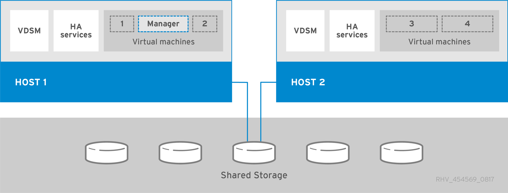

Untuk proses instalasi ISO oVirt Node pada masing-masing host terbilang relatif mudah, karenanya saya anggap tidak perlu dijelaskan pada artikel ini.

### Network
Saya tidak ingin IP kedua host tersebut berubah, maka kita perlu menyesuaikan konfigurasi _virtual network_ KVM pada komputer menggunakan `virsh` seperti berikut.
```shell
sudo virsh net-edit default
```

Masukkan masing-masing MAC address dari virtual NIC kedua VM host, misalnya seperti berikut.
```text
<network>
  <name>default</name>
  <uuid>85633c91-ef79-4ab7-8835-295b046c7xxx</uuid>
  <forward mode='nat'/>
  <bridge name='virbr0' stp='on' delay='0'/>
  <mac address='52:54:00:bn:6f:15'/>
  <ip address='192.168.122.1' netmask='255.255.255.0'>
    <dhcp>
      <range start='192.168.122.50' end='192.168.122.159'/>
      <host mac='52:54:00:b8:77:94' name='host1.ovirt.local' ip='192.168.122.20'/>
      <host mac='52:54:00:fa:df:2d' name='host2.ovirt.local' ip='192.168.122.21'/>
    </dhcp>
  </ip>
</network>
```

Artinya _virtual network_ KVM pada komputer kita hanya akan memulai alokasi DHCP dari `192.168.122.50` sampai `192.168.122.159`, sementara kedua MAC yang kita masukkan tidak berubah karena dijadikan static, dengan IP `192.168.122.20` untuk `host1.ovirt.local` dan IP `192.168.122.21` untuk `host2.ovirt.local`.

Karena deployment _hosted-engine_ nantinya akan melakukan _lookup_ hostname dan kita tidak menggunakan server DNS pada artikel ini, maka selanjutnya kita perlu menambahkan konfigurasi pada `/etc/hosts` pada komputer dan kedua host seperti berikut.
```text
192.168.122.20  host1.ovirt.local
192.168.122.21  host2.ovirt.local
192.168.122.15  hosted-engine.ovirt.local
```

### Spesifikasi Host
Karena hanya untuk keperluan belajar, saya meminimalisir penggunakan _resource_ agar efisien. Kedua host yang sudah saya persiapkan menggunakan spesifikasi seperti berikut.
| Host | vCPU cores | Memory | Disk | Additional Disk |
|:-----:|:----:|:-----:|:----:|:----:|
| host1.ovirt.local | 1 | 8 GB | 65 GB | 65 GB |   
| host2.ovirt.local | 1 | 2 GB | 65 GB | - |


Pada `host1.ovirt.local` diperlukan tambahan disk yang nantinya dijadikan sebagai NFS server. Setelah instalasi VM Self-hosted Engine selesai, memori pada host ini juga dapat kita resize sesuai kebutuhan, misalnya kita turunkan menjadi 5 GB. Jumlah memori awal sebesar 8 GB hanyalah untuk mencegah terjadinya kegagalan ketika proses deployment yang disebabkan oleh minimnya ketersediaan memori.


### NFS Server
Setidaknya sebuah Storage Domain dibutuhkan dalam Datacenter oVirt, dan kita dapat menambahkan beberapa jenis storage seperti misalnya NFS server. Pada sebelumnya kita kita telah menambahkan disk tambahan pada `host1.ovirt.local` anggaplah terbaca sebagai `/dev/vdb` dan akan kita gunakan sebagai filesystem bagi NFS. Supaya lebih efisien, dalam artikel ini NFS server akan saya bangun juga pada `host1.ovirt.local`.
```text
[root@host1 ~]# parted /dev/vdb
GNU Parted 3.2
Using /dev/vdb
Welcome to GNU Parted! Type 'help' to view a list of commands.
(parted) mklabel msdos
Warning: The existing disk label on /dev/vdb will be destroyed and all data on this disk will be lost.
Do you want to continue?
Yes/No? Yes                                                               
(parted) mkpart                                                           
Partition type?  primary/extended? primary                                
File system type?  [ext2]? xfs                                            
Start? 0%                                                                 
End? 100%                                                                 
(parted) print                                                            
Model: Virtio Block Device (virtblk)
Disk /dev/vdb: 69.8GB
Sector size (logical/physical): 512B/512B
Partition Table: msdos
Disk Flags: 

Number  Start   End     Size    Type     File system  Flags
 1      1049kB  69.8GB  69.8GB  primary  xfs          lba

(parted) quit                                                             
Information: You may need to update /etc/fstab.
```

Tambahkan partisi tersebut ke dalam konfigurasi `/etc/fstab`.
```text
# Mount partition for NFS server
/dev/vdb1        /mnt/storage1   xfs     defaults        0 0 
```

Kemudian refresh partition table dengan `udevadm` dan format partisi dengan `mkfs` lalu buat direktori untuk mountpoint pada `/mnt/storage1`, jangan lupa lakukan mount.
```shell
udevadm settle
mkfs.xfs /dev/vdb1
mkdir -p /mnt/storage1
mount -av
chmod 777 -R /mnt/storage1
```

Jika mount partition berhasil, akan muncul output seperti berikut.
```text
mount: /mnt/storage1 does not contain SELinux labels.
       You just mounted an file system that supports labels which does not
       contain labels, onto an SELinux box. It is likely that confined
       applications will generate AVC messages and not be allowed access to
       this file system.  For more details see restorecon(8) and mount(8).
/mnt/storage1            : successfully mounted
```

Tambahkan mountpoint tersebut ke dalam konfigurasi NFS server, lakukan export dan jalankan service `nfs-server`.
```shell
echo "/mnt/storage1 *(rw,sync)" >> /etc/exports
exportfs -arv
systemctl enable --now nfs-server.service
systemctl status nfs-server.service
```

Sesuaikan service yang diperbolehkan oleh `firewalld`, cukup lakukan ini di sisi `host1.ovirt.local` saja.
```shell
firewall-cmd --permanent --add-service=nfs
firewall-cmd --permanent --add-service=mountd
firewall-cmd --permanent --add-service=rpc-bind
firewall-cmd --reload
```

Sekarang cek dari kedua sisi host apakah NFS server sudah terdeteksi.
```shell
for i in host{1..2}.ovirt.local; do ssh root@$i "showmount -e host1.ovirt.local"; done 
```


---


## Self-hosted Engine
### VM Settings
Buka `cockpit` lewat web browser dengan URL [**https://host1.ovirt.local:9090/ovirt-dashboard#/he**](https://host1.ovirt.local:9090/ovirt-dashboard#/he) untuk deploy VM Self-hosted Engine. Gunakan username `root` dan kata sandi yang telah dibuat ketika instalasi oVirt Node. Setelah berhasil login, klik **Start** pada **Hosted Engine**.


Sesuaikan **Engine VM FQDN** dan **VM IP Address** dengan konfigurasi yang sudah dibuat pada `/etc/hosts`. Resize **Memory Size (MiB)** ke batas terendah (4096) serta **Number of Virtual CPUs** menjadi 1 saja, namun hal ini dapat disesuaikan dengan spesifikasi host yang kita hendaki.
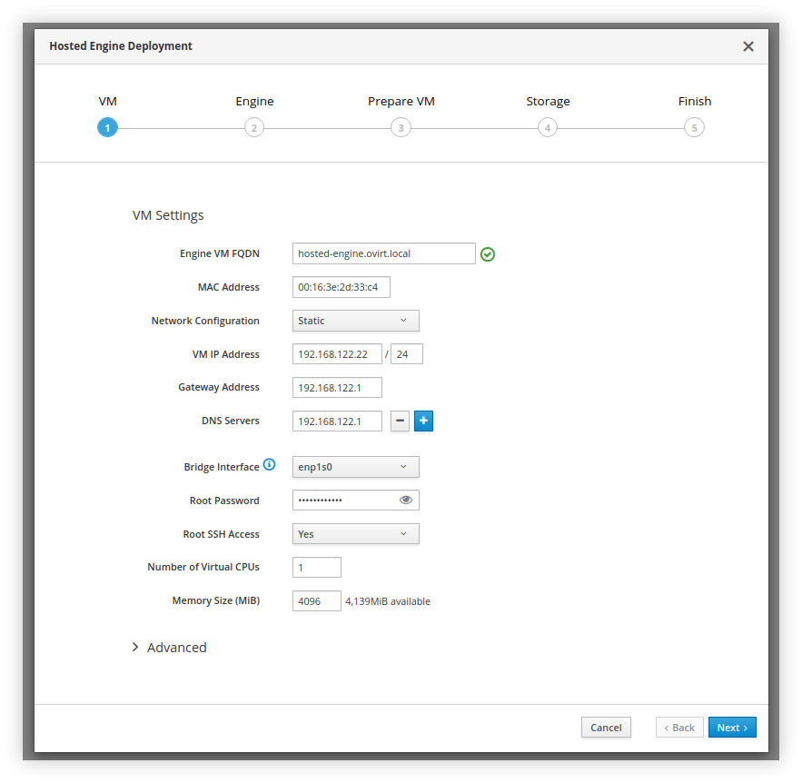
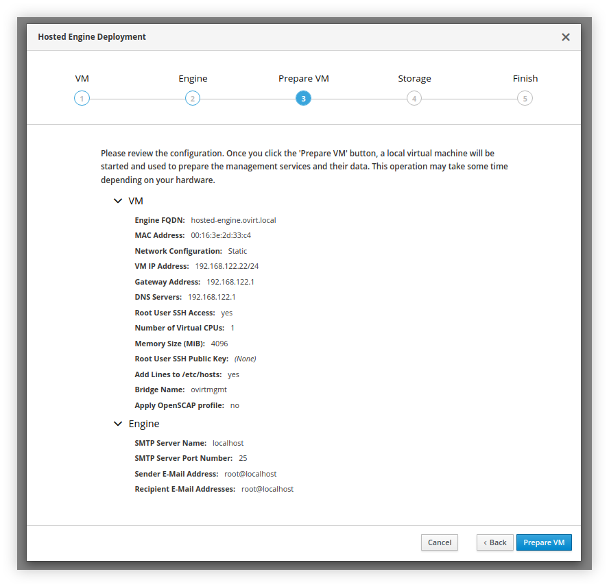

### Deployment Progress
Jika kita lihat dari output log, deployment dijalankan oleh Ansible. Durasi yang diperlukan untuk deployment sangat bergantung pada kecepatan koneksi jaringan internet, spesifikasi VM host, serta hardware komputer yang kita miliki. Dalam kasus saya, internet berkecepatan sekitar 5MB/s dengan spesifikasi host pada artikel ini, memakan waktu hingga sekitar 1 jam.
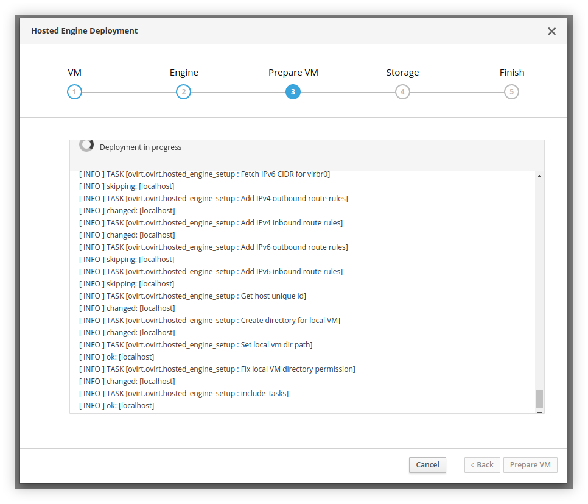

### Storage Domain
Seusai VM Self-hosted Engine sudah berhasil dinyalakan, kita lanjutkan dengan membuat Storage Domain. Fungsinya nanti adalah untuk menampung berbagai _images_ baik file ISO Installer maupun virtual disk bagi VM yang akan dibuat. Karena sebelumnya kita sudah membuat NFS server, maka seharusnya sekarang tinggal kita hubungkan saja seperti berikut.
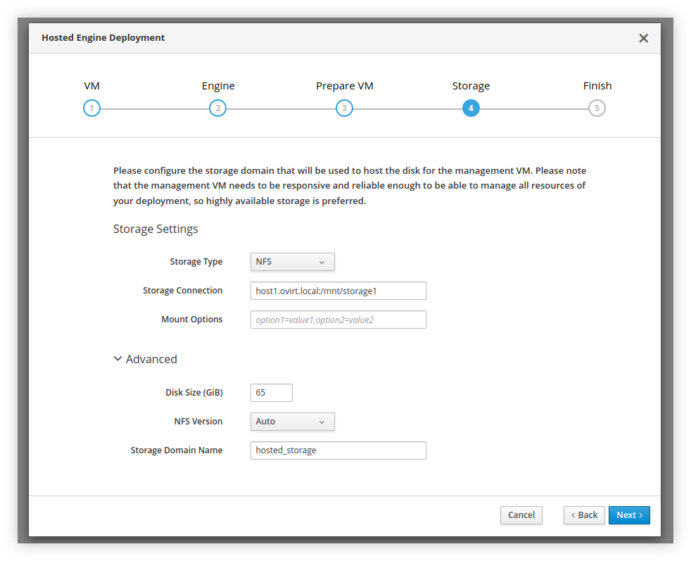

### Healthcheck Hosted Engine
Masuk ke shell untuk user `root` pada `host1.ovirt.local` misalnya dengan SSH, dan periksa apakah VM Self-hosted Enginer dalam keadaan baik.
```text
[root@host1 ~]# hosted-engine --vm-status


--== Host host1.ovirt.local (id: 1) status ==--

Host ID                            : 1
Host timestamp                     : 10187
Score                              : 3400
Engine status                      : {"vm": "up", "health": "good", "detail": "Up"}
Hostname                           : host1.ovirt.local
Local maintenance                  : False
stopped                            : False
crc32                              : a1c1f3b9
conf_on_shared_storage             : True
local_conf_timestamp               : 10187
Status up-to-date                  : True
Extra metadata (valid at timestamp):
	metadata_parse_version=1
	metadata_feature_version=1
	timestamp=10187 (Tue Nov 30 08:55:06 2021)
	host-id=1
	score=3400
	vm_conf_refresh_time=10187 (Tue Nov 30 08:55:06 2021)
	conf_on_shared_storage=True
	maintenance=False
	state=EngineUp
	stopped=False
```


Selagi masih dalam shell `host1.ovirt.local` coba untuk SSH ke `hosted-engine.ovirt.local` dan lakukan konfigurasi file `/etc/hosts` sesuai dengan yang sebelumnya telah kita bahas di bagian [**Network**](#network). Login SSH menggunakan user `root` dan kata sandi yang telah dibuat sebelumnya.


### oVirt Webmanager
Jika VM Self-hosted Engine dalam keadaan baik, kita dapat membuka Web Manager untuk mengelola oVirt lewat web browser dengan alamat [**https://hosted-engine.ovirt.local**](https://hosted-engine.ovirt.local) menggunakan username `admin` dan kata sandi yang telah kita buat sebelumnya pada saat melakukan konfigurasi [VM Settings](#vm-settings).
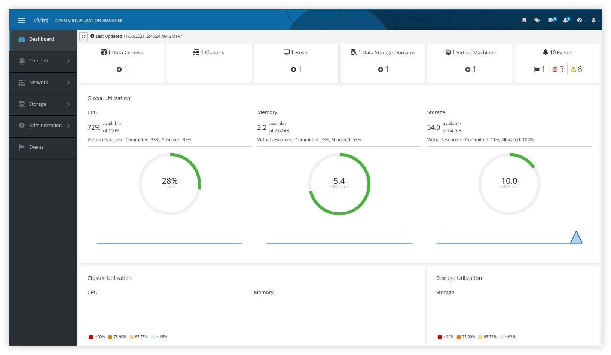


---


## Add Host
Tambahkan `host2.ovirt.local` ke datacenter oVirt yang berhasil kita deploy. Caranya adalah dengan masuk ke menu [**Hosts**](https://hosted-engine.ovirt.local/ovirt-engine/webadmin/#hosts) pada oVirt Webmanager Web Portal. Lalu pilih **New** dan masukkan hostname serta kata sandi dari user `root`. Tunggu beberapa saat, sampai host baru reboot dan berhasil join ke datacenter oVirt.
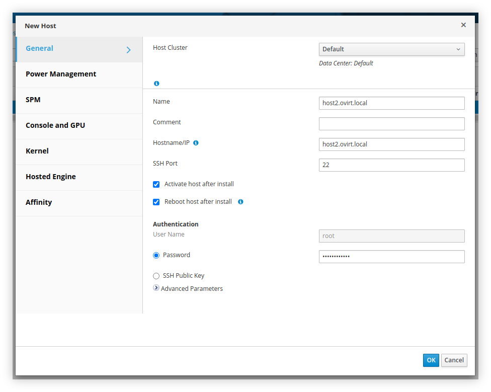

Bila berhasil, nantinya `host2.ovirt.local` akan muncul di oVirt Webmanager, total jumlah Host akan bertambah, dan ada alert seperti berikut.
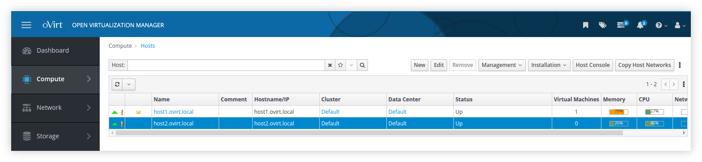
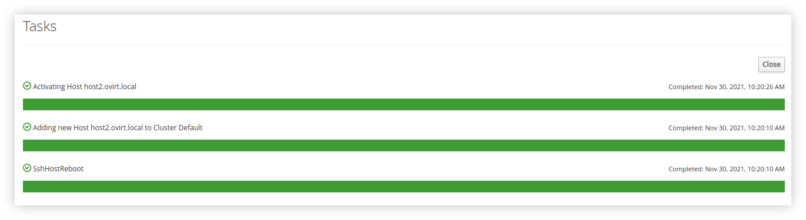


---


## Upload ISO
Sayangnya untuk mengunggah file installer ISO ke oVirt tidak terasa begitu ramah pengguna, kita perlu melakukannya secara manual seperti berikut.

### Mountpoint ISO
Buat sebuah direktori baru bernama `nfs-iso` dalam mountpoint NFS untuk Storage Domain khusus bagi ISO.
```shell
mkdir -p /mnt/storage1/nfs-iso
chmod 777 /mnt/storage1/nfs-iso
```

### New Storage Domain
Pada oVirt Webmanager pilih masuk ke bagian [**Storage Domains**](https://hosted-engine.ovirt.local/ovirt-engine/webadmin/#storage), kemudian klik **New Domains**.
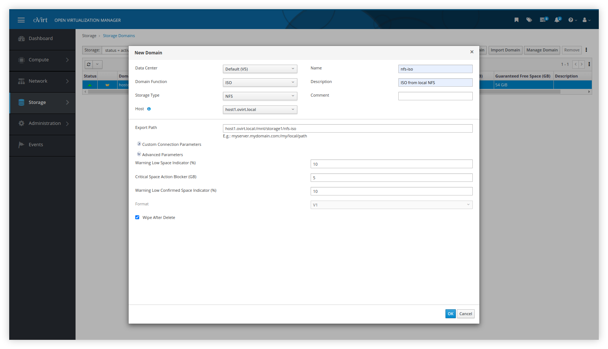
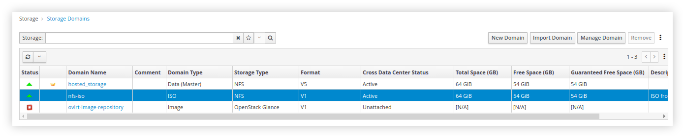


### Enable User
Kita ubah shell milik user `vdsm` dari yang sebelumnya `/sbin/nologin` menjadi `/bin/bash` lalu login ke dalam user tersebut.
```shell
usermod -s /bin/bash vdsm
su - vdsm
```

### Lokasi Direktori
```shell
tree /rhev/data-center/mnt
```
Setelah menjalankan perintah di atas, perhatikan output dari perintah `tree` dengan teliti karena kita akan membutuhkan letak _full path_ dari sebuah direktori bernama `11111111-1111-1111-1111-111111111111`.
```text
/rhev/data-center/mnt
└── host1.ovirt.local:_mnt_storage1_nfs-iso
    └── 7818ab21-eb15-4421-bd17-68d1f3a772b4
        ├── dom_md
        │   ├── ids
        │   ├── inbox
        │   ├── leases
        │   ├── metadata
        │   └── outbox
        └── images
            └── 11111111-1111-1111-1111-111111111111
```

### Rsync File
Masih di dalam user `vdsm` kita dapat menyalin file dari komputer lain dengan `rsync` atau `scp` melalui SSH.
```shell
rsync -aPv pwn3r@192.168.122.1:/run/media/pwn3r/DATA/ISOs/ubuntu-18.04.6-live-server-amd64.iso /rhev/data-center/mnt/host1.ovirt.local\:_mnt_storage1_nfs-iso/7818ab21-eb15-4421-bd17-68d1f3a772b4/images/11111111-1111-1111-1111-111111111111/
```


Pemilik IP `192.168.122.1` adalah komputer saya dengan username `pwn3r`, sesuaikan dengan environment kalian masing - masing. Dari sini saya menyalin file ISO Ubuntu Server dari komputer saya menuju ke Storage Domain di dalam oVirt.


### Disable User
Jika sudah, jangan lupa untuk logout dari user `vdsm` dan mematikan akses shell.
```shell
logout
usermod -s /sbin/nologin vdsm
```

### Check ISO File
Coba lihat dari sisi oVirt Webmanager apakah file ISO sudah muncul seberti berikut ini.
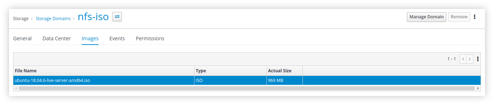


---


## Create VM 
### New VM
Buka menu [**Virtual Machines**](https://hosted-engine.ovirt.local/ovirt-engine/webadmin/#vms) pada oVirt Webmanager lalu pilih **New**.
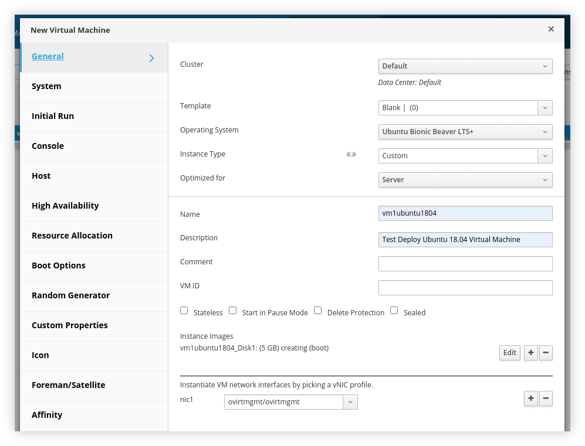

Silahkan buat disk baru yang akan digunakan oleh VM baru.
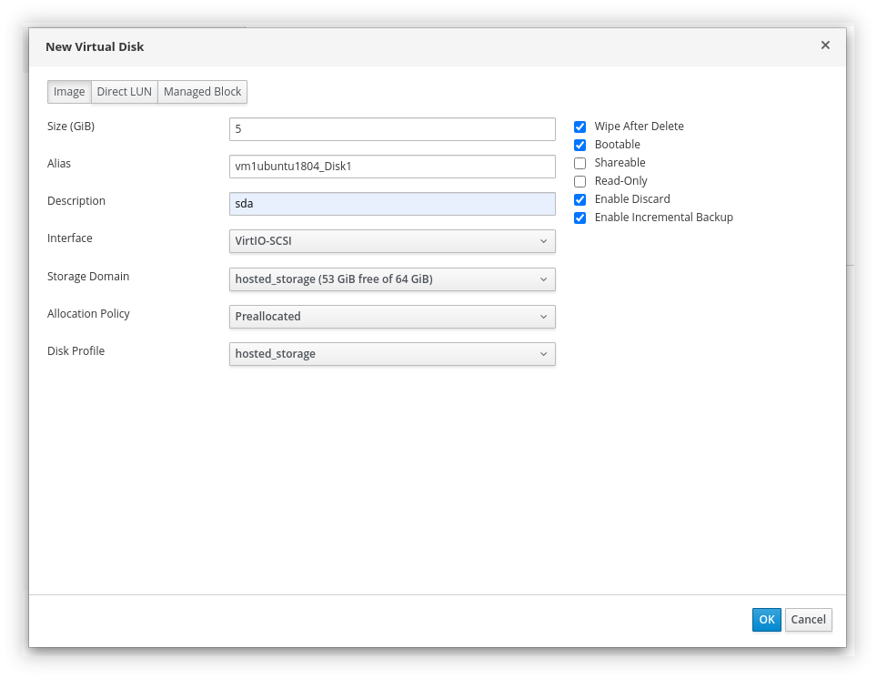

Sesuaikan resource memori dan CPU yang akan dialokasikan untuk VM.
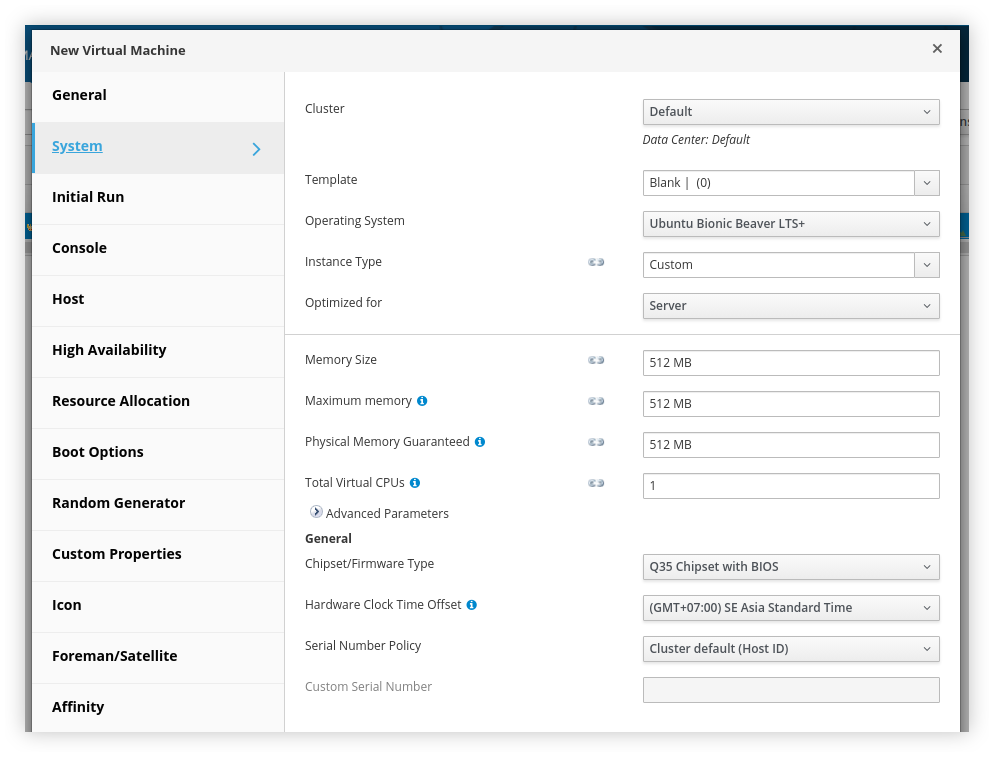

### Install OS on VM with ISO
Saat pertamakali membuat, VM akan dalam keadaan _Powered Off_, pilih **Run Once** dan _attach_ file ISO yang telah kita upload sebelumnya.
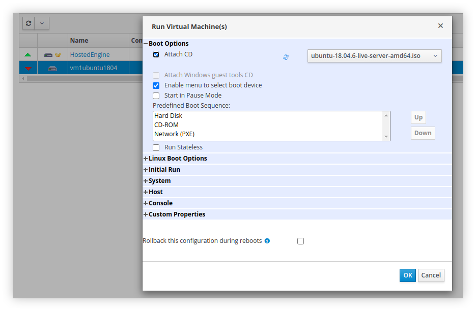

Untuk melakukan remote menggunakan protokol [`SPICE`](https://spice-space.org), klik VM yang kita nyalakan dan pilih **Console**. Web Browser akan mengunduh sebuah file bernama `console.vv` yang dapat kita bukan menggunakan tool bernama `virt-viewer`. Jika belum ada, silahkan install terlebih dahulu pada komputer kalian.
```shell
sudo pacman -Sy virt-viewer
```


Komputer saya menjalankan distro [Artix Linux](https://artixlinux.org) sehingga menggunakan package manager 'pacman'. Silahkan sesuaikan dengan distro yang kalian gunakan.


Berikut ini adalah tampilan dari VM yang berjalan di atas oVirt, sedang menjalankan instalasi Ubuntu Server menggunakan ISO yang telah kita upload ke Storage Domain lewat NFS.
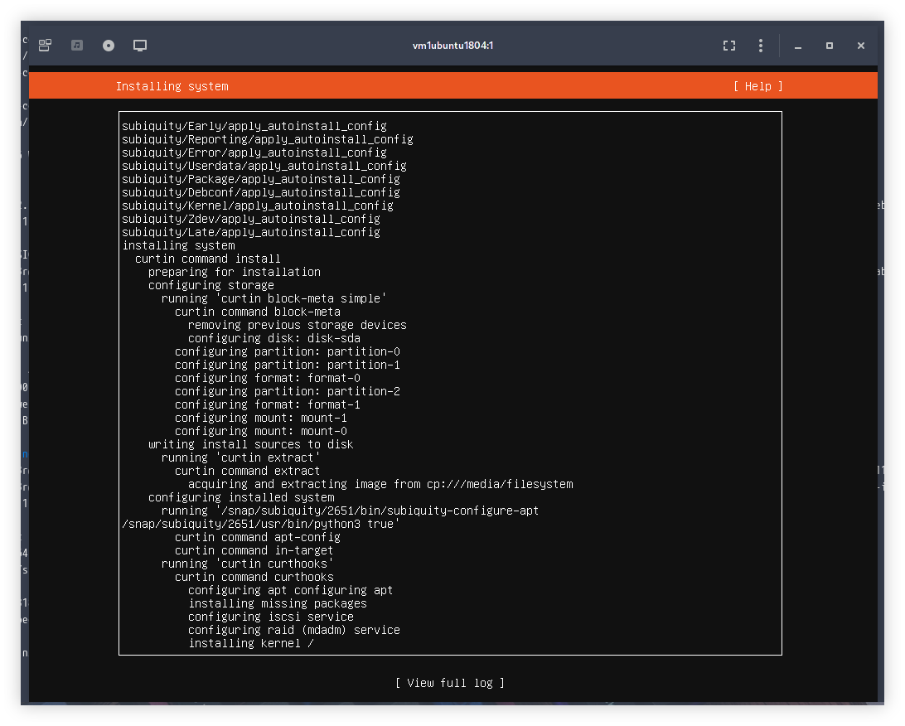

### Eject ISO
Ketika proses instalasi telah selesai, Ubuntu akan meminta reboot VM. Jangan lupa untuk _eject_ ISO terlebih dahulu agar VM booting menggunakan disk.
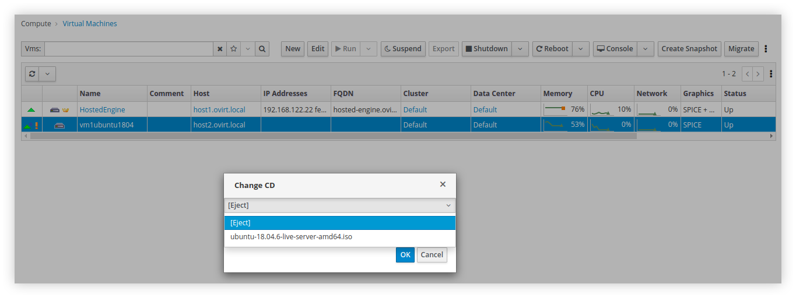

### Uji Coba
Instalasi OS telah berhasil dilakukan pada VM di atas, jika dilihat pada sisi oVirt Webmanager akan terlihat statusnya **Up** yang menandakan VM telah berjalan. VM juga sudah dapat mengakses internet
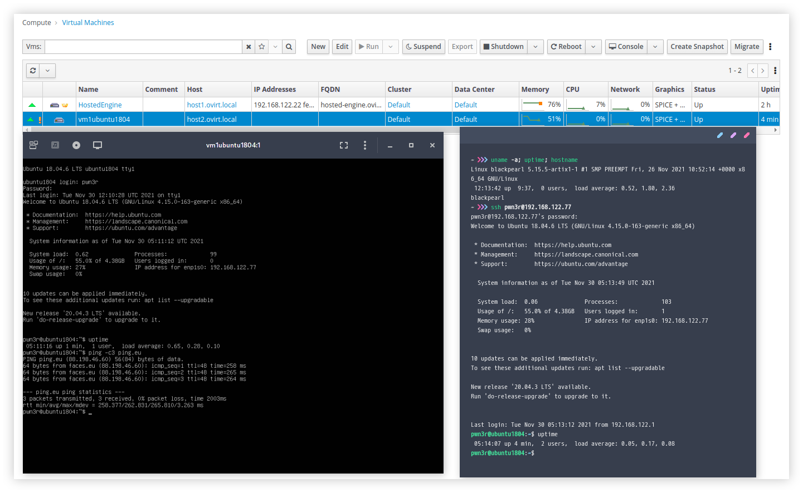

Sementara berikut ini adalah Overview dari oVirt Webmanager, terlihat bahwa dua VM sedang berjalan dan resource berkurang karena digunakan oleh VM baru.
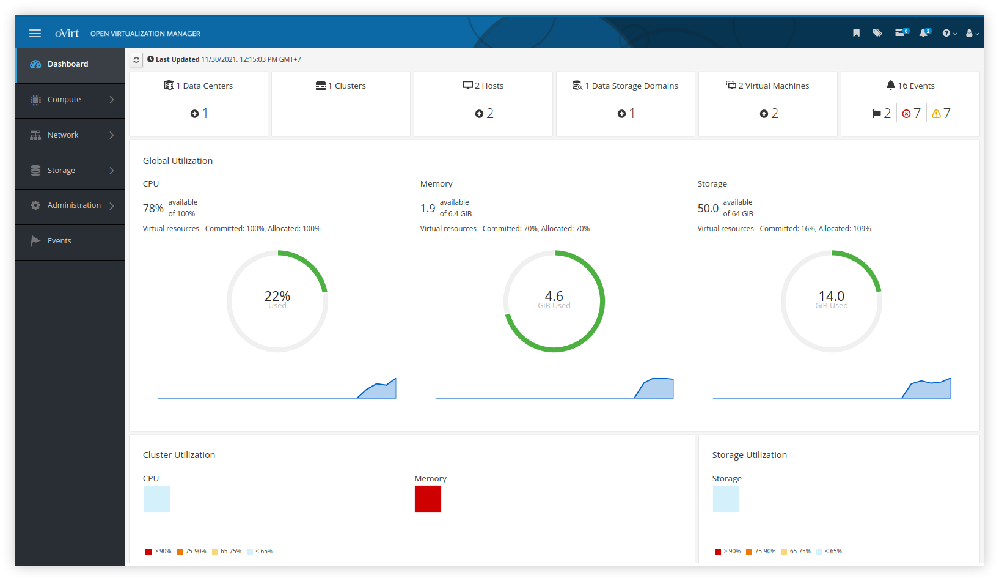


---


## Kesimpulan
Tentunya di production grade RHV lebih banyak diminati karena tersedianya support, dan oVirt menjadi alternatif jika ingin merasakan teknologi virtualisasi ini tanpa perlu biaya subscription. Harap dicatat bahwa dibutuhkan _effort_ lebih untuk produk community yang dapat dipakai secara bebas tanpa biaya langganan jika misalnya kita mendapati masalah atau issue. Selain RHV dan oVirt, masih ada banyak teknologi di level hypervisor yang dapat kita jadikan referensi seperti misalnya vSphere, Proxmox, ESXi, hingga OpenStack. Dari segi fitur, lumayan banyak yang bisa kita dapati di oVirt dan RHV. Namun untuk Web Interface saya rasa masih kurang user friendly jika dibandingkan kompetitornya.


---


## Referensi
- [ovirt.org/documentation/installing_ovirt_as_a_self-hosted_engine_using_the_command_line/index.html](https://ovirt.org/documentation/installing_ovirt_as_a_self-hosted_engine_using_the_command_line/index.html)
- [ovirt.org/develop/architecture/architecture.html](https://www.ovirt.org/develop/architecture/architecture.html)
- [www.linux-kvm.org/page/FAQ](https://www.linux-kvm.org/page/FAQ)
- [wiki.archlinux.org/title/libvirt](https://wiki.archlinux.org/title/libvirt)
- [wiki.archlinux.org/title/QEMU](https://wiki.archlinux.org/title/QEMU)
- [wiki.archlinux.org/title/KVM](https://wiki.archlinux.org/title/KVM)
- [www.desktop-virtualization.com/2008/05/01/qumranet-solid-ice](http://www.desktop-virtualization.com/2008/05/01/qumranet-solid-ice)
- [www.desktop-virtualization.com/2008/09/09/redhat-acquires-qumranet-for-107m](http://www.desktop-virtualization.com/2008/09/09/redhat-acquires-qumranet-for-107m)
- [access.redhat.com/documentation/en-us/red_hat_virtualization/4.4/html-single/administration_guide/index#Copy_ISO_to_ISO_domain-storage_tasks](https://access.redhat.com/documentation/en-us/red_hat_virtualization/4.4/html-single/administration_guide/index#Copy_ISO_to_ISO_domain-storage_tasks)
- [ccess.redhat.com/documentation/en-us/red_hat_enterprise_linux/8/html/deploying_different_types_of_servers/exporting-nfs-shares_deploying-different-types-of-servers](https://access.redhat.com/documentation/en-us/red_hat_enterprise_linux/8/html/deploying_different_types_of_servers/exporting-nfs-shares_deploying-different-types-of-servers)
- [ubuntu.com/tutorials/install-ubuntu-server](https://ubuntu.com/tutorials/install-ubuntu-server)

